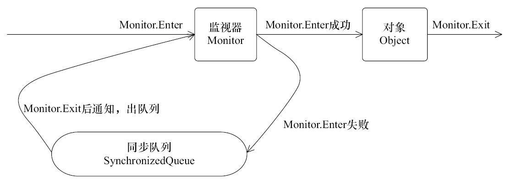

#### 多线程的同步机制：Synchronized volatile ReentrantLock wait&notify

#### 前言
多线程的同步机制是java的基础。
先看一个案例：现在有100张火车票，有两个窗口同时抢火车票，请使用多线程模拟抢票效果。
看这道题目，我们首先想到的是两个线程同时访问一个共享的100张火车票的数据，每当访问一次就把火车票减1，直到为0。
这里有一个问题，怎么保证线程1访问当是最新当数据，以及线程1买过票后线程2拿到的是最新的数据，那么这里就牵涉到线程安全问题。

#### 线程安全
 ````
 当多个线程同时共享同一个全局变量或者静态变量时，做写的操作时，可能会发生数据冲突的问题，这就是线程安全的问题。
 注：做读操作不会发生线程安全问题。
 ````
 有四种方式可以实现多线程的同步，我们来分别用这四种方式解决上面的案例。
 
#### Synchronized
synchronized是Java中的关键字，是一种同步锁。它修饰的对象有以下几种： 
+ 修饰一个代码块，被修饰的代码块称为同步语句块，其作用的范围是大括号{}括起来的代码，作用的对象是调用这个代码块的对象
+ 修饰一个方法，被修饰的方法称为同步方法，其作用的范围是整个方法，作用的对象是调用这个方法的对象
+ 修饰一个静态的方法，其作用的范围是整个静态方法，作用的对象是这个类的所有对象
+ 修饰一个类，其作用的范围是synchronized后面括号括起来的部分，作用主的对象是这个类的所有对象

##### Synchronized原理
JVM基于进入和退出Monitor对象来实现代码块同步和方法同步，两者实现细节不同。
+ 代码块同步：在编译后通过将monitorenter指令插入到同步代码块的开始处，将monitorexit指令插入到方法结束处和异常处。
  通过反编译字节码可以观察到，任何一个对象都有一个monitor与之关联，线程执行monitorenter指令时，会尝试获取对象对应的monitor的所有权，即尝试获得对象的锁。
+ 方法同步：synchronized方法在method_info结构有ACC_synchronized标记，线程执行时会识别该标记，获取对应的锁，实现方法同步。

两者虽然实现细节不同，但本质上都是对一个对象的监视器（monitor，也叫对象锁）的获取。
任意一个对象<font color=#00ffff>有且仅有一个</font> 自己的监视器，当同步代码块或同步方法时，
执行方法的线程必须先获得该对象的监视器才能进入同步块或同步方法，没有获取到监视器的线程将会被阻塞，
并进入同步队列，状态变为BLOCKED。当成功获取监视器的线程释放了锁后，会唤醒阻塞在同步队列的线程，使其重新尝试对监视器的获取。



思考：如果同步的方法又调用了另一个同步方法，会重新获取对象锁吗？
答案是不会！因为Synchronized是可重入锁，试想一下，如果同步的方法调用另一个方法要重新获取锁，但是这个锁自己已经持有了，重新获取锁又要等自己释放，这不就死锁了吗？
###### 可重入锁
```
若一个程序或子程序可以“在任意时刻被中断然后操作系统调度执行另外一段代码，这段代码又调用了该子程序不会出错”，则称其为可重入（reentrant或re-entrant）的。
即当该子程序正在运行时，执行线程可以再次进入并执行它，仍然获得符合设计时预期的结果。
与多线程并发执行的线程安全不同，可重入强调对单个线程执行时重新进入同一个子程序仍然是安全的。
```
通俗来说：当线程请求一个由其它线程持有的对象锁时，该线程会阻塞，而当线程请求由自己持有的对象锁时，如果该锁是重入锁，请求就会成功，否则阻塞。
所以在 java 内部，同一线程在调用自己类中其他 synchronized 方法/块或调用父类的 synchronized 方法/块都不会阻碍该线程的执行。
就是说同一线程对同一个对象锁是可重入的，而且同一个线程可以获取同一把锁多次，也就是可以多次重入。
因为java线程是基于“每线程（per-thread）”，而不是基于“每调用（per-invocation）”的（java中线程获得对象锁的操作是以线程为粒度的)。
###### 可重入锁原理
每一个锁关联一个线程持有者和计数器，当计数器为 0 时表示该锁没有被任何线程持有，那么任何线程都可能获得该锁而调用相应的方法；
当某一线程请求成功后，JVM会记下锁的持有线程，并且将计数器置为 1；此时其它线程请求该锁，则必须等待；
而该持有锁的线程如果再次请求这个锁，就可以再次拿到这个锁，同时计数器会递增；
当线程退出同步代码块时，计数器会递减，如果计数器为 0，则释放该锁。

#### ReentrantLock
ReentrantLock是jdk1.5之后提供的一套互斥锁，与Synchronized关键字类似，但提供了一些高级功能。
+ 等待可中断。持有锁的线程长期不释放的时候，正在等待的线程可以选择放弃等待，这相当于Synchronized来说可以避免出现死锁的情况。通过lock.lockInterruptibly()来实现这个机制。
+ 公平锁。多个线程等待同一个锁时，必须按照申请锁的时间顺序获得锁，Synchronized锁非公平锁，ReentrantLock默认的构造函数是创建的非公平锁，可以通过参数true设为公平锁，但公平锁表现的性能不是很好。
+ 锁绑定多个条件。一个ReentrantLock对象可以同时绑定多个Condition对象。ReentrantLock提供了一个Condition（条件）类，用来实现分组唤醒需要唤醒的线程们，而不是像synchronized要么随机唤醒一个线程要么唤醒全部线程。

#### ReentrantLock使用
```
Lock lock = new ReentrantLock();  //如果构造函数加true参数，则是公平锁
lock.lock();  // 加锁位于try外面，因为如果在获取锁时发生了异常，异常抛出的同时，也会导致锁释放。
try {   
  // update object state  
}  
finally {  
  lock.unlock();   
}  
```

##### ReentrantLock原理
ReentrantLock的实现是一种自旋锁，通过循环调用CAS操作(乐观锁的实现就是基于CAS操作)来实现加锁。在线程竞争很激烈但情况下它的性能比Synchronized好也是因为避免了使线程进入内核的阻塞状态。
ReentrantLock用的是乐观锁，Synchronized用的是悲观锁。
下面看几个概念。
###### 互斥锁
指的是一次最多只能有一个线程持有的锁。互斥锁通过锁机制来实现线程间的同步。ReentrantLock和Synchronized都属于互斥锁。
###### 自旋锁
是指当一个线程在获取锁的时候，如果锁已经被其它线程获取，那么该线程将循环等待，然后不断的判断锁是否能够被成功获取，直到获取到锁才会退出循环。
* 优点
+ 自旋锁不会使线程状态发生切换，一直处于用户态，即线程一直都是active的；不会使线程进入阻塞状态，减少了不必要的上下文切换，执行速度快
+ 非自旋锁在获取不到锁的时候会进入阻塞状态，从而进入内核态，当获取到锁的时候需要从内核态恢复，需要线程上下文切换。 
（线程被阻塞后便进入内核（Linux）调度状态，这个会导致系统在用户态与内核态之间来回切换，严重影响锁的性能）
* 缺点
+ 如果某个线程持有锁的时间过长，就会导致其它等待获取锁的线程进入循环等待，消耗CPU。使用不当会造成CPU使用率极高
+ 自旋锁不是公平的，即无法满足等待时间最长的线程优先获取锁。不公平的锁就会存在“线程饥饿”问题。
###### 悲观锁
总是假设最坏的情况，每次去拿数据的时候都认为别人会修改，所以每次在拿数据的时候都会上锁，这样别人想拿这个数据就会阻塞直到它拿到锁
(共享资源每次只给一个线程使用，其它线程阻塞，用完后再把资源转让给其它线程)。
###### 乐观锁
总是假设最好的情况，每次去拿数据的时候都认为别人不会修改，所以不会上锁，但是在更新的时候会判断一下在此期间别人有没有去更新这个数据，可以使用版本号机制和CAS算法实现。
乐观锁适用于多读的应用类型，这样可以提高吞吐量。

###### CAS(Compare And Swap)
首先，CPU 会将内存中将要被更改的数据与期望的值做比较。然后，当这两个值相等时，CPU 才会将内存中的数值替换为新的值。否则便不做操作，CPU会将旧的数值返回。
简单的来说，CAS有3个操作数，内存值V，旧的预期值A，要修改的新值B。当且仅当预期值A和内存值V相同时，将内存值V修改为B，否则返回V。
这是一种乐观锁的思路，它相信在它修改之前，没有其它线程去修改它；而Synchronized是一种悲观锁，它认为在它修改之前，一定会有其它线程去修改它，悲观锁效率很低。

###### CAS的ABA问题
1. 线程1在共享变量中读取到的数据A
2. 线程2把数据从A改成B，再改成A
3. 线程1读共享数据还是A，认为没有改变，继续执行。
虽然变量的值没有改变，但是数据确实是改变了。可以使用版本号机制或者CAS算法来避免这个问题。

###### Synchronized和ReentrantLock比较
###### 相似点
它们都是加锁方式同步，而且都是阻塞式的同步，也就是说如果一个线程获得了对象锁，进入了同步块，其他访问该同步块的线程都必须阻塞在同步块外面等待。
####### 区别
+ 对于Synchronized来说，它是java的关键字，是原生语法层面的互斥，需要jvm通过monitorEnter和monitorExit指令来实现。而ReentrantLock是jdk1.5之后提供的API层面的互斥锁，需要lock和unlock方法配合try/finally来完成。
+ Synchronized使用比较简洁，由编译器去保证锁的加锁和释放。而ReentrantLock需要手动声明加锁和释放，如果忘记会到你死锁。
+ ReentrantLock灵活性和细度来说更好，因为由用户自己按自己需求控制解锁和释放。
+ ReentrantLock增加的3个特性，可以通过lockInterruptibly来实现等待可中断，通过构造函数new ReentrantLock(true)来设置公平锁，通过Condition绑定多个条件，来实现分组唤醒。

###### 适用场景
+ Synchronized在资源竞争不是很激烈的情况下(大部分synchronized块几乎从来都没发生过争用)，或者偶尔会有同步是很合适的（线程少）。如果有大量线程同时竞争，ReentrantLock是很合适的。所以大部分情况下都用Synchronized，直到确实证明不适合。java官方也建议用Synchronized
+ 只有你确实需要ReentrantLock的3个特性的时候才考虑这个。

##### volatile
volatile是java的关键字，用来声明变量的值可能随时会被别的线程修改，使用volatile修饰的变量会强制将修改后的值写入主存。
+ 内存可见性 在多线程环境，共享变量的操作对于每个线程来说，都是内存可见的，也就是每个线程获取的volatile变量都是最新值；并且每个线程对volatile变量的修改，都直接刷新到主存。
+ 禁止指令重排序 为了优化编译速度，编译器在编译代码的时候并不是按照顺序编译，能保证结果一致但是不能保证编译过程一致。这在单线程处理中没任何问题，但在多线程中由于执行顺序不可控会影响到执行的正确性。
volatile禁止重排序底层实现原理是加上lock前缀指令，lock后就是一个原子操作，会使cpu发一条lock信号，确保多线程竞争的环境下互斥的使用这个内存地址，
执行完之后这个lock动作就会消失(对比synchronized的重量级锁，这个更底层更轻量，消耗代价更小）。lock前缀就相当于一个内存屏障，用来实现对内存操作的顺序限制。
volatile就是通过内存屏障来实现的。内存屏障相当于告诉编译器这个命令必须先执行，这样其他线程读取被volatile修饰的数据会先去主内存中获取最新值，这也是实现可见性的基础。

⚠️volatile不具备原子性，为了保证线程安全，还是需要加锁来保证原子性，所以使用场景非常有限。由于volatile不会像加锁那样线程阻塞，所以非常适合于读操作远远大于写操作。
###### volatile原理
处理器为了提高处理速度，不直接和内存进行通讯，而是先将系统内存的数据读到内部缓存后再进行操作，但操作完之后并不会立即写到内存，
如果对声明了Volatile变量进行写操作，JVM就会向处理器发送一条Lock前缀的指令，将这个变量所在缓存行的数据写回到系统内存。但是就算写回到内存，
如果其他处理器缓存的值还是旧的，再执行计算操作就会有问题，所以在多处理器下，为了保证各个处理器的缓存是一致的，就会实现缓存一致性协议，
每个处理器通过嗅探在总线上传播的数据来检查自己缓存的值是不是过期了，当处理器发现自己缓存行对应的内存地址被修改，
就会将当前处理器的缓存行设置成无效状态，当处理器要对这个数据进行修改操作的时候，会强制重新从系统内存里把数据读到处理器缓存里。
###### 适用场景
- 读多写少
- 可用作状态标示
对于开头提的卖票问题，由于volatile修饰的变量自增自减不具备原子性，显然是不适用的。这种情况下可以用AtomicInteger类来保证原子性。
AtomicInteger的自增自减具有原子性底层原理也是先自增自减，再通过CAS操作来保证原子性的。

##### wait && notify/notifyAll
- Object基础类的final方法，不能重写，不是Thread的方法。因为每个对象都有一个锁，这三个方法是最基础的锁操作。
- 调用以上方法一定要加锁，否则会抛IllegalMonitorStateException锁状态异常。所以一般要在Synchronized同步代码块中。
- 调用wait时会释放当前的锁，进入blocked状态，直到notify/notifyAll被执行，才会唤醒一个或者多个处在等待状态的线程，然后继续往下执行，直到执行完Synchronized代码块或者继续wait，再次释放锁。也就是说notify只是唤醒线程，而不会立即释放锁。
- wait需要被try/catch包围，中断也会使wait的线程唤醒。另外尽量在while循环中而不是if中使用wait。
- 假如有3个线程执行了obj.wait(),那么obj.notifyAll()能全部唤醒这三个线程，但是要继续执行wait的下一条语句，必须先获得Obj的锁。假如线程1获取到了锁，其他的线程需要等待线程1释放obj锁才能继续执行。
- 当调用notify后，调用线程依然持有obj锁，因此，3个线程虽然被唤醒，但是仍无法获取到obj锁，直到调用线程退出Synchronized块，释放obj锁之后这3个线程才有机会获得锁继续执行。
- 适合生产者消费者模型

###### 生产者消费者模型
假设有一个公共的容量有限的池子，有两种人，一种生产者，一种消费者。
生产者往池子里添加产品，如果池子满了就停止生产，直到池子里的产品被消耗能重新放进去。消费者消耗池子里的资源，如果池子里资源为空则停止消耗，直到池子里有产品。
不解释了，直接上代码，池子数量以及生产者和消费者数量可以自己设置。

另外Synchronized,ReentrantLock,以及Volatile实现开头那问题的见链接：
- [synchronized实现卖票](https://github.com/beyond667/study/blob/master/app/src/main/java/demo/beyond/com/blog/sync/SaleTrainTestSynchronized.java "synchronized实现卖票")
- [ReentrantLock实现卖票](https://github.com/beyond667/study/blob/master/app/src/main/java/demo/beyond/com/blog/sync/SaleTrainTestReentrantLock.java "ReentrantLock实现卖票")
- [volatile实现卖票](https://github.com/beyond667/study/blob/master/app/src/main/java/demo/beyond/com/blog/sync/SaleTrainTestVolatile.java "volatile实现卖票")

```
public class SaleTrainTestWait {

    private Ticket mTicket = new Ticket();

    public void produce() {
        synchronized (this) {
            while (mTicket.isFull()) {
                try {
                    System.out.println(Thread.currentThread().getName() + "池子已经满了，售票员等待中。。。" + mTicket.innerList.size());
                    wait();
                } catch (InterruptedException e) {
                    e.printStackTrace();
                }
            }
            mTicket.add();
            notifyAll();
        }
    }

    public void consume() {
        synchronized (this) {
            while (mTicket.isEmpty()) {
                try {
                    System.out.println(Thread.currentThread().getName() + "池子已经空了,买家等待中。。。" + mTicket.innerList.size());
                    wait();
                } catch (InterruptedException e) {
                    e.printStackTrace();
                }
            }
            mTicket.remove();
            notifyAll();
        }
    }

    private class Ticket {
        private static final int MAX_CAPACITY = 10;
        private List innerList = new ArrayList<>(MAX_CAPACITY);

        void add() {
            if (isFull()) {
                throw new IndexOutOfBoundsException();
            } else {
                innerList.add(new Object());
            }
            System.out.println(Thread.currentThread().getName() + " 生产后池子剩余" + innerList.size());
        }

        void remove() {
            if (isEmpty()) {
                throw new IndexOutOfBoundsException();
            } else {
                innerList.remove((innerList.size() - 1));
            }
            System.out.println(Thread.currentThread().getName() + " 消费后池子剩余" + innerList.size());
        }

        boolean isEmpty() {
            return innerList.isEmpty();
        }

        boolean isFull() {
            return innerList.size() == MAX_CAPACITY;
        }
    }

    static SaleTrainTestWait sth = new SaleTrainTestWait();

    public static void main(String[] args) {
        Product productRun = new Product();
        Consume consumeRun = new Consume();
        //如果只有一个买家和售票员
//        new Thread(consumeRun, "买家").start();
//        new Thread(productRun, "售票员").start();

        //多个买家 多个售票员
        for (int i = 0; i < 10; i++) {
            new Thread(consumeRun,"买家"+i).start();
        }
        for (int i = 0; i < 10; i++) {
            new Thread(productRun,"售票员"+i).start();
        }
    }

    static class Product implements Runnable {
        int count = 10000;

        @Override
        public void run() {
            while (count-- > 0) {
                sth.produce();
            }
        }
    }

    static class Consume implements Runnable {
        int count = 10000;

        @Override
        public void run() {
            while (count-- > 0) {
                sth.consume();
            }
        }
    }
}

```


