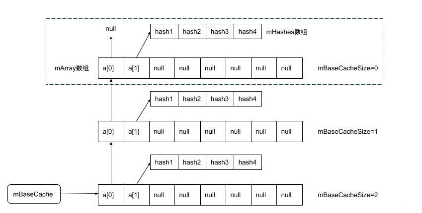
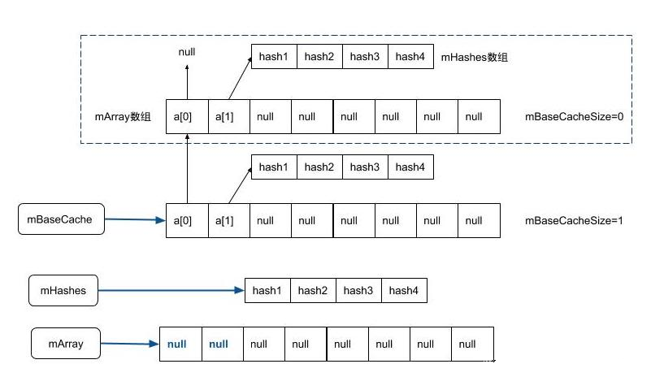

### HashMap & ArrayMap & SparseArray

#### 对比

在Android移动设备中，android为了内存优化专门设计了ArrayMap和SparseArray，在数据量小的情况下（数量小于1000），用ArrayMap和SparseArray理论上比HashMap更省内存。
HashMap和ArrayMap都是实现的Map接口，SparseArray原理和ArrayMap大部分都一样，区别是key只能是int型，所以其没有实现Map接口，因为要实现Map接口，其key必须是object对象。我们详细看下这三者的区别：

| 不同点|HashMap|ArrayMap|SparseArray|
| --------- |-------------|---------------|--------------|
|出处  | Java |  Android4.4 |Android4.4（以下必须引support包）|
|数据结构|1.8之前是数组+单链表，1,8之后再加红黑树（链表长度大于8变树，树长度减少到6时变回单链表）|两个数组，一个数组存key的hash值（从小到大排序），一个存key和value|两个数组，一个存key（从小到大排序），一个存value|
|操作复杂度|理想状态下1，在数组上直接查到，单链表上是n,红黑树是logN|在key的列表二分法查找，logN|同ArrayMap|
|默认长度|16|0|10|
|扩容时机|大于size*0.75（加载因子默认0.75），并且数组长度大于等于64| 插入时数组已满| 插入时数组已满                                   |
|扩容机制|乘2|0>4>8>之后一次扩0.5倍即>12>18>27>40>60（类似ArrayList，不过其第一次是0>10）|乘2|
|缩容时机 | 不能缩容，假如数组长度32，就算把数据删完长度也不会变为16 | 数组长度大于8，删除时使用的空间小于1/3即缩容，已用的大于8，缩小到已用的1.5倍，否则缩小到8 | 不能缩容 |
|使用场景|数据量大或者需要高效查询，但是消耗更多内存|数据小于1000，且对内存占用要求较高|同ArrayMap，且key是int时|

#### HashMap

```java
public class HashMap<K,V> extends AbstractMap<K,V>
    implements Map<K,V>, Cloneable, Serializable {
    //1 默认加载因子0.75 默认初始化容量16
    static final float DEFAULT_LOAD_FACTOR = 0.75f;
    static final int DEFAULT_INITIAL_CAPACITY = 1 << 4; // aka 16
     
    /**
     * The table, initialized on first use, and resized as
     * necessary. When allocated, length is always a power of two.
     * (We also tolerate length zero in some operations to allow
     * bootstrapping mechanics that are currently not needed.)
     */
    // 注释写的很清楚，Node数组，第一次使用时才初始化，有需要时就扩容，每次扩2倍
    transient Node<K,V>[] table;

    /**
     * Holds cached entrySet(). Note that AbstractMap fields are used
     * for keySet() and values().
     */
    //set集合里存的单链表或者树
    transient Set<Map.Entry<K,V>> entrySet;
    
    public HashMap() {
        this.loadFactor = DEFAULT_LOAD_FACTOR; // all other fields defaulted
    }
    //2 手动传容量或者加载因子
    public HashMap(int initialCapacity) {
        this(initialCapacity, DEFAULT_LOAD_FACTOR);
    }
    public HashMap(int initialCapacity, float loadFactor) {
        if (initialCapacity > MAXIMUM_CAPACITY)
            initialCapacity = MAXIMUM_CAPACITY;
        this.loadFactor = loadFactor;
        this.threshold = tableSizeFor(initialCapacity);
    }
    static final int MAXIMUM_CAPACITY = 1 << 30;

}
```

+ 注释1默认的加载因子0.75，我们直接new HashMap()时并没有初始化数组，此时数组长度为0，只有在往map里存值时才会通过resize把数组初始化长度16
+ 注释2如果我们确定map的长度，可以在new HashMap时设置大小，这样就避免一次往map里塞很多值时进行扩容耗时操作。另注意，设置大小时尽量是2的n次方，比如2,4,8,16,32，尽量避免奇数或者2的奇数倍，比如5，6，因为这么设置会加剧hash冲突

我们具体看下put插入流程：

```java
public V put(K key, V value) {
    return putVal(hash(key), key, value, false, true);
}
static final int hash(Object key) {
    int h;
    //计算key的hashCode
    return (key == null) ? 0 : (h = key.hashCode()) ^ (h >>> 16);
}

```

计算key的hashCode值也比较有意思，并不是直接return的key.hashCode()，而是把key.hashCode()得到的值与此值右移16位做了异或操作，主要为了增加低位的随机性

```java
final V putVal(int hash, K key, V value, boolean onlyIfAbsent,boolean evict) {
    Node<K,V>[] tab; Node<K,V> p; int n, i;
    //1 table为空，调用resize初始化长度为16
    if ((tab = table) == null || (n = tab.length) == 0)
        n = (tab = resize()).length;
    //2 hash值与长度-1做了并运行，相当于hash%(n-1),确定数组下标
    // 如果此处还没数据，直接把此数据放到数组的这个位置，否则说明有hash冲突，此时p有可能是链表，也可能是树
    if ((p = tab[i = (n - 1) & hash]) == null)
        tab[i] = newNode(hash, key, value, null);
    else {
        Node<K,V> e; K k;
        //3 如果put的key与根节点的key完全相等，直接赋值到根节点即可
        if (p.hash == hash &&
            ((k = p.key) == key || (key != null && key.equals(k))))
            e = p;
        //4 如果是树，通过putTreeVal放到合适的位置
        else if (p instanceof TreeNode)
            e = ((TreeNode<K,V>)p).putTreeVal(this, tab, hash, key, value);
        else {
            //5 如果是单链表，如果到队尾都没找到，那直接在队尾插入（java1.7是插入队头），能找到就直接break循环
            for (int binCount = 0; ; ++binCount) {
                if ((e = p.next) == null) {
                    p.next = newNode(hash, key, value, null);
                    if (binCount >= TREEIFY_THRESHOLD - 1) // -1 for 1st
                        treeifyBin(tab, hash);
                    break;
                }
                if (e.hash == hash &&
                    ((k = e.key) == key || (key != null && key.equals(k))))
                    break;
                p = e;
            }
        }
        //6 如果找到，直接替换值即可，不需要走后面的判断是否需要扩容，返回的是旧值
        if (e != null) { // existing mapping for key
            V oldValue = e.value;
            if (!onlyIfAbsent || oldValue == null)
                e.value = value;
            afterNodeAccess(e);
            return oldValue;
        }
    }
    //7 没找到，需判断是否需要扩容，threshold值即为数组长度*加载因子
    ++modCount;
    if (++size > threshold)
        resize();
    afterNodeInsertion(evict);
    return null;
}
```

+ 注释1 第一次往map里put时，会先resize初始化数组长度为16
+ 注释2 hash值与长度-1做了并运行，相当于hash%(n-1)，但是只有长度为2的n次方才相等。先确定数组下标，如果此处还没数据，直接把此数据放到数组的这个位置，否则说明有hash冲突
+ 注释3 4 5就是判断要把新put的节点放到哪个位置，可能是数组的根节点，也可能是树里或链表里
+ 注释6 7判断是否是新增的，如果是新增的，需判断是否走扩容逻辑，否则直接替换原值

删除的流程与插入相反

```java
public V remove(Object key) {
    Node<K,V> e;
    return (e = removeNode(hash(key), key, null, false, true)) == null ?
        null : e.value;
}
final Node<K,V> removeNode(int hash, Object key, Object value,
                           boolean matchValue, boolean movable) {
    Node<K,V>[] tab; Node<K,V> p; int n, index;
    //表不为空，并且取余后的节点也不为空才往下走，否则直接返回null
    if ((tab = table) != null && (n = tab.length) > 0 &&
        (p = tab[index = (n - 1) & hash]) != null) {
        Node<K,V> node = null, e; K k; V v;
        //同添加 一样的套路，先找到具体的节点，如果是在数组的根节点，直接返回
        if (p.hash == hash &&
            ((k = p.key) == key || (key != null && key.equals(k))))
            node = p;
        else if ((e = p.next) != null) {
            if (p instanceof TreeNode)
                //如果是树结构，从树里找
                node = ((TreeNode<K,V>)p).getTreeNode(hash, key);
            else {
                do {
                    //否则从单链表里找，直到查到最后
                    if (e.hash == hash &&
                        ((k = e.key) == key ||
                         (key != null && key.equals(k)))) {
                        node = e;
                        break;
                    }
                    p = e;
                } while ((e = e.next) != null);
            }
        }
        //能找到此元素就走里面移除逻辑
        if (node != null && (!matchValue || (v = node.value) == value ||
                             (value != null && value.equals(v)))) {
            if (node instanceof TreeNode)
                //1 通过removeTreeNode从树里移除元素，可能会把树变为链表
                ((TreeNode<K,V>)node).removeTreeNode(this, tab, movable);
            else if (node == p)
                //如果找到的是数组的根节点，直接把数组指向移除元素的下一个元素，相当于把该元素删除
                tab[index] = node.next;
            else
                //如果是单链表里面的，前一个元素的next指向找到元素的next元素，相当于把查找到元素删除
                p.next = node.next;
            ++modCount;
            --size;
            afterNodeRemoval(node);
            return node;
        }
    }
    return null;
}
```

删除和插入逻辑很像，不赘述。需关注删除时注释1处通过removeTreeNode从树里移除元素，可能会把树变为链表

```java
final void removeTreeNode(HashMap<K,V> map, Node<K,V>[] tab,boolean movable) {
    int n;
    if (tab == null || (n = tab.length) == 0)
        return;
    int index = (n - 1) & hash;
    TreeNode<K,V> first = (TreeNode<K,V>)tab[index], root = first, rl;
    TreeNode<K,V> succ = (TreeNode<K,V>)next, pred = prev;
    //...
    //1 树变链表的条件
    if (root == null || root.right == null ||
        (rl = root.left) == null || rl.left == null) {
        tab[index] = first.untreeify(map);  // too small
        return;
    }
    //...
}
```

可以看到删除元素时，如果树的根，根的右子树，根的左子树，跟的左子树的左子树有一个为空，都会把树变为链表。所以理论上如果这4个位置都不为空，即树长度只有4也不会变为链表。还有个场景也会把树变为链表，即在数组扩容时，树的一部分数据可能要移动到新扩容的数组下，此树的数据少了当然可能会退回链表。

继续看put时调用的resize扩容

```java
static final int DEFAULT_INITIAL_CAPACITY = 1 << 4; // aka 16
final Node<K,V>[] resize() {
    Node<K,V>[] oldTab = table;
    int oldCap = (oldTab == null) ? 0 : oldTab.length;
    int oldThr = threshold;
    int newCap, newThr = 0;
    if (oldCap > 0) {
        if (oldCap >= MAXIMUM_CAPACITY) {
            threshold = Integer.MAX_VALUE;
            return oldTab;
        }
        else if ((newCap = oldCap << 1) < MAXIMUM_CAPACITY &&
                 oldCap >= DEFAULT_INITIAL_CAPACITY)
            //容量和阈值都扩容2倍
            newThr = oldThr << 1; // double threshold
    }
    else if (oldThr > 0) // initial capacity was placed in threshold
        newCap = oldThr;
    else {               // zero initial threshold signifies using defaults
        //1 第一次put数据时初始化容量为16，默认扩容的阈值为12
        newCap = DEFAULT_INITIAL_CAPACITY;
        newThr = (int)(DEFAULT_LOAD_FACTOR * DEFAULT_INITIAL_CAPACITY);
    }
    if (newThr == 0) {
        float ft = (float)newCap * loadFactor;
        newThr = (newCap < MAXIMUM_CAPACITY && ft < (float)MAXIMUM_CAPACITY ?
                  (int)ft : Integer.MAX_VALUE);
    }
    threshold = newThr;
    //新建的Node数组是原数组的2倍
    Node<K,V>[] newTab = (Node<K,V>[])new Node[newCap];
    table = newTab;
    if (oldTab != null) {
        //遍历原数组
        for (int j = 0; j < oldCap; ++j) {
            Node<K,V> e;
            //索引处不为空才往下走
            if ((e = oldTab[j]) != null) {
                oldTab[j] = null;
                //如果根进点的next为空，说明该位置只有一个数组，直接放到新数组即可
                if (e.next == null)
                    newTab[e.hash & (newCap - 1)] = e;
                else if (e instanceof TreeNode)
                    //2 如果当前是树，调用split去分割树，此时可能树变链表
                    ((TreeNode<K,V>)e).split(this, newTab, j, oldCap);
                else { // preserve order
                    //否则是链表，采用尾插法
                    Node<K,V> loHead = null, loTail = null;
                    Node<K,V> hiHead = null, hiTail = null;
                    Node<K,V> next;
                    do {
                        next = e.next;
                        if ((e.hash & oldCap) == 0) {
                            if (loTail == null)
                                loHead = e;
                            else
                                loTail.next = e;
                            loTail = e;
                        }
                        else {
                            if (hiTail == null)
                                hiHead = e;
                            else
                                hiTail.next = e;
                            hiTail = e;
                        }
                    } while ((e = next) != null);
                    if (loTail != null) {
                        loTail.next = null;
                        newTab[j] = loHead;
                    }
                    if (hiTail != null) {
                        hiTail.next = null;
                        newTab[j + oldCap] = hiHead;
                    }
                }
            }
        }
    }
    return newTab;
}
```

+ 注释1处是首次put时会初始化长度为16，扩容的阈值为12
+ 注释2处扩容的当前节点是树的话，调用split去分割树

```java
static final int UNTREEIFY_THRESHOLD = 6;
final void split(HashMap<K,V> map, Node<K,V>[] tab, int index, int bit) {
    //红黑树在node数组上的元素
    TreeNode<K,V> b = this;
    //loHead 低位树头结点， loTail 低位树尾结点
    TreeNode<K,V> loHead = null, loTail = null;
    //hiHead 高位树头结点， hiTail 高位树尾结点
    TreeNode<K,V> hiHead = null, hiTail = null;
    int lc = 0, hc = 0;
    //红黑树为链表转换而成，hashmap链表节点（node类型）在转换成红黑树（treeNode类型）时
    //保留了原有node节点的变量(next等等)，数据，用于进行迭代器遍历，及退化为链表

    //虽然是红黑树，不过保留了next，可以按照链表方式进行遍历
    for (TreeNode<K,V> e = b, next; e != null; e = next) {
        next = (TreeNode<K,V>)e.next;
        e.next = null;
        //如果当前节点hash与运算扩容前map容量为0，代表扩容后索引位置不变
        //扩容后索引位置不变的节点放在低位树中
        if ((e.hash & bit) == 0) {
            //尾结点为空，此时还未放入输入，设置头结点为e
            if ((e.prev = loTail) == null)
                loHead = e;
            //尾结点不为空，此时已有数据，将尾结点next指向当前数据(尾插法)
            else
                loTail.next = e;
            loTail = e;
            ++lc;
        }
        else {
            if ((e.prev = hiTail) == null)
                hiHead = e;
            else
                hiTail.next = e;
            hiTail = e;
            ++hc;
        }
    }
    //lc,hc从0开始增加，lo树中有6个元素，则lc=6
    //hi树有6个元素，则hc=6
    if (loHead != null) {
        //1 lc<=6，将lo树退化为链表，也就是lc树中有6个元素，就会退化为链表
        if (lc <= UNTREEIFY_THRESHOLD)
            tab[index] = loHead.untreeify(map);

        /**lc>6 将lc转化为真正的红黑树结构
        *前面lc只是next赋值了，还只是链表结构
        *红黑树需要对parent,left,right等属性赋值
        */
            else {
                tab[index] = loHead;
                if (hiHead != null)  
                    loHead.treeify(tab);
            }
    }
    //hi树与lo同理
    if (hiHead != null) {
        if (hc <= UNTREEIFY_THRESHOLD)
            tab[index + bit] = hiHead.untreeify(map);
        else {
            tab[index + bit] = hiHead;
            if (loHead != null)
                hiHead.treeify(tab);
        }
    }
}
```

这里可以看到在扩容时如果链表长度小于等于6就会进行树变链表。

#### ArrayMap

为了解决HashMap占内存的弊端，Android专门提供了内存效率更高的ArrayMap。内部使用两个数组，一个记录key的hash值（按序排列），另一个数组记录key-value，其顺序和第一个数组一致，数据类似如下：

mHashes: hashA-hashB-hashC

mArray:keyA-valueA-keyB-valueB-keyC-valueC

增删改查时先通过对mHashes进行二分查找，找到具体位置index，再在mArray数组里从2*index处进行相应操作。其数据结构相对于HashMap可以看到会小一些，比如HashMap的链表中会记录next节点，树结构会记录左右子树。ArrayMap的另一个优点是缓存机制。我们从源码上来看具体实现：

> android/util/ArrayMap.java

```java
public final class ArrayMap<K, V> implements Map<K, V> {
 private static final boolean CONCURRENT_MODIFICATION_EXCEPTIONS = true;
    
    private static final int BASE_SIZE = 4;  // 容量增量的最小值
    private static final int CACHE_SIZE = 10; // 缓存数组的上限

    static Object[] mBaseCache; //用于缓存大小为4的ArrayMap
    static int mBaseCacheSize; //记录baseCache里已缓存的数量
    static Object[] mTwiceBaseCache; //用于缓存大小为8的ArrayMap
    static int mTwiceBaseCacheSize;//记录TwiceBaseCache里已缓存的数量

    final boolean mIdentityHashCode;
    int[] mHashes;         //由key的hashcode所组成的数组
    Object[] mArray;       //由key-value对所组成的数组，是mHashes大小的2倍
    int mSize;             //成员变量的个数
    public ArrayMap() {
        this(0, false);
    }
    public ArrayMap(int capacity, boolean identityHashCode) {
        mIdentityHashCode = identityHashCode;
        if (capacity < 0) {
            mHashes = EMPTY_IMMUTABLE_INTS;
            mArray = EmptyArray.OBJECT;
        } else if (capacity == 0) {
            mHashes = EmptyArray.INT;
            mArray = EmptyArray.OBJECT;
        } else {
            allocArrays(capacity);
        }
        mSize = 0;
    }
}
```

根据其成员变量，可以看到其内部有两个对象数组，即两个缓冲池，一个缓存大小为4的Array，一个缓存大小为8的，并分别记录了这两个缓冲池的size。根据构造函数默认长度为0，也可以直接指定长度，并调用allocArrays去分配指定的长度的数组。

先看数据插入：

```java
public V put(K key, V value) {
    final int osize = mSize; // 当前 map 大小
    final int hash;
    int index;
     // 如果 key 为 null，其 hashCode 算作 0
    if (key == null) { 
        hash = 0; 
        index = indexOfNull();
    } else {
        //1 通过二分法在 mHashes 数组中查找值等于 hash 的 key
        hash = mIdentityHashCode ? System.identityHashCode(key) : key.hashCode();
        index = indexOf(key, hash); 
    }
    //2 index 大于等于 0 时，更新 key 对应 value 并返回旧值。
    if (index >= 0) {
        index = (index<<1) + 1;
        final V old = (V)mArray[index];
        mArray[index] = value;
        return old;
    }

    index = ~index;
    //否则说明是插入操作，当 osize >= mHashes.length 时进行扩容
    if (osize >= mHashes.length) {
        //3 扩容规则即0>4>8> n的1.5倍
        final int n = osize >= (BASE_SIZE*2) ? (osize+(osize>>1))
            : (osize >= BASE_SIZE ? (BASE_SIZE*2) : BASE_SIZE);

        //4 先记录旧的数组，再通过allocArrays把这两个数组扩容
        final int[] ohashes = mHashes;
        final Object[] oarray = mArray;
        allocArrays(n);
        if (mHashes.length > 0) {
            //5 将旧数组复制到新分配的数组 mHashes 和 mArray 中
            System.arraycopy(ohashes, 0, mHashes, 0, ohashes.length);
            System.arraycopy(oarray, 0, mArray, 0, oarray.length);
        }
        //6 释放掉旧数据的内存，如果旧数组长度为4或者8，会加进缓存池
        freeArrays(ohashes, oarray, osize);
    }
    //7 当插入的位置不在数组末尾时，需要将 index 位置后的数据往后移动一位
    if (index < osize) {
        System.arraycopy(mHashes, index, mHashes, index + 1, osize - index);
        System.arraycopy(mArray, index << 1, mArray, (index + 1) << 1, (mSize - index) << 1);
    }

    //8 完成数据插入，mSize 个数加1  
    mHashes[index] = hash;
    mArray[index<<1] = key;
    mArray[(index<<1)+1] = value;
    mSize++;
    return null;
}
```

上面注释已经写的很详细了。

+ 注释1如果key不为null，先通过二分法在 mHashes 数组中查找值等于 hash 的 key
+ 注释2如果能找到，直接在mArray数组的2n+1处赋值并返回
+ 注释3如果找不到index，说明是插入操作，需先判断是否需要扩容，需要的话走4 5 6
+ 注释4 5 6会先记录旧的数组，再通过allocArrays把原数组扩容，扩容时会先尝试容缓存拿，之后通过System.arraycopy拷贝到新的数组，最后在注释6释放原数组，释放时会放进缓存
+ 到注释7 8会真正插入进去，如果index不在队尾，先把index处以后的数据都往后移一位，再在mHashes数组的index处插入key的hash值，mArray的2 * index处插入key，2*index+1处插入value

再看删除操作：

```java
public V remove(Object key) {
    // 先二分法查找到具体的index
    final int index = indexOfKey(key);
    if (index >= 0) {
        return removeAt(index);
    }

    return null;
}
public V removeAt(int index) {
    final Object old = mArray[(index << 1) + 1];
    final int osize = mSize;
    final int nsize;
    if (osize <= 1) {
        //只剩1个 删除后为空
        final int[] ohashes = mHashes;
        final Object[] oarray = mArray;
        mHashes = EmptyArray.INT;
        mArray = EmptyArray.OBJECT;
        freeArrays(ohashes, oarray, osize);
        nsize = 0;
    } else {
        nsize = osize - 1;
        //1 数组长度大于8并且已用的小于3分之一，进行缩容操作。缩小到已用size的1.5
        // 假如现在数组长度18，已用的5个，缩容后为8
        // 假如现在数组长度是40，已用12个，缩容后为18
        if (mHashes.length > (BASE_SIZE*2) && mSize < mHashes.length/3) {
            final int n = osize > (BASE_SIZE*2) ? (osize + (osize>>1)) : (BASE_SIZE*2);
            final int[] ohashes = mHashes;
            final Object[] oarray = mArray;
            allocArrays(n);

            //2 需要缩容时先把index之前的copy到新数组 再把旧数组index+1后的移动到新数组的index之后
            if (index > 0) {
                System.arraycopy(ohashes, 0, mHashes, 0, index);
                System.arraycopy(oarray, 0, mArray, 0, index << 1);
            }
            if (index < nsize) {
                System.arraycopy(ohashes, index + 1, mHashes, index, nsize - index);
                System.arraycopy(oarray, (index + 1) << 1, mArray, index << 1,
                                 (nsize - index) << 1);
            }
        } else {
            //3 不需要缩容的话直接移index+1后的到index处
            if (index < nsize) {
                System.arraycopy(mHashes, index + 1, mHashes, index, nsize - index);
                System.arraycopy(mArray, (index + 1) << 1, mArray, index << 1,
                                 (nsize - index) << 1);
            }
            mArray[nsize << 1] = null;
            mArray[(nsize << 1) + 1] = null;
        }
    }
    mSize = nsize;
    return (V)old;
}
```

删除操作类似，先通过二分法查到index，再看下是否需要缩容

+ 注释1 数组长度大于8，并且已用的不到1/3就缩容，缩容规则是如果已用的小于等于8，直接设置为8，否则缩小到已用的1.5倍
+ 注释2和3 需要缩容的话就先把index之前的移动到新数组，后面都会移动index+1之后的到index处

##### ArrayMap缓存机制

上面put操作需要扩容时先allocArrays分配内存，再freeArrays释放旧数组；

删除操作需要缩容时也会allocArrays分配指定到的缩容的内存；

构造函数中也可以传具体的长度，并通过allocArrays分配指定的长度。

另外还有个场景会调用到：putAll，先ensureCapacity确保下一次插入多个需不需要扩容，需要的话就allocArrays先扩容，再freeArrays释放旧数组，之后for循环调用put。

我们具体看下allocArrays（从缓存取）和freeArrays（释放旧数组时存缓存）

先看freeArrays存

```java
private static final int CACHE_SIZE = 10;
private static void freeArrays(final int[] hashes, final Object[] array, final int size) {
    // 1 释放的数组长度为8
    if (hashes.length == (BASE_SIZE*2)) {
        synchronized (sTwiceBaseCacheLock) {
            //当前缓存的小于10个才加进缓冲池，即最多缓冲10个
            if (mTwiceBaseCacheSize < CACHE_SIZE) {
                //2 缓存数组的第0个位置指向缓存池，第1个位置指向缓存的hash表
                array[0] = mTwiceBaseCache;
                array[1] = hashes;
                //3 缓存数组的第2-n全部置空
                for (int i=(size<<1)-1; i>=2; i--) {
                    array[i] = null;
                }
                //4 缓冲池指向传进来的数组，长度加1
                mTwiceBaseCache = array;
                mTwiceBaseCacheSize++;
            }
        }
    } else if (hashes.length == BASE_SIZE) {
        //长度为4的类似上面
        //...
    }
}
```

+ 注释1 释放时可以看到，只会缓存长度为4和8的数组，并且最多各缓存10个
+ 注释2和3 把要缓存的数组的第0个位置指向原缓冲池，第一个数组指向hash的数组，后面的全部置空
+ 注释4再把缓冲池指向新缓冲的数组



再看allocArrays分配数组
```java
private void allocArrays(final int size) {
    // 分配数组长度为8
    if (size == (BASE_SIZE*2)) {
        synchronized (sTwiceBaseCacheLock) {
            if (mTwiceBaseCache != null) {
                final Object[] array = mTwiceBaseCache;
                //1 从缓冲池取出 赋值给mArray
                mArray = array;
                try {
                    //2 缓冲池指向其上一个缓存
                    mTwiceBaseCache = (Object[]) array[0];
                    //3 从缓冲池取出mHashes
                    mHashes = (int[]) array[1];
                    //4 mHashes不为空的话，把array的第0和1个位置都置空，缓存长度-1
                    if (mHashes != null) {
                        array[0] = array[1] = null;
                        mTwiceBaseCacheSize--;
                        return;
                    }
                } catch (ClassCastException e) {}
                //5 托底措施，正常情况下不会走到这里，走到的话就把缓存清空
                mTwiceBaseCache = null;
                mTwiceBaseCacheSize = 0;
            }
        }
    } else if (size == BASE_SIZE) {
        //分配长度为4，类似上面
        //...
    }

    //长度非4和8的情况，直接赋值指定的长度的数组
    mHashes = new int[size];
    mArray = new Object[size<<1];
}
```
取缓存的逻辑和存的基本是逆操作。

注释1 2 3 4从缓冲池取出赋值给mArray，并把缓冲池指向其上个缓存，再把取出的第0和1置空。值得注意的是，这里在注释5处做了托底措施，如果有ClassCastException异常后，直接把缓冲池清空。

#### SparseArray

SparseArray与ArrayMap基本类似，区别是其key只能是int类型，如果是long类型的可以用Android提供的LongSparseArray。另外其内部一个数组存的是key，另一个是value，ArrayMap是一个数组存的是key的hashcode，另一个是key-value的数组。如果key是int类型的，推荐使用SparseArray，因为其减少了装箱的过程，并且其内部更省内存。

```java
public class LongSparseArray<E> implements Cloneable {
    private int[] mKeys;
    private Object[] mValues;
    private int mSize;
    public SparseArray() {
        this(10);
    }
}
```

默认长度为10，看其put操作

```java
private static final Object DELETED = new Object();
public void put(int key, E value) {
    //1 二分查找key所在的位置
    int i = ContainerHelpers.binarySearch(mKeys, mSize, key);
    //位置大于等于0，说明已经存在了，直接赋值，否则插入
    if (i >= 0) {
        mValues[i] = value;
    } else {
        //2 取反得到待插入key的位置
        i = ~i;
		//如果该位置小于size，并且该位置的值被标记了DELETED,直接赋值返回
        if (i < mSize && mValues[i] == DELETED) {
            mKeys[i] = key;
            mValues[i] = value;
            return;
        }

        //3 mGarbage为true，说明有元素被删除了，如果mSize已经满了，此时先gc回收，再查找一遍
        if (mGarbage && mSize >= mKeys.length) {
            gc();
            i = ~ContainerHelpers.binarySearch(mKeys, mSize, key);
        }
		//4 将插入位置之后的所有数据向后移动一位,如果数组空间不足还会开启扩容
        mKeys = GrowingArrayUtils.insert(mKeys, mSize, i, key);
        mValues = GrowingArrayUtils.insert(mValues, mSize, i, value);
        mSize++;
    }
}
```

+ 注释1 先通过ContainerHelpers.binarySearch查找key所在的位置，大于0说明查找到了，直接赋值
+ 注释2把注释1处查到到的取反，即是key要插入的位置，也侧面说明了ContainerHelpers.binarySearch方法如果查找不到，返回最合适位置的负值。如果该位置小于数组长度，并且该处数据被标记了DELETED，直接赋值返回
+ 注释3处如果mGarbage为true，说明有元素被删除了，如果mSize已经满了，此时先gc回收，再查找一遍
+ 注释4 将插入位置之后的所有数据向后移动一位,如果数组空间不足还会开启扩容

```java
class ContainerHelpers {
    static int binarySearch(int[] array, int size, int value) {
        int lo = 0;
        int hi = size - 1;

        while (lo <= hi) {
            final int mid = (lo + hi) >>> 1;
            final int midVal = array[mid];

            if (midVal < value) {
                lo = mid + 1;
            } else if (midVal > value) {
                hi = mid - 1;
            } else {
                return mid;  // value found
            }
        }
        return ~lo;  // value not present
    }
}
```

这个二分查找也挺有意思，能找到具体指就返回正数的index，找不到就返回最合适的index的负数

```java
public final class GrowingArrayUtils {
    public static <T> T[] insert(T[] array, int currentSize, int index, T element) {
        assert currentSize <= array.length;

        //插入后不超过array的长度，先把index后的全部后移一位，再在index处赋值
        if (currentSize + 1 <= array.length) {
            System.arraycopy(array, index, array, index + 1, currentSize - index);
            array[index] = element;
            return array;
        }

        //需要扩容2倍，扩容后把index前的copy到新数组，再把index处赋值，最后把老数组的index后的copy到新数组
        T[] newArray = ArrayUtils.newUnpaddedArray((Class<T>)array.getClass().getComponentType(),
                                                   growSize(currentSize));
        System.arraycopy(array, 0, newArray, 0, index);
        newArray[index] = element;
        System.arraycopy(array, index, newArray, index + 1, array.length - index);
        return newArray;
    }
     public static int growSize(int currentSize) {
        return currentSize <= 4 ? 8 : currentSize * 2;
    }
}   
```

插入操作类似，默认小于等于4扩容到8，否则扩2倍

再看remove操作

```java
public void remove(int key) {
    delete(key);
}
public void delete(int key) {
    int i = ContainerHelpers.binarySearch(mKeys, mSize, key);

    if (i >= 0) {
        if (mValues[i] != DELETED) {
            mValues[i] = DELETED;
            mGarbage = true;
        }
    }
}
```

删除也很简单，先二分查到位置，再把该位置标记为DELETED，并且mGarbage设为true

另外，正常情况下，如果确定要添加的位置在最后，最好调用append，这样效率最高，不用二分查找。

```java
public void append(int key, E value) {
    if (mSize != 0 && key <= mKeys[mSize - 1]) {
        put(key, value);
        return;
    }

    if (mGarbage && mSize >= mKeys.length) {
        gc();
    }

    mKeys = GrowingArrayUtils.append(mKeys, mSize, key);
    mValues = GrowingArrayUtils.append(mValues, mSize, value);
    mSize++;
}
```

可以看到append时也会与数组最后一个比较下，如果小的话还是走put操作，否则直接插入到最后。

