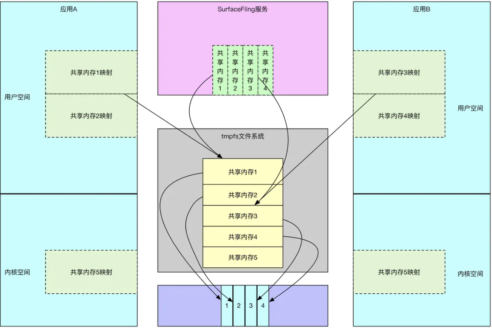
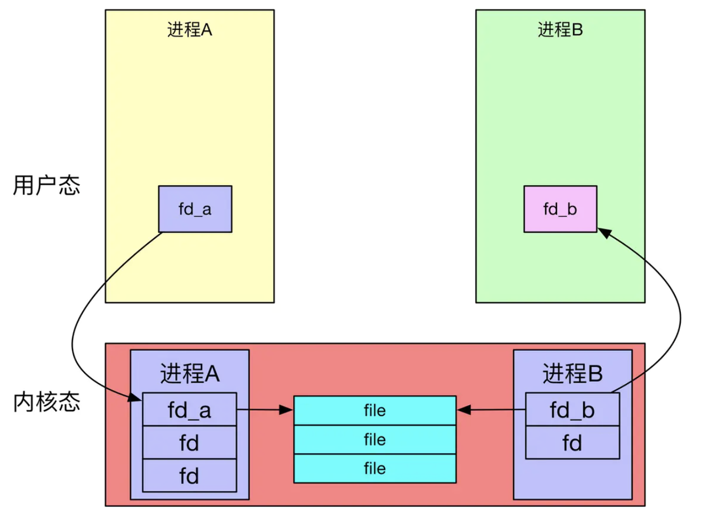

#### 深入理解共享内存

##### 前言

> Ashmem即Android Shared Memory, 是Android提供的一种内存共享的机制。
>
> java层借助MemoryFile或者SharedMemory
>
> Native层借助MemoryHeapBase或者MemoryBase，
>
> Native层调用libc的ashmem_create_region和mmap，即native层都是基于Linux层的内存共享机制

共享内存看似高深，其实在android进程通信非常常见，比如startActivity传的Intent/Bundle，为什么能从A进程把Intent传递到AMS的SystemServer进程？Intent传递的大小为什么最大为1M？要传输大的对象比如bitmap要怎么做？（本文基于andorid13）

##### Intent传递的本质

先看Intent/Bundle的定义

```java
public class Intent implements Parcelable, Cloneable {}
public final class Bundle extends BaseBundle implements Cloneable, Parcelable {}
```

Intent和Bundle都是实现Parcelable接口，其实就是通过序列化来实现通信的。

> 序列化就是把对象转换成二进制流的过程，这样就可以在网络或者进程间进行二进制流的传输。
>
> 反序列化即把二进制流还原成对象的过程。
>
> Parcelable与Serializable对比
>
> Serializable是java提供的一个标准的序列化接口，使用简单，可能会有频繁的I/O操作，并且用到反射机制，资源消耗较大。
>
> Parcelable是android提供的序列化的接口，也是google工程师引以为傲的，使用效率据说比Serializable快10倍。使用较麻烦，读和写的字段必须一一对应。
>
> 内存序列化上选择Parcelable，网络或者存储到设备上用Serializable。

Parcelable的底层使用了`Parcel`机制。数据传递实际使用了 `bindler`机制，bindler机制会将parcel序列化的数据即字节流写入一个共享内存中，读取时也是binder从共享内存中读取字节流，再通过parcel机制反序列化后使用。这就是Intent/Bundle能在进程间通信的原理。

binder使用的这块共享内存就叫`Binder transaction buffer`，这块内存有大小限制（即binder映射内存的限制），谷歌默认是1M，而且是公用的，也就是说假如同时通过Intent传递，就算每个都不超过1M，但是几个加起来超过1M也会报错

```c++
/system/libhwbinder/ProcessState.cpp
## 实际binder最大可用的共享内存大小为（1M-8kb）
#define DEFAULT_BINDER_VM_SIZE ((1 * 1024 * 1024) - sysconf(_SC_PAGE_SIZE) * 2)
```

假如要传大于1M的数据要怎么做呢？

1. 把对象先存到本地，再把地址传给另一进程，另一进程根据地址再取，本质还是地址的字符串传递
2. 共享内存。真正做到了0拷贝，效率最高。

##### 共享内存使用

可以参照项目[MyMemoryShareService](https://github.com/beyond667/PaulTest/blob/master/server/src/main/java/com/paul/test/server/ShareMemoryUtils.java)，共享内存使用需结合binder

定义IMemoryFileApi.aidl

```java
interface IMemoryFileApi {
	ParcelFileDescriptor getParcelFileDescriptor(String name);
    oneway void releaseParcelFileDescriptor(String type);
}
```

服务端service：MyMemoryShareService.java

```java
public class MyMemoryShareService extends Service {
    @Override
    public IBinder onBind(Intent intent) {
        return binder;
    }
    private final IMemoryFileApi.Stub binder = new IMemoryFileApi.Stub() {
        private ParcelFileDescriptor pfd;
        private  MemoryFile memoryFile;
        @Override
        public ParcelFileDescriptor getParcelFileDescriptor(String name) throws RemoteException {
            //1 先获取共享文件的byte数组
            byte[] bytes = getBytes();
            //2 生成共享文件MemoryFile
            memoryFile =ShareMemoryUtils.getMemoryFile(name,bytes);
            //3 根据共享文件获取其文件描述
            pfd = ShareMemoryUtils.getPfdFromMemoryFile(memoryFile);
            return pfd;
        }
        @Override
        public void releaseParcelFileDescriptor(String type) throws RemoteException {
            //4 需在共享文件用完后close资源
            ShareMemoryUtils.closeMemoryFile(memoryFile,pfd);
        }
    };
}
//ShareMemoryUtils.java
public class ShareMemoryUtils {
    public static MemoryFile getMemoryFile(final String name, final byte[] bytes) {
        MemoryFile memoryFile = new MemoryFile(name, bytes.length);
        memoryFile.allowPurging(true);
        memoryFile.writeBytes(bytes, 0, 0, bytes.length);
        return memoryFile;
    }
    public static ParcelFileDescriptor getPfdFromMemoryFile(MemoryFile memoryFile) {
        Method method = MemoryFile.class.getDeclaredMethod("getFileDescriptor");
        method.setAccessible(true);
        FileDescriptor fd = (FileDescriptor) method.invoke(memoryFile);
        return ParcelFileDescriptor.dup(fd);
    }
    public static void closeMemoryFile(MemoryFile memoryFile, ParcelFileDescriptor pfd) {
        if (pfd != null) pfd.close();
        if (memoryFile != null) memoryFile.close();
    }
}

```

服务端定义binder来返回共享内存的文件描述符，生成此描述符需以下3步：

+ 注释1先获取要共享的大文件的byte数组，此demo是从本地取了个14M的txt文件

+ 注释2把byte数组通过new MemoryFile来生成共享文件

+ 注释3通过反射调用memoryFile.getFileDescriptor方法获取FileDescriptor，再通过ParcelFileDescriptor.dup对其封装即是支持binder通信的ParcelFileDescriptor
+ 注释4 提供释放资源的方法，待客户端用完后需通知关闭共享内存

客户端获取此ParcelFileDescriptor

```java
public class ClientMainActivity extends Activity {
    protected void onCreate(Bundle savedInstanceState) {
        findViewById(R.id.memory_share_get).setOnClickListener(new View.OnClickListener() {
            @Override
            public void onClick(View v) {
                //先bind服务
                if (iMemoryFileApi == null) {
                    bindMemoryService();
                }
                StringBuffer sb = new StringBuffer();
                try {
                    //1 调用服务端的方法来获取ParcelFileDescriptor
                    ParcelFileDescriptor parcelFileDescriptor = iMemoryFileApi.getParcelFileDescriptor("111");
                    if (parcelFileDescriptor == null) {
                        Log.e(TAG, "client 无法获取到共享内存");
                        return;
                    }
                    //2 拿到文件描述符，转换为文件输入流，后面就是读出共享的大文件流
                    FileInputStream fi = new FileInputStream(parcelFileDescriptor.getFileDescriptor());

                    String str = new String();
                    byte[] buffer = new byte[1024];
                    while ((fi.read(buffer)) != -1) {
                        str = new String(buffer, "UTF-8");
                        Log.e(TAG, str);
                        sb.append(str);
                    }
                    fi.close();
                } catch (Exception e) {
                    e.printStackTrace();
                }
                //3 用完后关闭共享内存
                iMemoryFileApi.releaseParcelFileDescriptor("111");
            }
        });
    }
}
```

注释1客户端通过binder拿到服务端的ParcelFileDescriptor，注释2拿到文件描述符后转换为文件输入流，后面就是读出共享的大文件流。注释3在用完后通知服务端释放资源。

梳理下流程，A进程创建MemoryFile并写入数据，通过binder把其文件描述符传递给B进程，B进程通过获取到的文件描述符进程数据的读写。

这里有个问题，A,B进程的文件描述符是同一个吗？答案是并不是同一个，只不过他们都指向了内核中的同一个文件

##### 共享内存原理

Android的共享内存（Ashmem）基于Linux的共享内存，都是在临时文件系统（tmpfs）上创建虚拟文件，再映射到不同的进程，它可以让多个进程共享同一块内存区域，并且除了物理内存限制，没有其他大小限制。

###### 补充tmpfs文件系统

tmpfs是一种基于内存的虚拟文件系统，最大特点就是它的存储空间在VM(virtual memory)里，VM是由Linux内核里面的vm子系统管理，现在大部分操作系统都采用了虚拟内存管理机制。

缺点：不具备持久性，系统重启后数据将丢失

优点：

1. 动态文件系统大小。/mnt/tmpfs最初只有很小的空间，随着文件的复制和创建，tmpfs文件系统驱动程序会分配更多的VM，并且按照需求动态的增加文件系统的空间，当/mnt/tmpfs中的文件被删除时，又会动态的减少文件系统并释放VM资源，tmpfs的好处就在于这些都是自动处理的
2. 速度非常快。因为tmpfs文件系统会完全驻留在RAM，读写几乎都是瞬时的。



##### 源码分析
生成MemoryFile是直接new的，并且只有这一个构造函数

> framworks/base/core/java/android/os/MemoryFile.java

```java
public class MemoryFile {
    private SharedMemory mSharedMemory;
    private ByteBuffer mMapping;
    public MemoryFile(String name, int length) {
        //1 通过SharedMemory创建共享内存
        mSharedMemory = SharedMemory.create(name, length);
        //2 映射
        mMapping = mSharedMemory.mapReadWrite();
    }
    //3 通过1处创建的SharedMemory，获取FileDescriptor
    public FileDescriptor getFileDescriptor() throws IOException {
        return mSharedMemory.getFileDescriptor();
    }
}
```

+ 注释1中MemoryFile通过SharedMemory.create创建了共享内存

+ 注释2执行mapReadWrite完成映射
+ 注释3是我们通过反射调用MemoryFile.getFileDescriptor，本质上还是基于注释1处创建的SharedMemory来获取FileDescriptor

先详细看下注释1的创建，再看注释2映射

>framworks/base/core/java/android/os/SharedMemory.java

```java
public final class SharedMemory implements Parcelable, Closeable {

    private static native FileDescriptor nCreate(String name, int size) ;
    private static native int nGetSize(FileDescriptor fd);
    
    public static SharedMemory create(String name, int size){
        //1 调用Native方法创建FileDescriptor，并返回到SharedMemory的构造函数
        return new SharedMemory(nCreate(name, size));
    }
    
    private SharedMemory(FileDescriptor fd) {
        //...校验fd非空并且合法
        //2 构造函数中存储通过1处JNI创建的FileDescriptor
        mFileDescriptor = fd;
        mSize = nGetSize(mFileDescriptor);
        //...
    }
    //3 反射调用MemoryFile.getFileDescriptor，其实返回的就是nCreate创建的
    public @NonNull FileDescriptor getFileDescriptor() {
        return mFileDescriptor;
    }
}
```

+ 注释1调用Native方法创建了FileDescriptor，主要干活的都在native层
+ 注释2在SharedMemory构造函数中存储通过注释1处JNI创建的FileDescriptor
+ 注释3反射调用MemoryFile.getFileDescriptor，其实返回的就是nCreate创建的

> frameworks/base/core/jni/android_os_SharedMemory.cpp

```cpp
jobject SharedMemory_nCreate(JNIEnv* env, jobject, jstring jname, jint size) {
	//获取java层传过来的name
    const char* name = jname ? env->GetStringUTFChars(jname, nullptr) : nullptr;
	//1 ashmem_create_region创建fd
    int fd = ashmem_create_region(name, size);

    // Capture the error, if there is one, before calling ReleaseStringUTFChars
    int err = fd < 0 ? errno : 0;

    if (name) {
        env->ReleaseStringUTFChars(jname, name);
    }

    if (fd < 0) {
        jniThrowErrnoException(env, "SharedMemory_create", err);
        return nullptr;
    }
	// 2 返回java层对应的FileDescriptor对象
    jobject jifd = jniCreateFileDescriptor(env, fd);
    if (jifd == nullptr) {
        close(fd);
    }
    return jifd;
}
```
注释1通过ashmem_create_region创建fd，在注释2处把c层的fd转换为java层的FileDescriptor对象返回

真正创建ashmen的地方在ashmem-dev的ashmem_create_region方法

> system/core/libcutils/ashmem-dev.cpp

```cpp
int ashmem_create_region(const char *name, size_t size)
{
    int ret, save_errno;
	//1 大于等于android10，并且sys.use_memfd=ture并且系统支持就通过memfd_create_region这种方式创建文件描述符
    if (has_memfd_support()) {
        return memfd_create_region(name ? name : "none", size);
    }
	//2 打开/dev/ashmem设备，得到文件描述符
    int fd = __ashmem_open();
    if (fd < 0) {
        return fd;
    }

    //3 通过ioctl给fd设置名字，TEMP_FAILURE_RETRY宏定义会让返回的结果为false时一直重试
    //ioctl是系统调用，用户进程和内存进行交互，内部调用copy_from_user获取到用户进程传递的数据
    if (name) {
        char buf[ASHMEM_NAME_LEN] = {0};

        strlcpy(buf, name, sizeof(buf));
        ret = TEMP_FAILURE_RETRY(ioctl(fd, ASHMEM_SET_NAME, buf));
        if (ret < 0) {
            goto error;
        }
    }
	//通过ioctl给fd设置大小
    ret = TEMP_FAILURE_RETRY(ioctl(fd, ASHMEM_SET_SIZE, size));
    if (ret < 0) {
        goto error;
    }

    return fd;

error:
    save_errno = errno;
    close(fd);
    errno = save_errno;
    return ret;
}
```

+ 注释1android10之后增加了memfd_create_region的方式创建文件描述符，需要系统支持并且sys.use_memfd=ture
+ 注释2通过__ashmem_open去打开/dev/ashmem设备，得到文件描述符
+ 注释3给文件描述符fd设置name和大小

继续看注释2的__ashmem_open

> system/core/libcutils/ashmem-dev.cpp

```cpp
static int __ashmem_open()
{
    int fd;
    pthread_mutex_lock(&__ashmem_lock);
    //1 执行__ashmem_open_locked前后加了锁机制
    fd = __ashmem_open_locked();
    pthread_mutex_unlock(&__ashmem_lock);
    return fd;
}

static int __ashmem_open_locked()
{
    static const std::string ashmem_device_path = get_ashmem_device_path();
    if (ashmem_device_path.empty()) {
        return -1;
    }
	//2 打开指定的文件，这里拿到的ashmem_device_path为/dev/ashmem+boot_id
    int fd = TEMP_FAILURE_RETRY(open(ashmem_device_path.c_str(), O_RDWR | O_CLOEXEC));
	//3  android10之前的拿不到，就从默认的/dev/ashmem路径拿fd
    if (fd < 0) {
        int saved_errno = errno;
        fd = TEMP_FAILURE_RETRY(open("/dev/ashmem", O_RDWR | O_CLOEXEC));
        if (fd < 0) {
            return fd;
        }
    }
	//...
    return fd;
}
```

+ 注释1在执行__ashmem_open_locked前后加了锁机制
+ 注释2去打开指定的文件，这里拿到的ashmem_device_path为/dev/ashmem+boot_id
+ 注释3由于android10之前的fd通过2的路径是拿不到的，所以从默认的/dev/ashmem拿fd

创建的过程就结束了，继续看一开始的注释2的映射过程mapReadWrite

> framworks/base/core/java/android/os/SharedMemory.java

```java
public @NonNull ByteBuffer mapReadWrite() throws ErrnoException {
    return map(OsConstants.PROT_READ | OsConstants.PROT_WRITE, 0, mSize);
}
public @NonNull ByteBuffer map(int prot, int offset, int length) throws ErrnoException {
    checkOpen();
    validateProt(prot);
    //1 调用系统mmap把文件描述符映射到内存空间
    long address = Os.mmap(0, length, prot, OsConstants.MAP_SHARED, mFileDescriptor, offset);
    boolean readOnly = (prot & OsConstants.PROT_WRITE) == 0;
    Runnable unmapper = new Unmapper(address, length, mMemoryRegistration.acquire());
    //2 把文件的内存地址传给DirectByteBuffer，以便通过DirectByteBuffer直接操作文件
    return new DirectByteBuffer(length, address, mFileDescriptor, unmapper, readOnly);
}
```

+ 注释1通过调用Os.mmap把文件映射到内存空间，映射成功后就可以通过返回的内存地址对文件进行读写操作
+ 注释2处返回的DirectByteBuffer会封装注释1处的内存地址，后面就可以通过DirectByteBuffer直接对该文件进行操作

new MemoryFile的过程就到这了。new出来之后会通过writeBytes往里面写入字节数组

> framworks/base/core/java/android/os/MemoryFile.java

```java
private ByteBuffer mMapping;
public void writeBytes(byte[] buffer, int srcOffset, int destOffset, int count) {
    try {
        mMapping.position(destOffset);
        mMapping.put(buffer, srcOffset, count);
    } finally {
        endAccess();
    }
}
```

这个mMapping就是上面的DirectByteBuffer，里面有通过mmap映射文件的内存地址，这样就把我们app的数据写入到共享内存中。此后再通过反射调用MemoryFile.getFileDescriptor，就获取已经写入数据的共享内存的文件描述符，此时fd还不能在进程间传递，还需要借助binder机制来传递文件描述符。

##### binder机制传递文件描述符的流程

Demo中获取到FileDescriptor后通过ParcelFileDescriptor.dup(fd)来获取ParcelFileDescriptor

> framworks/base/core/java/android/os/ParcelFileDescriptor.java

```java
public class ParcelFileDescriptor implements Parcelable, Closeable {
    private final FileDescriptor mFd;
    private FileDescriptor mCommFd;
    private final ParcelFileDescriptor mWrapped;
     /** {@hide} */
    public ParcelFileDescriptor(FileDescriptor fd) {
        this(fd, null);
    }

    /** {@hide} */
    public ParcelFileDescriptor(FileDescriptor fd, FileDescriptor commChannel) {
        mWrapped = null;
        mFd = fd;
        mCommFd = commChannel;
    }

    /**
     * Create a new ParcelFileDescriptor that is a dup of an existing
     * FileDescriptor.  This obeys standard POSIX semantics, where the
     * new file descriptor shared state such as file position with the
     * original file descriptor.
     */
    //1 上面注释写的很清楚，这个方法会创建个新的重复的FileDescriptor，与传入的FileDescriptor共享状态
    public static ParcelFileDescriptor dup(FileDescriptor orig) throws IOException {
        try {
            final FileDescriptor fd = new FileDescriptor();
            int intfd = Os.fcntlInt(orig, (isAtLeastQ() ? F_DUPFD_CLOEXEC : F_DUPFD), 0);
            fd.setInt$(intfd);
            return new ParcelFileDescriptor(fd);
        } catch (ErrnoException e) {
            throw e.rethrowAsIOException();
        }
    }
}
```

注释1上面的英文注释写的很清楚，此方法会根据传过来的FileDescriptor创建个新的重复的FileDescriptor，这两个FileDescriptor共享同样的文件状态，即指向的是同一个文件，后面再通过binder通信把新创建的FileDescriptor的包装类ParcelFileDescriptor传到其他进程
继续看ParcelFileDescriptor，由于其实现Parcelable所以其可以在进程间传递

> framworks/base/core/java/android/os/ParcelFileDescriptor.java

```java
public class ParcelFileDescriptor implements Parcelable, Closeable {
      public void writeToParcel(Parcel out, int flags) {
        if (mWrapped != null) {
            try {
                mWrapped.writeToParcel(out, flags);
            } finally {
                releaseResources();
            }
        } else {
            if (mCommFd != null) {
                out.writeInt(1);
                out.writeFileDescriptor(mFd);
                out.writeFileDescriptor(mCommFd);
            } else {
                out.writeInt(0);
                //1 demo中的流程中mWrapped和mCommFd都是空。写入parcel
                out.writeFileDescriptor(mFd);
            }
        }
    }
    
    public static final Parcelable.Creator<ParcelFileDescriptor> CREATOR
        = new Parcelable.Creator<ParcelFileDescriptor>() {
        @Override
        public ParcelFileDescriptor createFromParcel(Parcel in) {
            int hasCommChannel = in.readInt();
            //2 读parcel
            final FileDescriptor fd = in.readRawFileDescriptor();
            FileDescriptor commChannel = null;
            if (hasCommChannel != 0) {
                commChannel = in.readRawFileDescriptor();
            }
            return new ParcelFileDescriptor(fd, commChannel);
        }
    };
}
```

+ 注释1处通过Parcel.writeFileDescriptor写入fd
+ 注释2处通过Parcel.readRawFileDescriptor读取fd

>framworks/base/core/java/android/os/Parcel.java

```java
public final class Parcel {
    private static native void nativeWriteFileDescriptor(long nativePtr, FileDescriptor val);
    private static native FileDescriptor nativeReadFileDescriptor(long nativePtr);
    public final void writeFileDescriptor(@NonNull FileDescriptor val) {
        nativeWriteFileDescriptor(mNativePtr, val);
    }
    public final FileDescriptor readRawFileDescriptor() {
        return nativeReadFileDescriptor(mNativePtr);
    }
}
```

继续看jni层怎么读写FileDescriptor

>frameworks/base/core/jni/android_os_Parcel.cpp

```cpp
static void android_os_Parcel_writeFileDescriptor(JNIEnv* env, jclass clazz, jlong nativePtr, jobject object)
{
    //转换成Parcel指针
    Parcel* parcel = reinterpret_cast<Parcel*>(nativePtr);
    if (parcel != NULL) {
        //1 先通过jniGetFDFromFileDescriptor获取java层的FileDescriptor.descriptor的id，再调用Parcel.writeDupFileDescriptor写入
        const status_t err =
            parcel->writeDupFileDescriptor(jniGetFDFromFileDescriptor(env, object));
        if (err != NO_ERROR) {
            signalExceptionForError(env, clazz, err);
        }
    }
}
```

先通过jniGetFDFromFileDescriptor调用java层的FileDescriptor.descriptor获取fd的id，此id为上面创建新的fd时Os.fcntlInt生成的。再继续看writeDupFileDescriptor怎么通过此id写入

>frameworks/native/libs/binder/Parcel.cpp

```cpp
status_t Parcel::writeDupFileDescriptor(int fd)
{
    int dupFd = fcntl(fd, F_DUPFD_CLOEXEC, 0);
    if (dupFd < 0) {
        return -errno;
    }
    status_t err = writeFileDescriptor(dupFd, true /*takeOwnership*/);
    if (err != OK) {
        close(dupFd);
    }
    return err;
}
status_t Parcel::writeFileDescriptor(int fd, bool takeOwnership)
{
    //1 把fd写入flat_binder_object对象，并指定type为BINDER_TYPE_FD
    flat_binder_object obj;
    obj.hdr.type = BINDER_TYPE_FD;
    obj.flags = 0x7f | FLAT_BINDER_FLAG_ACCEPTS_FDS;
    obj.binder = 0; /* Don't pass uninitialized stack data to a remote process */
    obj.handle = fd;
    obj.cookie = takeOwnership ? 1 : 0;
    return writeObject(obj, true);
}
```

注释1处把fd写入flat_binder_object对象，并指定type为BINDER_TYPE_FD，此对象最终会发送给binder驱动

再看jni是怎么读fd的

> frameworks/base/core/jni/android_os_Parcel.cpp

```cpp
static jobject android_os_Parcel_readFileDescriptor(JNIEnv* env, jclass clazz, jlong nativePtr)
{
    Parcel* parcel = reinterpret_cast<Parcel*>(nativePtr);
    if (parcel != NULL) {
        //1 通过Parcel.readFileDescriptor拿到binder驱动传过来的fd
        int fd = parcel->readFileDescriptor();
        if (fd < 0) return NULL;
        fd = fcntl(fd, F_DUPFD_CLOEXEC, 0);
        if (fd < 0) return NULL;
        //2 调用java方法创建java层的fd
        jobject jifd = jniCreateFileDescriptor(env, fd);
        if (jifd == NULL) {
            close(fd);
        }
        return jifd;
    }
    return NULL;
}
```

+ 注释1通过Parcel.readFileDescriptor拿到binder驱动传过来的fd
+ 注释2调用java层FileDescriptor的构造方法创建对象，并把拿到的fd赋值给此对象

看注释1的parcel.readFileDescriptor

>frameworks/native/libs/binder/Parcel.cpp

```cpp
int Parcel::readFileDescriptor() const {
    const flat_binder_object* flat = readObject(true);
    if (flat && flat->hdr.type == BINDER_TYPE_FD) {
        return flat->handle;
    }
    return BAD_TYPE;
}
```

另一进程拿到flat_binder_object对象，fd就存在其handle变量里。这里有个重点，write写入的时候obj.handle和这里读的时候的handle是否是同一个fd对象。答案是不是。这个关键点就在binder传输的过程中对fd的传递做了处理，因为Linux中fd只对本进程有效且唯一，进程A打开文件得到的文件描述符fd，并不能直接给进程B使用，因为B中的fd可能压根就无效或者对应其他的文件，虽然一个文件可以有多个文件描述符，但内核层只会对应一个inode节点与file对象，这也是内核层可以传递fd的基础。Binder驱动通过当前进程的fd找到对应的文件，然后为目标进程创建新的fd，并传递给目标进程，来看下Android中binder的实现（以下代码非android13）

```cpp
void binder_transaction(){
   ...
        case BINDER_TYPE_FD: {
        int target_fd;
        struct file *file;
        //1 可以根据fd在当前进程获取到file ，多个进程打开同一文件，在内核中对应的file是一样
        file = fget(fp->handle);
        //2 为目标进程获取空闲fd
        target_fd = task_get_unused_fd_flags(target_proc, O_CLOEXEC);
        //3 将目标进程的空闲fd与file绑定
        task_fd_install(target_proc, target_fd, file);
        fp->handle = target_fd;
    } break;    
    ...
 }

//4 从当前进程打开的files中找到file在内核中的实例
struct file *fget(unsigned int fd)
{
    struct file *file;
    struct files_struct *files = current->files;
    rcu_read_lock();
    file = fcheck_files(files, fd);
    rcu_read_unlock();
    return file;
}

static void task_fd_install(
    struct binder_proc *proc, unsigned int fd, struct file *file)
{
    struct files_struct *files = proc->files;
    struct fdtable *fdt;
    if (files == NULL)
        return;
    spin_lock(&files->file_lock);
    fdt = files_fdtable(files);
    rcu_assign_pointer(fdt->fd[fd], file);
    spin_unlock(&files->file_lock);
}
```

+ 注释1根据fd在当前进程获取到file ，多个进程打开同一文件，在内核中对应的file是一样
+ 注释2为目标进程获取空闲fd
+ 注释3将目标进程的空闲fd与file绑定

这样binder传递过程中就为目标进程创建了同一个文件的fd，此fd与原进程的fd不是同一个对象。



#### 使用场景

+ 进程间传递较大的数据，比如bitmap，大文件等
+ 提升进程间传递数据的效率，比如ContentProvider就是基于共享内存实现数据传递的
+ 整个显示系统:App-WMS-SurfaceFlinger就是共享内存实现的帧数据的传递

#### 总结

Android共享内存是基于Linux共享内存的，都是在tmpfs文件系统上新建文件，并将其映射到不同的进程空间，从而达到共享内存的目的，只是，Android在Linux的基础上进行了改造，借助Binder+fd文件描述符实现了共享内存的传递。
