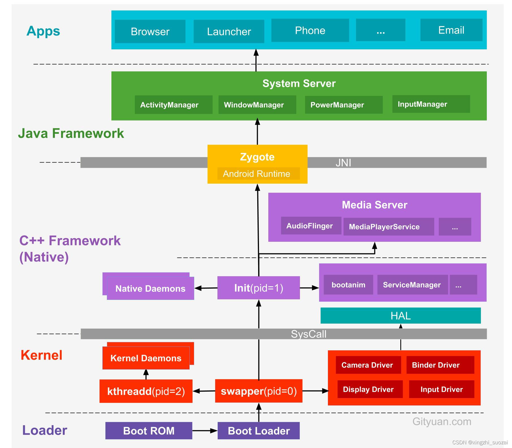

### 开机流程

#### 背景

Android5层架构分别为：Linux Kernel -->HAL --> Library+Runtime --> Framework --> Application  

安卓是基于Linux系统的，可以理解为处理过的Linux系统（个人理解：Linux是由键盘+鼠标+显示器，Android合并成触屏显示器）  

以下分析以Android12为例。

#### 具体流程

先看具体图：



#### 1 Loader层

可以分为两个阶段：

1. BIOS阶段：点电源开关后会执行主板预置的ROM，启动BIOS
2. Bootloader阶段：加载引导程序。

Bootloader引导程序负责加载Linux Kernel内核

```cpp
//bootable/recovery/bootloader.h
#include "bootloader_message/include/bootloader_message/bootloader_message.h"
```

#### Linux Kernel层

可以分为3步：

1. 启动`swapper`进程（0号进程）：这个是所有进程的祖先，后面的1号2号进程都是其fork出来的。初始化相关驱动，比如Camera，Binder，Display，Input。

2. `init`进程（1号进程）：用户进程，是所有用户进程的祖先。

3. `kthreadd`进程(2号进程)：内核进程，负责内核态所有进程的管理和调度，是所有Linux内核进程的祖先。


#### Native层

Nativie层主要包括init进程fork的用户进程的守护进程（Native Daemons），bootanim开机动画和hal层（Hardware Abstraction Layer硬件抽象层）。  

init进程主要做了以下三件事：

1. 创建（mkdir）和挂载（mount）启动所需的文件目录。其中挂载了 tmpfs、devpts、proc、sysfs 和 selinuxfs 共 5 种文件系统
2. 初始化和启动属性服务（property service）
3. 解析 init.rc 配置文件并fork出来ServiceManager，SurfaceFlinger，Zygote进程。

main.cpp

```c++
int main(int argc, char** argv) {
    //省略
    return SecondStageMain(argc, argv);
    //省略
}
```

init.cpp实现了SecondStageMain方法

```c++
int SecondStageMain(int argc, char** argv) {
    //省略
    //初始化属性服务
    PropertyInit();

    // Now set up SELinux for second stage.
    SelinuxSetupKernelLogging();
    SelabelInitialize();
    SelinuxRestoreContext();

    //启动属性服务
    StartPropertyService(&property_fd);
     //省略
    LoadBootScripts(am, sm); 
    //省略
}
static void LoadBootScripts(ActionManager& action_manager, ServiceList& service_list) {
    Parser parser = CreateParser(action_manager, service_list);

    //解析init.rc
    std::string bootscript = GetProperty("ro.boot.init_rc", "");
    if (bootscript.empty()) {
        parser.ParseConfig("/system/etc/init/hw/init.rc");
        if (!parser.ParseConfig("/system/etc/init")) {
            late_import_paths.emplace_back("/system/etc/init");
    } else {
        parser.ParseConfig(bootscript);
    }
}
```

init.rc

```java
// 加载init.配置的zygote.rc
import /system/etc/init/hw/init.${ro.zygote}.rc

//fork出zygote进程
start zygote
start zygote_secondary

//fork出serviceManager服务 468行
# Start essential services. 
start servicemanager

// SurfaceFlinger相关，未看到start
# cgroup for system_server and surfaceflinger
mkdir /dev/memcg/system 0550 system system
write /dev/memcg/system/memory.swappiness 100

# set system-background to 0775 so SurfaceFlinger can touch it
chmod 0775 /dev/cpuset/system-background
```

init.zygote64.rc

```java
service zygote /system/bin/app_process64 -Xzygote /system/bin --zygote --start-system-server
```

在frameworks/base/cmds/app_process/Android.bp中定义了`app_process64`模块

```cmake
cc_binary {
    name: "app_process",

    srcs: ["app_main.cpp"],

    multilib: {
        lib32: {
            suffix: "32",
        },
        lib64: {
            suffix: "64",
        },
    }
    //省略
}
```

找到app_main.cpp的main方法:

```c++
int main(int argc, char* const argv[])
{
	//省略
     while (i < argc) {
        const char* arg = argv[i++];
        if (strcmp(arg, "--zygote") == 0) {
            //如果当前运行在zygote进程，把zygote变量设为true
            zygote = true;
            niceName = ZYGOTE_NICE_NAME; //进程名叫"zygote"或"zygote64"
        } else if (strcmp(arg, "--start-system-server") == 0) {
            startSystemServer = true;
        } else if (strcmp(arg, "--application") == 0) {
            application = true;
        } else if (strncmp(arg, "--nice-name=", 12) == 0) {
            niceName.setTo(arg + 12);
        } else if (strncmp(arg, "--", 2) != 0) {
            className.setTo(arg);
            break;
        } else {
            --i;
            break;
        }
    }
    //省略
    //如果是zygote进程，调用Runtime.start方法,传进来的参数是ZygoteInit
    if (zygote) {
        runtime.start("com.android.internal.os.ZygoteInit", args, zygote);
    } else if (className) {
        runtime.start("com.android.internal.os.RuntimeInit", args, zygote);
    } else {
        fprintf(stderr, "Error: no class name or --zygote supplied.\n");
        app_usage();
        LOG_ALWAYS_FATAL("app_process: no class name or --zygote supplied.");
    }

}

class AppRuntime : public AndroidRuntime
{
    //省略
}
```

实际调用的是AndroidRuntime.start方法

```c++
void AndroidRuntime::start(const char* className, const Vector<String8>& options, bool zygote)
{
    // 省略
    //创建java虚拟机
    if (startVm(&mJavaVM, &env, zygote, primary_zygote) != 0) {
        return;
    }
    // 注册android 常用的JNI
    if (startReg(env) < 0) {
        ALOGE("Unable to register all android natives\n");
        return;
    }
    
    /*
     * Start VM.  This thread becomes the main thread of the VM, and will
     * not return until the VM exits.
     */
    //传过来的className是"com.android.internal.os.ZygoteInit"
    char* slashClassName = toSlashClassName(className != NULL ? className : "");
    jclass startClass = env->FindClass(slashClassName);
    if (startClass == NULL) {
        ALOGE("JavaVM unable to locate class '%s'\n", slashClassName);
        /* keep going */
    } else {
        //拿ZygoteInit的main方法
        jmethodID startMeth = env->GetStaticMethodID(startClass, "main",
            "([Ljava/lang/String;)V");
        if (startMeth == NULL) {
            ALOGE("JavaVM unable to find main() in '%s'\n", className);
            /* keep going */
        } else {
            //反射调用其main方法
            env->CallStaticVoidMethod(startClass, startMeth, strArray);
            if (env->ExceptionCheck())
                threadExitUncaughtException(env);
        }
    }
    free(slashClassName);
}
```

#### Framework层
AndroidRuntime.cpp里反射调用了ZygoteInit.main方法，终于到第一个java方法，运行在zygote进程

```java
//ZygoteInit.java
public static void main(String[] argv) {
    //省略
    Runnable caller;
    try {
        //省略
        boolean startSystemServer = false;
        String zygoteSocketName = "zygote";
        String abiList = null;
        boolean enableLazyPreload = false;
        //遍历传过来的参数，找到start-system-server后把startSystemServer设为true
        for (int i = 1; i < argv.length; i++) {
            if ("start-system-server".equals(argv[i])) {
                startSystemServer = true;
            } else if ("--enable-lazy-preload".equals(argv[i])) {
                enableLazyPreload = true;
            } else if (argv[i].startsWith(ABI_LIST_ARG)) {
                abiList = argv[i].substring(ABI_LIST_ARG.length());
            } else if (argv[i].startsWith(SOCKET_NAME_ARG)) {
                zygoteSocketName = argv[i].substring(SOCKET_NAME_ARG.length());
            } else {
                throw new RuntimeException("Unknown command line argument: " + argv[i]);
            }
        }

        final boolean isPrimaryZygote = zygoteSocketName.equals(Zygote.PRIMARY_SOCKET_NAME);
        zygoteServer = new ZygoteServer(isPrimaryZygote);

        //zygote进程第一次进来startSystemServer为true
        if (startSystemServer) {
            //fork SystemServer进程 
            //关键点一
            Runnable r = forkSystemServer(abiList, zygoteSocketName, zygoteServer);

            //这里谷歌注释了，zygote进程会返回null，fork出来的子进程(此时为system_server进程)不为空
            // {@code r == null} in the parent (zygote) process, and {@code r != null} in the
            // child (system_server) process.
            if (r != null) {
                r.run();
                return;
            }
        }

        //关键点二
        // The select loop returns early in the child process after a fork and
        // loops forever in the zygote.
        caller = zygoteServer.runSelectLoop(abiList);
    } catch (Throwable ex) {
        Log.e(TAG, "System zygote died with fatal exception", ex);
        throw ex;
    } finally {
        if (zygoteServer != null) {
            zygoteServer.closeServerSocket();
        }
    }

    // We're in the child process and have exited the select loop. Proceed to execute the
    // command.
    if (caller != null) {
        caller.run();
    }
}
```

上面有两个关键点

1. forkSystemServer：fork有个机制，一次调用两次返回。比如由zygote进程执行fork操作fork出system_server进程时，新fork出的system_server进程也会继续执行，所以关键点一中zygote进程和system_server进程都会返回，只不过父进程（zygote进程）返回Runable的是空，子进程返回的非空
2. zygote进程执行runSelectLoop，循环遍历等待有新的fork请求进来。

##### forkSystemServer的过程

继续看forkSystemServer和runSelectLoop这两个关键方法

```java
private static Runnable forkSystemServer(String abiList, String socketName,
                                         ZygoteServer zygoteServer) {
    //省略

    // 参数中传了com.android.server.SystemServer
    /* Hardcoded command line to start the system server */
    String[] args = {
        "--setuid=1000",
        "--setgid=1000",
        "--setgroups=1001,1002,1003,1004,1005,1006,1007,1008,1009,1010,1018,1021,1023,"
            + "1024,1032,1065,3001,3002,3003,3006,3007,3009,3010,3011,3012",
        "--capabilities=" + capabilities + "," + capabilities,
        "--nice-name=system_server",
        "--runtime-args",
        "--target-sdk-version=" + VMRuntime.SDK_VERSION_CUR_DEVELOPMENT,
        "com.android.server.SystemServer",
    };
    try {
        //省略

        /* Request to fork the system server process */
        pid = Zygote.forkSystemServer(
            parsedArgs.mUid, parsedArgs.mGid,
            parsedArgs.mGids,
            parsedArgs.mRuntimeFlags,
            null,
            parsedArgs.mPermittedCapabilities,
            parsedArgs.mEffectiveCapabilities);
    } catch (IllegalArgumentException ex) {
        throw new RuntimeException(ex);
    }

    // fork出的子进程pid为0，代表的是子进程，pid不为0代表父进程
    /* For child process */
    if (pid == 0) {
        if (hasSecondZygote(abiList)) {
            waitForSecondaryZygote(socketName);
        }

        zygoteServer.closeServerSocket();
        return handleSystemServerProcess(parsedArgs);
    }

    return null;
}
```

先看JNI层Zygote.forkSystemServer的fork流程，再看java层handleSystemServerProcess怎么返回Runnable的

```java
static int forkSystemServer(int uid, int gid, int[] gids, int runtimeFlags,
                            int[][] rlimits, long permittedCapabilities, long effectiveCapabilities) {
    ZygoteHooks.preFork();
    int pid = nativeForkSystemServer(
        uid, gid, gids, runtimeFlags, rlimits,
        permittedCapabilities, effectiveCapabilities);
    ZygoteHooks.postForkCommon();
    return pid;
}
private static native int nativeForkSystemServer(int uid, int gid, int[] gids, int runtimeFlags,
                                                 int[][] rlimits, long permittedCapabilities, long effectiveCapabilities);
```

调用了jni的nativeForkSystemServer方法

```c++
static jint com_android_internal_os_Zygote_nativeForkSystemServer(
        JNIEnv* env, jclass, uid_t uid, gid_t gid, jintArray gids,
        jint runtime_flags, jobjectArray rlimits, jlong permitted_capabilities,
        jlong effective_capabilities) {

  //Fork操作
  pid_t pid = zygote::ForkCommon(env, true,
                                 fds_to_close,
                                 fds_to_ignore,
                                 true);
  if (pid == 0) {
      // System server prcoess does not need data isolation so no need to
      // know pkg_data_info_list.
      SpecializeCommon(env, uid, gid, gids, runtime_flags, rlimits, permitted_capabilities,
                       effective_capabilities, MOUNT_EXTERNAL_DEFAULT, nullptr, nullptr, true,
                       false, nullptr, nullptr, /* is_top_app= */ false,
                       /* pkg_data_info_list */ nullptr,
                       /* allowlisted_data_info_list */ nullptr, false, false);
  } else if (pid > 0) {
      // The zygote process checks whether the child process has died or not.
	//省略
  }
  return pid;
}

// Utility routine to fork a process from the zygote.
pid_t zygote::ForkCommon(JNIEnv* env, bool is_system_server,
                         const std::vector<int>& fds_to_close,
                         const std::vector<int>& fds_to_ignore,
                         bool is_priority_fork,
                         bool purge) {
//这个就是C++调的fork操作，此方法调用后返回两个pid分别表示父进程（pid不为0）和fork出的子进程（pid=0）
  pid_t pid = fork();
  //省略   --先不关注fork完的操作
  if (pid == 0) {

  } else {
    ALOGD("Forked child process %d", pid);
  }
  return pid;
}

```

这里注意的是执行fork方法后，返回的两个pid在父进程中为子进程的pid，在子进程中返回的pid=0。  

再看java层ZygoteInit.handleSystemServerProcess怎么返回Runnable的

```java
//ZygoteInit.java
private static Runnable handleSystemServerProcess(ZygoteArguments parsedArgs) {
    //省略
    return ZygoteInit.zygoteInit(parsedArgs.mTargetSdkVersion,
                                 parsedArgs.mDisabledCompatChanges,
                                 parsedArgs.mRemainingArgs, cl);
}
public static Runnable zygoteInit(int targetSdkVersion, long[] disabledCompatChanges,
                                  String[] argv, ClassLoader classLoader) {
    //省略
    ZygoteInit.nativeZygoteInit();
    return RuntimeInit.applicationInit(targetSdkVersion, disabledCompatChanges, argv,
                                       classLoader);
}
protected static Runnable applicationInit(int targetSdkVersion, long[] disabledCompatChanges,
                                          String[] argv, ClassLoader classLoader) {
    VMRuntime.getRuntime().setTargetSdkVersion(targetSdkVersion);
    VMRuntime.getRuntime().setDisabledCompatChanges(disabledCompatChanges);
    final Arguments args = new Arguments(argv);
    // Remaining arguments are passed to the start class's static main
    return findStaticMain(args.startClass, args.startArgs, classLoader);
}

//RuntimeInit.java
protected static Runnable findStaticMain(String className, String[] argv,
                                         ClassLoader classLoader) {
    Class<?> cl;
    cl = Class.forName(className, true, classLoader);
    Method m;
    //调用静态main方法
    m = cl.getMethod("main", new Class[] { String[].class });
    int modifiers = m.getModifiers();
    if (! (Modifier.isStatic(modifiers) && Modifier.isPublic(modifiers))) {
        throw new RuntimeException(
            "Main method is not public and static on " + className);
    }
    return new MethodAndArgsCaller(m, argv);
}

```

传进来的ZygoteArguments是com.android.server.SystemServer，最终会通过反射调用其main方法，这样新fork出来的system_server进程就会执行SystemServer.main方法。

##### runSelectLoop

ZygoteServer.runSelectLoop

```java
Runnable runSelectLoop(String abiList) {
    ArrayList<FileDescriptor> socketFDs = new ArrayList<>();
    ArrayList<ZygoteConnection> peers = new ArrayList<>();

    socketFDs.add(mZygoteSocket.getFileDescriptor());
    peers.add(null);    

    while (true) {
        StructPollfd[] pollFDs;
        if (mUsapPoolEnabled) {
            pollFDs = new StructPollfd[socketFDs.size() + 1 + usapPipeFDs.length];
        } else {
            pollFDs = new StructPollfd[socketFDs.size()];
        }

        int pollIndex = 0;
        for (FileDescriptor socketFD : socketFDs) {
            pollFDs[pollIndex] = new StructPollfd();
            pollFDs[pollIndex].fd = socketFD;
            pollFDs[pollIndex].events = (short) POLLIN;
            ++pollIndex;
        }
        
        try {
            //阻塞的方法，这个方法的底层就是调用linux系统的poll方法，
            pollReturnValue = Os.poll(pollFDs, pollTimeoutMs);
        } catch (ErrnoException ex) {
            throw new RuntimeException("poll failed", ex);
        }
        //省略
        
        //通过ZygoteConnection.processCommand去fork子进程
        ZygoteConnection connection = peers.get(pollIndex);
        boolean multipleForksOK = !isUsapPoolEnabled()
            && ZygoteHooks.isIndefiniteThreadSuspensionSafe();
        final Runnable command =
            connection.processCommand(this, multipleForksOK);
        //省略
    }
}
```

Linux的世界里，一切都是文件。这里Os.poll就是等待文件描述符上的某个事件，比如这里socketFDs的文件描述被修改后就会唤醒此方法，fork出system_server之后Zygote进程会通过ZygoteConnection.processCommand去fork新的子进程。

```java
//ZygoteConnection.processCommand
Runnable processCommand(ZygoteServer zygoteServer, boolean multipleOK) {
    //省略
    
    //主要看这里
    if (parsedArgs.mInvokeWith != null || parsedArgs.mStartChildZygote
        || !multipleOK || peer.getUid() != Process.SYSTEM_UID) {
        // Continue using old code for now. TODO: Handle these cases in the other path.
        pid = Zygote.forkAndSpecialize(parsedArgs.mUid, parsedArgs.mGid,
                                       parsedArgs.mGids, parsedArgs.mRuntimeFlags, rlimits,
                                       parsedArgs.mMountExternal, parsedArgs.mSeInfo, parsedArgs.mNiceName,
                                       fdsToClose, fdsToIgnore, parsedArgs.mStartChildZygote,
                                       parsedArgs.mInstructionSet, parsedArgs.mAppDataDir,
                                       parsedArgs.mIsTopApp, parsedArgs.mPkgDataInfoList,
                                       parsedArgs.mAllowlistedDataInfoList, parsedArgs.mBindMountAppDataDirs,
                                       parsedArgs.mBindMountAppStorageDirs);

        try {
            //forkAndSpecialize这个跟上面一样，fork一次返回两次，zygote父进程和子进程都会执行到这里，父进程返回的pid不为0，子进程为0
            if (pid == 0) {
                // in child
                zygoteServer.setForkChild();

                //子进程由于不是服务端，需关闭socket
                zygoteServer.closeServerSocket();
                IoUtils.closeQuietly(serverPipeFd);
                serverPipeFd = null;

                return handleChildProc(parsedArgs, childPipeFd,
                                       parsedArgs.mStartChildZygote);
            } else {
                // In the parent. A pid < 0 indicates a failure and will be handled in
                // handleParentProc.
                IoUtils.closeQuietly(childPipeFd);
                childPipeFd = null;
                handleParentProc(pid, serverPipeFd);
                return null;
            }
        } finally {
            IoUtils.closeQuietly(childPipeFd);
            IoUtils.closeQuietly(serverPipeFd);
        }
}
```

再来子进程执行handleChildProc和父进程执行handleParentProc

```java
    private Runnable handleChildProc(ZygoteArguments parsedArgs,
            FileDescriptor pipeFd, boolean isZygote) {
        //关socket，并设置进程名
        closeSocket();
        Zygote.setAppProcessName(parsedArgs, TAG);

        if (parsedArgs.mInvokeWith != null) {
			//省略
        } else {
            if (!isZygote) {
                return ZygoteInit.zygoteInit(parsedArgs.mTargetSdkVersion,
                        parsedArgs.mDisabledCompatChanges,
                        parsedArgs.mRemainingArgs, null /* classLoader */);
            } else {
                return ZygoteInit.childZygoteInit(
                        parsedArgs.mRemainingArgs  /* classLoader */);
            }
        }
    }
```

ZygoteInit.zygoteInit上面已经贴过了，这里需要注意的是，启动system_server进程时传的参数是com.android.server.SystemServer，但是在runSelectLoop循环里传过来的是android.app.ActivityThread，是由ams往zygote进程请求fork新进程时传过来的。

```java
private void handleParentProc(int pid, FileDescriptor pipeFd) {
	//省略
    
    //zygote往socket输出流里写子进程的id
    mSocketOutStream.writeInt(pid);
    mSocketOutStream.writeBoolean(usingWrapper);
}
```

可以看到zygote父进程往socket通道里写入fork出来的子进程的pid，之后ams就能拿到新的fork出来的pid。  

上面native层已经通过反射调用SystemServer.main方法

```java
public final class SystemServer {
    public static void main(String[] args) {
        new SystemServer().run();
    }
    private void run() {
        //省略
        Looper.prepareMainLooper();

        // Initialize native services.
        System.loadLibrary("android_servers");

        // Initialize the system context.
        createSystemContext();

        // Create the system service manager.
        mSystemServiceManager = new SystemServiceManager(mSystemContext);
        try {
            t.traceBegin("StartServices");
            startBootstrapServices(t);
            startCoreServices(t);
            startOtherServices(t);
        } catch (Throwable ex) {
            throw ex;
        } finally {
            t.traceEnd(); // StartServices
        }

        // Loop forever.
        Looper.loop();
    }
}
```

谷歌的英文注释写的很详细，主要是先初始化looper，systemContext，mSystemServiceManager，然后start**services启动引导，核心，其他服务，目前android12已经启动了200多个服务。

```java
private void startBootstrapServices(@NonNull TimingsTraceAndSlog t) {
    t.traceBegin("startBootstrapServices");
    t.traceBegin("StartWatchdog");
    final Watchdog watchdog = Watchdog.getInstance();
    watchdog.start();
    t.traceEnd();
	//省略

    //启动atms和ams
    ActivityTaskManagerService atm = mSystemServiceManager.startService(
        ActivityTaskManagerService.Lifecycle.class).getService();
    mActivityManagerService = ActivityManagerService.Lifecycle.startService(
        mSystemServiceManager, atm);
    mActivityManagerService.setSystemServiceManager(mSystemServiceManager);
    mActivityManagerService.setInstaller(installer);

    //启动PowerManagerService
    mPowerManagerService = mSystemServiceManager.startService(PowerManagerService.class);
    //ams和atms关联powerManagerService
    mActivityManagerService.initPowerManagement();

    //启动pms，走的是其静态main方法
    mPackageManagerService = PackageManagerService.main(mSystemContext, installer,
                                                        mFactoryTestMode != FactoryTest.FACTORY_TEST_OFF, mOnlyCore);

    //自定义系统服务那一节分析过，这里才是ams真正绑定到系统服务中，在这之前ams只是启动
    mActivityManagerService.setSystemProcess();
  	//省略
}
```

startBootstrapServices里启动了ams，atms，powermanagerservice，pms  

wms是在startOtherServices启动

```java
private void startOtherServices(@NonNull TimingsTraceAndSlog t) {
    //省略
    wm = WindowManagerService.main(context, inputManager, !mFirstBoot, mOnlyCore,
                                   new PhoneWindowManager(), mActivityManagerService.mActivityTaskManager);
    ServiceManager.addService(Context.WINDOW_SERVICE, wm, /* allowIsolated= */ false,
                              DUMP_FLAG_PRIORITY_CRITICAL | DUMP_FLAG_PROTO);


    //所有服务启动完后执行ams的systemReady
    mActivityManagerService.systemReady(() -> {
        //省略
        //启动SystemUI
        startSystemUi(context, windowManagerF);
        //省略
    }
}
 
 //启动systemui，这里是startService启动了服务
 private static void startSystemUi(Context context, WindowManagerService windowManager) {
     PackageManagerInternal pm = LocalServices.getService(PackageManagerInternal.class);
     Intent intent = new Intent();
     intent.setComponent(pm.getSystemUiServiceComponent());
     intent.addFlags(Intent.FLAG_DEBUG_TRIAGED_MISSING);
     //Slog.d(TAG, "Starting service: " + intent);
     context.startServiceAsUser(intent, UserHandle.SYSTEM);
     windowManager.onSystemUiStarted();
 }

//PackageManagerService.java 拿SystemUI服务组件，通过xml配置
public ComponentName getSystemUiServiceComponent() {
    return ComponentName.unflattenFromString(mContext.getResources().getString(
        com.android.internal.R.string.config_systemUIServiceComponent));
}
<string name="config_systemUIServiceComponent" translatable="false"
            >com.android.systemui/com.android.systemui.SystemUIService</string>

```

再看AMS的systemReady方法

```java
public void systemReady(final Runnable goingCallback, @NonNull TimingsTraceAndSlog t) {
    //省略	
    if (goingCallback != null) goingCallback.run();
    //省略	
    final boolean bootingSystemUser = currentUserId == UserHandle.USER_SYSTEM;
	//省略	
    //这里会通过atms启动launcher
    if (bootingSystemUser) {
        t.traceBegin("startHomeOnAllDisplays");
        mAtmInternal.startHomeOnAllDisplays(currentUserId, "systemReady");
        t.traceEnd();
    }
    //省略	
}

```

这里调用atms的startHomeOnAllDisplays方法来启动launcher

```java
@Override
public boolean startHomeOnAllDisplays(int userId, String reason) {
    synchronized (mGlobalLock) {
   		 return mRootWindowContainer.startHomeOnAllDisplays(userId, reason);
    }
}
```

到RootWindowContainer.startHomeOnAllDisplays

```java
public class RootWindowContainer extends WindowContainer<DisplayContent>
        implements DisplayManager.DisplayListener {
    
    //多显示器
    boolean startHomeOnAllDisplays(int userId, String reason) {
        boolean homeStarted = false;
        for (int i = getChildCount() - 1; i >= 0; i--) {
            final int displayId = getChildAt(i).mDisplayId;
            homeStarted |= startHomeOnDisplay(userId, reason, displayId);
        }
        return homeStarted;
    }

    boolean startHomeOnDisplay(int userId, String reason, int displayId) {
        return startHomeOnDisplay(userId, reason, displayId, false /* allowInstrumenting */,
                                  false /* fromHomeKey */);
    }

    boolean startHomeOnDisplay(int userId, String reason, int displayId, boolean allowInstrumenting,
                               boolean fromHomeKey) {
        // Fallback to top focused display or default display if the displayId is invalid.
        if (displayId == INVALID_DISPLAY) {
            final Task rootTask = getTopDisplayFocusedRootTask();
            displayId = rootTask != null ? rootTask.getDisplayId() : DEFAULT_DISPLAY;
        }

        final DisplayContent display = getDisplayContent(displayId);
        return display.reduceOnAllTaskDisplayAreas((taskDisplayArea, result) ->
                        result | startHomeOnTaskDisplayArea(userId, reason, taskDisplayArea,
                                allowInstrumenting, fromHomeKey),
                false /* initValue */);
    }
    boolean startHomeOnTaskDisplayArea(int userId, String reason, TaskDisplayArea taskDisplayArea,
                                       boolean allowInstrumenting, boolean fromHomeKey) {

        //省略
        Intent homeIntent = null;
        ActivityInfo aInfo = null;
        if (taskDisplayArea == getDefaultTaskDisplayArea()) {
            homeIntent = mService.getHomeIntent();
            aInfo = resolveHomeActivity(userId, homeIntent);
        } else if (shouldPlaceSecondaryHomeOnDisplayArea(taskDisplayArea)) {
            Pair<ActivityInfo, Intent> info = resolveSecondaryHomeActivity(userId, taskDisplayArea);
            aInfo = info.first;
            homeIntent = info.second;
        }
        if (aInfo == null || homeIntent == null) {
            return false;
        }

        mService.getActivityStartController().startHomeActivity(homeIntent, aInfo, myReason,
                                                                taskDisplayArea);
        return true;
    }
    
    ActivityInfo resolveHomeActivity(int userId, Intent homeIntent) {
        final int flags = ActivityManagerService.STOCK_PM_FLAGS;
        final ComponentName comp = homeIntent.getComponent();
        ActivityInfo aInfo = null;
        
        //通过pms拿具体要启动的ResolveInfo，以获取启动的activityInfo
        final ResolveInfo info = AppGlobals.getPackageManager()
            .resolveIntent(homeIntent, resolvedType, flags, userId);
        if (info != null) {
            aInfo = info.activityInfo;
        }
        aInfo = new ActivityInfo(aInfo);
        aInfo.applicationInfo = mService.getAppInfoForUser(aInfo.applicationInfo, userId);
        return aInfo;
    }
}
```

通过mService.getActivityStartController().startHomeActivity来启动

```java
    void startHomeActivity(Intent intent, ActivityInfo aInfo, String reason,
            TaskDisplayArea taskDisplayArea) {
        final ActivityOptions options = ActivityOptions.makeBasic();

        final ActivityStack homeStack;
        try {
            // Make sure home stack exists on display area.
            homeStack = taskDisplayArea.getOrCreateRootHomeTask(ON_TOP);
        } finally {
            mSupervisor.endDeferResume();
        }
		
		Bundle bundle = options.toBundle();
		ActivityStack stack = mService.getTopDisplayFocusedStack();
		
        mLastHomeActivityStartResult = obtainStarter(intent, "startHomeActivity: " + reason)
                .setOutActivity(tmpOutRecord)
                .setCallingUid(0)
                .setActivityInfo(aInfo)
                .setActivityOptions(options.toBundle())
                .execute();
        mLastHomeActivityStartRecord = tmpOutRecord[0];
        if (homeStack.mInResumeTopActivity) {
            // If we are in resume section already, home activity will be initialized, but not
            // resumed (to avoid recursive resume) and will stay that way until something pokes it
            // again. We need to schedule another resume.
            mSupervisor.scheduleResumeTopActivities();
        }
    }
```

obtainStarter拿到的是ActivityStarter,这里执行其execute来启动Launcher，后面就是正常的启动Activity的启动流程，由于代码太多只贴重要的

```java
int execute() {
    //省略
    res = executeRequest(mRequest);
    //省略
}
private int executeRequest(Request request) {
     //省略
    mLastStartActivityResult = startActivityUnchecked(r, sourceRecord, voiceSession,
                                                      request.voiceInteractor, startFlags, true /* doResume */, checkedOptions,
                                                      inTask, inTaskFragment, restrictedBgActivity, intentGrants);
     //省略
}

private int startActivityUnchecked(final ActivityRecord r, ActivityRecord sourceRecord,
                                   IVoiceInteractionSession voiceSession, IVoiceInteractor voiceInteractor,
                                   int startFlags, boolean doResume, ActivityOptions options, Task inTask,
                                   TaskFragment inTaskFragment, boolean restrictedBgActivity,
                                   NeededUriGrants intentGrants) {
    //省略
    result = startActivityInner(r, sourceRecord, voiceSession, voiceInteractor,
                                startFlags, doResume, options, inTask, inTaskFragment, restrictedBgActivity,
                                intentGrants);

    //省略
}

```

至此，从点击电源到Launcher启动就走完了。


#### 总结

开机流程根据流程图：

1. Loader层：点电源后启动主板上内置的ROM，启动BIOS和bootloader引导程序，引导程序负责加载Linux内核

2. Linux层：创建第一个进程0号进程swapped，这个进程是所有进程的祖先，其他所有进程都是其或其子进程fork出来的。然后0号进程fork出1号init进程（用户进程，所有用户进程的祖先），2号kthredd进程（内核进程，是所有linux进程的祖先），还会初始化Camear，Display，input，binder驱动

3. Native层：主要创建和挂载启动所需的文件目录，并解析init.rc文件通过init进程fork出zygote进程，SurfaceFlinger进程和ServiceManager进程。

4. Framework层：第一个执行的java方法ZygoteInit的main方法会先去fork出system_server进程，由于Linux fork机制一次调用两次返回，这里父进程zygote进程会循环执行runSelectLoop等待新的fork请求，子进程system_server进程会执行SystemServer.main方法，来启动200多个系统服务，包括ams，pms，wms等，启动完服务会执行ams.systemReady，传进来的Runnable接口会先被执行，这里会启动systemUI，ams.systemReady会通过startHomeOnAllDisplays来启动Launcher app。

   

#### Android Init Language 语法

init.rc是个配置文件，内部由ail编写的脚本，主要有五种类型的语句：Action，Commands，Services，Options，import

##### Action

通过trigger,即以on开头的语句，决定何时执行相应的action。当满足action的trigger事件发生时，这个action会被加到执行队列的尾部，除非该队列已经有这个action。

```ini
on <trigger> [&& <trigger>]*
   <command>
   <command>
   <command>
```

例如

```ini
# Used to disable USB when switching states
on property:sys.usb.config=none && property:sys.usb.configfs=0
    stop adbd
    write /sys/class/android_usb/android0/enable 0
    write /sys/class/android_usb/android0/bDeviceClass 0
    setprop sys.usb.state ${sys.usb.config}
```

##### Services

services是一些程序，init会建立它们，或者当它们退出时选择性地重启它们。

```ini
service <name> <pathname> [ <argument> ]*
   <option>
   <option>
```

例如init.zygote64.rc

```ini
service zygote /system/bin/app_process64 -Xzygote /system/bin --zygote --start-system-server
    class main
    priority -20
    user root
    group root readproc reserved_disk
    socket zygote stream 660 root system
    socket usap_pool_primary stream 660 root system
    onrestart exec_background - system system -- /system/bin/vdc volume abort_fuse
    onrestart write /sys/power/state on
    onrestart restart audioserver
    onrestart restart cameraserver
    onrestart restart media
    onrestart restart netd
    onrestart restart wificond
    writepid /dev/cpuset/foreground/tasks
    critical window=${zygote.critical_window.minute:-off} target=zygote-fatal

```

##### Options

options是对Services的修饰，它们会影响什么时候以及如何运行这些services。

* critical：如果一个 critical 的 service 在四分钟内退出超过四次，设备会重启进入 recovery 模式
* disabled：这些 services 不会自动启动，它必须被通过名字显示地启动
* setenv <name> <value>：在创建过程中对环境变量 name 设置 value
* class <name>：为这个 service 指定一个 class name。所有相同 class name 的 services 会被一起启动或停止。如果没有指定，那么这个 service 的 class name 将默认为 “default”
* onrestart：当 service 重启时，执行一个 command
* writepid <file...>：当这个 service fork 时，将其孩子的 pid 写入文件当中
* oneshot：当 service 退出时，不要重启
* socket <name> <type> <perm> [ <user> [ <group> [ <seclabel> ] ] ]：

```
例如：socket zygote stream 660 root system 
1 创建一个名为 /dev/socket/<name> 的 socket 并且将其传给创建的进程
2 <type> 必须为 “dgram”、”stream” 或者 “seqpacket”
3 <User> 和 <group> 默认为 0
4 <seclabel> 是这个 socket 的 SELinux 安全上下文，其默认为这个 service 的 SELinux 安全上下文
```

##### Commands

一些常用的命令如下：

* bootchart_init：如果配置过则开启 bootcharting
*  chmod <octal-mode> <path>：改变文件访问权限
*  chown <owner> <group> <path>：改变文件 owner 和 group
* class_start <serviceclass>：启动指定 class 的所有 services
* class_stop <serviceclass>：停止并且关闭指定 class 的所有运行中的 services
* class_reset <serviceclass>：停止指定 class 的所有运行中的 services，但是不关闭，之后可以通过 class_start 重新启动它们
* exec [ <seclabel> [ <user> [ <group> ]* ] ] -- <command> [ <argument> ]*：fork 并且执行给定参数的 command，一个命令执行完之前其他的不会被执行。<seclabel> 可以为 - 表示默认

##### import

其在包含它的.rc文件被解析完成后会被处理。

* import <path> 解析一个 init 配置文件，扩展现在的配置，如果 `<path>` 是一个目录，目录中的每个文件都会被当作一个配置文件来解析，嵌套的目录不会被解析。

更多详情请查看 `/system/core/init/readme.txt` 文件
