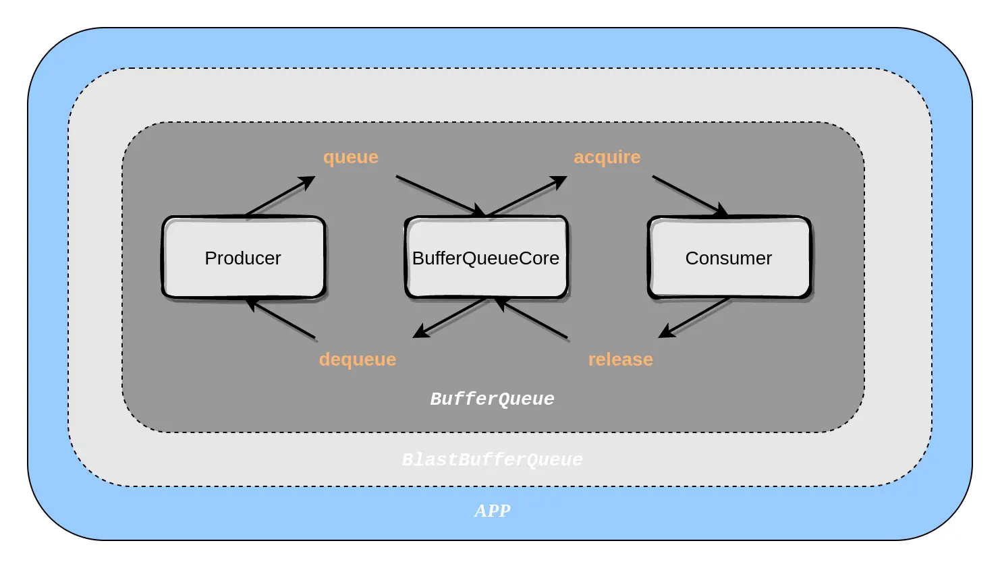
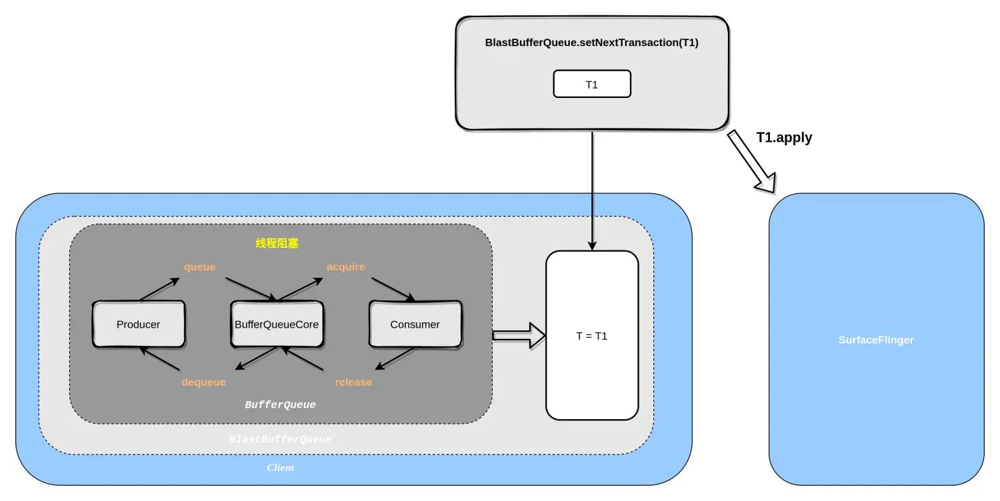

### 前言

在[深入理解WMS](https://github.com/beyond667/study/blob/master/note/%E6%B7%B1%E5%85%A5%E7%90%86%E8%A7%A3WMS.md)一节中，我们知道WMS只是负责窗口的管理，并不负责窗口里面的内容(具体的view)的渲染和显示，比如手机桌面上显示有状态栏，导航栏，桌面图标列表，壁纸等，这几个窗口是怎么合成并同时显示出来的？这就要靠SurfaceFlinger来负责。本文基于Android13。

### SurfaceFlinger原理

SurfaceFlinger和[installd守护进程](https://github.com/beyond667/study/blob/master/note/installd%E5%AE%88%E6%8A%A4%E8%BF%9B%E7%A8%8B.md)一样，都在其独立的进程中，而不是在System_Server进程。SurfaceFlinger作为核心服务，负责将应用程序和系统服务的图像界面合成并呈现在屏幕上，此过程可以理解成双生成者-消费者模型。

+ 对于客户端来说，SurfaceFlinger作为消费者，客户端作为生产者，客户端负责生产出Surface，SurfaceFlinger负责消费Surface，把这些Surface合成到一个layer中，再把此layer渲染到FrameBuffer缓冲区
+ 对屏幕来说，SurfaceFlinger作为生产者，把生产出的FrameBuffer传递给屏幕驱动，屏幕驱动负责消费这些FrameBuffer来显示到屏幕。

当然，上面是简化了的流程，还有些比较重要的概念，比如合成后的FrameBuffer实际是传递给屏幕驱动的后缓冲区，在等待下一个vsync信号后，会把后缓冲区显示到前台作为前缓冲区，之前显示的前缓冲区改为后缓冲区，等待新的FrameBuffer数据。我们先从SurfaceFlinger守护进程的启动来看。

#### SurfaceFlinger启动

跟Installd守护进程一样，SurfaceFlinger也是通过rc启动的。Android7.0之前是在init.rc中，之后都拆分到独立的rc文件中。

> frameworks/native/services/surfaceflinger/surfaceflinger.rc

```properties
service surfaceflinger /system/bin/surfaceflinger
    class core animation
    user system
    group graphics drmrpc readproc
    capabilities SYS_NICE
    onrestart restart --only-if-running zygote
    task_profiles HighPerformance
    socket pdx/system/vr/display/client     stream 0666 system graphics u:object_r:pdx_display_client_endpoint_socket:s0
    socket pdx/system/vr/display/manager    stream 0666 system graphics u:object_r:pdx_display_manager_endpoint_socket:s0
    socket pdx/system/vr/display/vsync      stream 0666 system graphics u:object_r:pdx_display_vsync_endpoint_socket:s0
```

`service surfaceflinger`代表启动surfaceflinger服务，surfaceflinger服务在同目录的Android.bp文件里定义

>frameworks/native/services/surfaceflinger/Android.bp

```properties
filegroup {
    name: "surfaceflinger_binary_sources",
    srcs: [
        ":libsurfaceflinger_sources",
        "main_surfaceflinger.cpp",
    ],
}
cc_binary {
    name: "surfaceflinger",
    defaults: ["libsurfaceflinger_binary"],
    init_rc: ["surfaceflinger.rc"],
    srcs: [
        ":surfaceflinger_binary_sources",
        "SurfaceFlingerFactory.cpp",
    ],
}
```

指定其启动文件为本目录的`main_surfaceflinger.cpp`

>frameworks/native/services/surfaceflinger/main_surfaceflinger.cpp

```cpp
int main(int, char**) {
    //忽略了SIGPIPE信号，因为在SurfaceFlinger的Client-Server模型中，或者说IPC机制中，很可能会触发SIGPIPE信号，而这个信号的默认动作是终止进程
    signal(SIGPIPE, SIG_IGN);
    //SF进程开启后，binder线程池最大为4
    ProcessState::self()->setThreadPoolMaxThreadCount(4);
    
    //启动线程池
    //大多数程序都是需要IPC的，这里也需要，但是使用Binder机制是很繁琐的，所以Android为程序进程使用Binder机制封装了两个实现类：ProcessState、IPCThreadState
    //其中ProcessState负责打开Binder驱动，进行mmap等准备工作；IPCThreadState负责具体线程跟Binder驱动进行命令交互。
    sp<ProcessState> ps(ProcessState::self());
    ps->startThreadPool();
    
    //1 创建SurfaceFlinger对象，并执行其init方法来初始化
    sp<SurfaceFlinger> flinger = surfaceflinger::createSurfaceFlinger();
    flinger->init();
    
    //获取ServiceManager对象
    sp<IServiceManager> sm(defaultServiceManager());
    //2 发布名为SurfaceFlinger服务
    sm->addService(String16(SurfaceFlinger::getServiceName()), flinger, false,
                   IServiceManager::DUMP_FLAG_PRIORITY_CRITICAL | IServiceManager::DUMP_FLAG_PROTO);
    //发布名为SurfaceFlingerAIDL服务
    sp<SurfaceComposerAIDL> composerAIDL = new SurfaceComposerAIDL(flinger);
    sm->addService(String16("SurfaceFlingerAIDL"), composerAIDL, false,
                   IServiceManager::DUMP_FLAG_PRIORITY_CRITICAL | IServiceManager::DUMP_FLAG_PROTO);
    
    startDisplayService(); // dependency on SF getting registered above
    
    //3 调用run方法，进入休眠
    flinger->run();
    return 0;
}

//SurfaceFlinger.h
static char const* getServiceName() ANDROID_API { return "SurfaceFlinger"; }
```

此main函数先做了准备工作，比如忽略了SIGPIPE信号，设置binder进程最大连接数，开启线程池等

+ 注释1调用surfaceflinger的createSurfaceFlinger创建surfaceflinger
+ 注释2发布名为SurfaceFlinger的系统服务，后面还发布了名为SurfaceFlingerAIDL的系统服务
+ 注释3调用其run方法，进入休眠

我们先看注释1 `surfaceflinger::createSurfaceFlinger`这里的surfaceflinger其实指的是SurfaceFlingerFactory

```c++
//SurfaceFlingerFactory.h
namespace surfaceflinger {
//...
    ANDROID_API sp<SurfaceFlinger> createSurfaceFlinger();
}

//SurfaceFlingerFactory.cpp
sp<SurfaceFlinger> createSurfaceFlinger() {
    static DefaultFactory factory;
    return new SurfaceFlinger(factory);
}
```

调用SurfaceFlinger的构造函数来实例化对象

>frameworks/native/services/surfaceflinger/surfaceflinger.cpp

```cpp
SurfaceFlinger::SurfaceFlinger(Factory& factory) : SurfaceFlinger(factory, SkipInitialization) {
    // 一些参数的初始化
    //...
}

SurfaceFlinger::SurfaceFlinger(Factory& factory, SkipInitializationTag)
      : mFactory(factory),
        mPid(getpid()),
        mInterceptor(mFactory.createSurfaceInterceptor()),
        mTimeStats(std::make_shared<impl::TimeStats>()),
        mFrameTracer(mFactory.createFrameTracer()),
        mFrameTimeline(mFactory.createFrameTimeline(mTimeStats, mPid)),
		//关注下这个mCompositionEngine的初始化
        mCompositionEngine(mFactory.createCompositionEngine()),
        mHwcServiceName(base::GetProperty("debug.sf.hwc_service_name"s, "default"s)),
        mTunnelModeEnabledReporter(new TunnelModeEnabledReporter()),
        mInternalDisplayDensity(getDensityFromProperty("ro.sf.lcd_density", true)),
        mEmulatedDisplayDensity(getDensityFromProperty("qemu.sf.lcd_density", false)),
        mPowerAdvisor(std::make_unique<Hwc2::impl::PowerAdvisor>(*this)),
        mWindowInfosListenerInvoker(sp<WindowInfosListenerInvoker>::make(*this)) {
}
```

构造函数里的其他参数初始化不再细看，主要看下mCompositionEngine（Composition译为作品，构图，组合等）的初始化。

> frameworks/native/services/surfaceflinger/SurfaceFlingerDefaultFactory.cpp 

```cpp
std::unique_ptr<compositionengine::CompositionEngine> DefaultFactory::createCompositionEngine() {
    return compositionengine::impl::createCompositionEngine();
}
//创建HWComposer，后面init方法有用到
std::unique_ptr<HWComposer> DefaultFactory::createHWComposer(const std::string& serviceName) {
    return std::make_unique<android::impl::HWComposer>(serviceName);
}

//frameworks/native/services/surfaceflinger/CompositionEngine/src/CompositionEngine.cpp
std::unique_ptr<compositionengine::CompositionEngine> createCompositionEngine() {
    return std::make_unique<CompositionEngine>();
}
```

> make_unique是C++14引入的一个函数模板,用于创建并返回一个指向动态分配对象的unique_ptr智能指针。它是为了简化代码,避免手动使用new和delete,以及确保资源的正确释放而设计的。其实就是创建并返回了个指定对象的智能指针。

继续看注释1处`flinger->init()`执行了SurfaceFlinger的init方法

```cpp
void SurfaceFlinger::init() {
    //...
    //基于build模式创建RenderEngine对象，再把其设置到mCompositionEngine里
    auto builder = renderengine::RenderEngineCreationArgs::Builder()
        .setPixelFormat(static_cast<int32_t>(defaultCompositionPixelFormat))
        .setImageCacheSize(maxFrameBufferAcquiredBuffers)
        .setUseColorManagerment(useColorManagement)
        .setEnableProtectedContext(enable_protected_contents(false))
        .setPrecacheToneMapperShaderOnly(false)
        .setSupportsBackgroundBlur(mSupportsBlur)
        .setContextPriority(
        useContextPriority
        ? renderengine::RenderEngine::ContextPriority::REALTIME
        : renderengine::RenderEngine::ContextPriority::MEDIUM);
    mCompositionEngine->setRenderEngine(renderengine::RenderEngine::create(builder.build()));
    
    mCompositionEngine->setTimeStats(mTimeStats);
	//创建HWComposer对象，再把其设置到mCompositionEngine里
    mCompositionEngine->setHwComposer(getFactory().createHWComposer(mHwcServiceName));
    mCompositionEngine->getHwComposer().setCallback(*this);
    
    //4 处理热插拔和显示更改的事件
    processDisplayHotplugEventsLocked();
    
    //初始化display
    initializeDisplays();
    
    //创建开机动画线程并执行开机动画过程
    mStartPropertySetThread = getFactory().createStartPropertySetThread(presentFenceReliable);

    if (mStartPropertySetThread->Start() != NO_ERROR) {
        ALOGE("Run StartPropertySetThread failed!");
    }
}
```

里面会先对CompositionEngine设置RenderEngine和HwComposer（通过HAL层的HWComposer硬件模块或者软件模拟产生Vsync信号），再看注释4处`processDisplayHotplugEventsLocked`方法

```c++
void SurfaceFlinger::processDisplayHotplugEventsLocked() {
    for (const auto& event : mPendingHotplugEvents) {
        std::optional<DisplayIdentificationInfo> info =
            getHwComposer().onHotplug(event.hwcDisplayId, event.connection);
        //...
        processDisplayChangesLocked();
    }
}

void SurfaceFlinger::processDisplayChangesLocked() {
    //...
    for (size_t i = 0; i < draw.size(); i++) {
        const ssize_t j = curr.indexOfKey(displayToken);
        if (j < 0) {
            //处理display移除事件
            processDisplayRemoved(displayToken);
        }else {
            //处理display更新事件
            const DisplayDeviceState& currentState = curr[j];
            const DisplayDeviceState& drawingState = draw[i];
            processDisplayChanged(displayToken, currentState, drawingState);
        }
    }
    for (size_t i = 0; i < curr.size(); i++) {
        const wp<IBinder>& displayToken = curr.keyAt(i);
        if (draw.indexOfKey(displayToken) < 0) {
            //处理display添加事件
            processDisplayAdded(displayToken, curr[i]);
        }
    }
}

void SurfaceFlinger::processDisplayAdded(const wp<IBinder>& displayToken,
                                         const DisplayDeviceState& state) {
    //...
    if (display->isPrimary()) {
        //5 进行Scheduler初始化
        initScheduler(display);
    }
}
```

注释5处执行initScheduler初始化Scheduler

```c++
void SurfaceFlinger::initScheduler(const sp<DisplayDevice>& display) {
    //如果初始化过就直接return
    if (mScheduler) {
        mScheduler->setRefreshRateConfigs(display->holdRefreshRateConfigs());
        return;
    }
	//获取当前屏幕的fps 刷新率即帧率
    const auto currRefreshRate = display->getActiveMode()->getFps();
    mRefreshRateStats = std::make_unique<scheduler::RefreshRateStats>(*mTimeStats, currRefreshRate,
                                                                      hal::PowerMode::OFF);
	//基于帧率创建vsync配置
    mVsyncConfiguration = getFactory().createVsyncConfiguration(currRefreshRate);
    mVsyncModulator = sp<VsyncModulator>::make(mVsyncConfiguration->getCurrentConfigs());
    
	//6 生成scheduler
    mScheduler = std::make_unique<scheduler::Scheduler>(static_cast<ICompositor&>(*this),
                                                        static_cast<ISchedulerCallback&>(*this),features);
    //...
    //7 创建app和appSf的连接
    mAppConnectionHandle =
        mScheduler->createConnection("app", mFrameTimeline->getTokenManager(),
                                     /*workDuration=*/configs.late.appWorkDuration,
                                     /*readyDuration=*/configs.late.sfWorkDuration,
                                     impl::EventThread::InterceptVSyncsCallback());
    mSfConnectionHandle =
        mScheduler->createConnection("appSf", mFrameTimeline->getTokenManager(),
                                     /*workDuration=*/std::chrono::nanoseconds(vsyncPeriod),
                                     /*readyDuration=*/configs.late.sfWorkDuration,
                                     [this](nsecs_t timestamp) {
                                         mInterceptor->saveVSyncEvent(timestamp);
                                     });
    //初始化vsync
    mScheduler->initVsync(mScheduler->getVsyncDispatch(), *mFrameTimeline->getTokenManager(),
                          configs.late.sfWorkDuration);
    
    //...
}
```

重点看注释7分别创建app和appSf连接

>frameworks/native/services/surfaceflinger/Scheduler/Scheduler.cpp

```c++
ConnectionHandle Scheduler::createConnection(
    const char* connectionName, frametimeline::TokenManager* tokenManager,
    std::chrono::nanoseconds workDuration, std::chrono::nanoseconds readyDuration,
    impl::EventThread::InterceptVSyncsCallback interceptCallback) {
    //8 创建DispSyncSource
    auto vsyncSource = makePrimaryDispSyncSource(connectionName, workDuration, readyDuration);
    auto throttleVsync = makeThrottleVsyncCallback();
    auto getVsyncPeriod = makeGetVsyncPeriodFunction();
    //9 基于DispSyncSource创建EventThread线程
    auto eventThread = std::make_unique<impl::EventThread>(std::move(vsyncSource), tokenManager,
                                                           std::move(interceptCallback),
                                                           std::move(throttleVsync),
                                                           std::move(getVsyncPeriod));
    //strcmp判断两个字符串是否相等，相等的话返回0，这里如果传的是app，strcmp即0，前面取非即1
    //也就是说如果是app，这个triggerRefresh为true
    bool triggerRefresh = !strcmp(connectionName, "app");
    return createConnection(std::move(eventThread), triggerRefresh);
}

ConnectionHandle Scheduler::createConnection(std::unique_ptr<EventThread> eventThread,
                                             bool triggerRefresh) {
    //10 创建ConnectionHandle
    const ConnectionHandle handle = ConnectionHandle{mNextConnectionHandleId++};
    //11 创建EventThreadConnection
    auto connection = createConnectionInternal(eventThread.get(), triggerRefresh);

    std::lock_guard<std::mutex> lock(mConnectionsLock);
    //12 往mConnections缓存ConnectionHandle和Connection
    //其中Connection里包含了EventThreadConnection和eventThread
    mConnections.emplace(handle, Connection{connection, std::move(eventThread)});
    return handle;
}

sp<EventThreadConnection> Scheduler::createConnectionInternal(EventThread* eventThread,
                                                              bool triggerRefresh, ISurfaceComposer::EventRegistrationFlags eventRegistration) {
    // Refresh need to be triggered from app thread alone.
    // Triggering it from sf connection can result in infinite loop due to requestnextvsync.
    //上面英文注释说明，刷新操作只能从app线程触发，如果从sf线程触发，会由于requestnextvsync导致无限循环
    if (triggerRefresh) {
        return eventThread->createEventConnection([&] { resyncAndRefresh(); }, eventRegistration);
    } else {
        return eventThread->createEventConnection([&] { resync(); }, eventRegistration);
    }
}
```

+ 注释8和9会创建DispSyncSource，并根据DispSyncSource创建EventThread线程，这里会创建app和appSf
+ 注释10会创建ConnectionHandle
+ 注释11基于9处创建的EventThread来创建EventThreadConnection
+ 注释12以ConnectionHandle作为key，EventThreadConnection作为value缓存到mConnections里

> app线程负责接收vsync信号并且上报给app，app开始画图，即负责通知app渲染
>
> sf线程用于接收vsync信号用于合成。
>
> 两个线程同时收到vsync信号，如果同时工作的话第一个线程还没渲染完第二个线程就没办法合成，所以这里会对这两个线程配置不同的时间偏移量，保证第一个线程执行完后再执行第二个。

注意一点的是，Android12之前偏移量在createConnection时就会传进来

```cpp
//Android11的surfaceflinger.cpp
void SurfaceFlinger::init() {
    //...
    mAppConnectionHandle =
        mScheduler->createConnection("app", mPhaseConfiguration->getCurrentOffsets().late.app,
                                     impl::EventThread::InterceptVSyncsCallback());
    mSfConnectionHandle =
        mScheduler->createConnection("sf", mPhaseConfiguration->getCurrentOffsets().late.sf,
                                     [this](nsecs_t timestamp) {
                                         mInterceptor->saveVSyncEvent(timestamp);
                                     });
    //...
}
```

可以看到11在SurfaceFlinger的init里就直接createConnection，并且createConnection传了offsets，而Android12即以后createConnection放到了initScheduler里，并且偏移量也不是直接传进去的

```c++
//Android13的surfaceflinger.cpp
void SurfaceFlinger::init() {
    //...
    startUnifiedDraw();
}
void SurfaceFlinger::startUnifiedDraw() {
  createPhaseOffsetExtn();
}

void SurfaceFlinger::createPhaseOffsetExtn() {
    //...
    const auto vsyncConfig =
        mVsyncModulator->setVsyncConfigSet(mVsyncConfiguration->getCurrentConfigs());
    ALOGI("VsyncConfig sfOffset %" PRId64 "\n", vsyncConfig.sfOffset);
    ALOGI("VsyncConfig appOffset %" PRId64 "\n", vsyncConfig.appOffset);  
}
  
```

最上面注释1处的init过程就看完了，surfaceflinger初始化时会创建两个eventthread线程：app和appsf，分别用来接收vsync后通知app完成绘制和sf来完成合成，两个线程基于不同的偏移量，保证app线程执行完渲染后再由appsf线程完成合成。

注释2处是把surfaceflinger发布到ServiceManager，绑定时会回调surfaceflinger的binderDied方法

```cpp
void SurfaceFlinger::binderDied(const wp<IBinder>&) {
    // the window manager died on us. prepare its eulogy.
    mBootFinished = false;

    // Sever the link to inputflinger since it's gone as well.
    static_cast<void>(mScheduler->schedule([=] { mInputFlinger = nullptr; }));

    // restore initial conditions (default device unblank, etc)
    initializeDisplays();

    // restart the boot-animation
    startBootAnim();
}
```

如果绑定到ServerManager的surfaceflinger服务挂掉的话，这里会重新执行开机动画。

注释3会调用run方法，进入休眠

```c++
//SurfaceFlinger.cpp
void SurfaceFlinger::run() {
    mScheduler->run();
}

//Scheduler.cpp
void Scheduler::run() {
    while (true) {
        waitMessage();
    }
}
```

Android12之后Scheduler就是继承于MessageQueue，所以这里调用的是MessageQueue的waitMessage

```c++
//Scheduler.h
class Scheduler : impl::MessageQueue {
    using Impl = impl::MessageQueue;
}   
//MessageQueue.java
void MessageQueue::waitMessage() {
    do {
        IPCThreadState::self()->flushCommands();
        int32_t ret = mLooper->pollOnce(-1);
        switch (ret) {
            case Looper::POLL_WAKE:
            case Looper::POLL_CALLBACK:
                continue;
            case Looper::POLL_ERROR:
                ALOGE("Looper::POLL_ERROR");
                continue;
            case Looper::POLL_TIMEOUT:
                // timeout (should not happen)
                continue;
            default:
                // should not happen
                ALOGE("Looper::pollOnce() returned unknown status %d", ret);
                continue;
        }
    } while (true);
} 
```

可以看到SurfaceFlinger的主线程通过死循环执行waitMessage，而其内部是通过mLooper->pollOnce去获取消息。这块的Looper，MessageQueue和java层的不是同一个对象，此处的Looper和MQ是专门为SurfaceFlinger设计的。  

到这里先总结下，SurfaceFlinger启动过程是从SurfaceFlinger.rc配置执行了main_surfaceflinger.cpp的main方法，这里会先创建SurfaceFlinger对象并执行其init方法，这里会初始化scheduler，在scheduler初始化时会创建两个EventThread线程：app，appsf线程，接收到vsync信号后app线程通知客户端执行绘制流程，然后appsf线程在一段时间后执行合成流程。初始化完之后surfaceflinger会在主线程执行waitMessage等待消息，内部是通过Looper.poolOnce去获取消息。  

#### SurfaceFlinger工作流程

> 启动过程有几个比较重要的对象没有细看，比如，DispSyncSource，HWComposer，在SurfaceFlinger工作流程中将会再关注到这几个对象。

我们分析下从应用启动流程到屏幕显示出画面的过程。

##### 1 与SurfaceFlinger创建连接

先复习下，在[深入理解WMS](https://github.com/beyond667/study/blob/master/note/%E6%B7%B1%E5%85%A5%E7%90%86%E8%A7%A3WMS.md)一节的Session中可知，ActivityThread.handleResumeActivity -> WindowManagerImpl.addView -> WindowManagerGlobal.addView -> new ViewRootImpl ->WindowManagerGlobal.getWindowSession()，应用初始化ViewRootImpl时会去获取Session，而Session在应用中是单例存在的，即一个应用只有一个Session。

```java
public static IWindowSession getWindowSession() {
    synchronized (WindowManagerGlobal.class) {
        if (sWindowSession == null) {
            IWindowManager windowManager = getWindowManagerService();
            sWindowSession = windowManager.openSession(
                new IWindowSessionCallback.Stub() {
                    @Override
                    public void onAnimatorScaleChanged(float scale) {
                        ValueAnimator.setDurationScale(scale);
                    }
                });

        }
        return sWindowSession;
    }
}
```

可以看到第一次获取Session会调用WMS.openSession去获取Session，然后缓存到当前进程。

> frameworks/base/services/core/java/com/android/server/wm/WindowManagerService.java

```java
public IWindowSession openSession(IWindowSessionCallback callback) {
    //Session肯定是个Binder对象，要把其代理对象返回给客户端
    return new Session(this, callback);
}
//Session.java
class Session extends IWindowSession.Stub implements IBinder.DeathRecipient {}
```

然后在viewRootImpl.setView -> session.addToDisplayAsUser -> wms.addWindow，wms会创建WindowState，并执行其attach

```java
public int addWindow(Session session, IWindow client, LayoutParams attrs...){
    //...
    final WindowState win = new WindowState(this,session...);
    win.attach();
    //...
}
void attach() {
    mSession.windowAddedLocked();
}

//Session.java
private int mNumWindow = 0;
void windowAddedLocked() {
    //从这里可以看到只有应用第一次添加窗口时才会创建一次SurfaceSession
    if (mSurfaceSession == null) {
        //11 这里会创建SurfaceSession
        mSurfaceSession = new SurfaceSession();
        mService.mSessions.add(this);
        if (mLastReportedAnimatorScale != mService.getCurrentAnimatorScale()) {
            mService.dispatchNewAnimatorScaleLocked(this);
        }
    }
    mNumWindow++;
}
```

注释11会创建SurfaceSession，我们从这个开始看。

> frameworks/base/core/java/android/view/SurfaceSession.java

```java
private long mNativeClient; // SurfaceComposerClient*
public SurfaceSession() {
    mNativeClient = nativeCreate();
}
```

调用了JNI的nativeCreate方法，并且把返回的long指针地址保存起来，后面再调用JNI方法就把这个指针地址传过去就能直接访问JNI层创建的SurfaceComposerClient对象

> frameworks/base/core/jni/android_view_SurfaceSession.cpp

```cpp
static jlong nativeCreate(JNIEnv* env, jclass clazz) {
    SurfaceComposerClient* client = new SurfaceComposerClient();
    client->incStrong((void*)nativeCreate);
    return reinterpret_cast<jlong>(client);
}
```

直接创建了SurfaceComposerClient对象

> frameworks/native/libs/gui/SurfaceComposerClient.cpp

```c++
//初始化时状态为NO_INIT
SurfaceComposerClient::SurfaceComposerClient() : mStatus(NO_INIT) {}

void SurfaceComposerClient::onFirstRef() {
    //12 获取SurfaceFlinger的代理对象
    sp<ISurfaceComposer> sf(ComposerService::getComposerService());
    //13 SurfaceFlinger不为空，并且SurfaceComposerClient状态为NO_INIT时创建连接
    if (sf != nullptr && mStatus == NO_INIT) {
        sp<ISurfaceComposerClient> conn;
        conn = sf->createConnection();
        if (conn != nullptr) {
            //14 把返回的ISurfaceComposerClient的代理对象保存到mClinet中
            mClient = conn;
            mStatus = NO_ERROR;
        }
    }
}
```

SurfaceComposerClient的构造函数中设置状态为NO_INIT，由于SurfaceComposerClient继承自RefBase所以会执行onFirstRef，这里会去拿SurfaceFlinger（注释12），如果不为空，并且状态是NO_INIT，会去执行SurfaceFlinger.createConnection来创建跟SurfaceFlinger的连接。我们先看下注释12

```c++
//SurfaceComposerClient.cpp
/*static*/ sp<gui::ISurfaceComposer> ComposerServiceAIDL::getComposerService() {
    ComposerServiceAIDL& instance = ComposerServiceAIDL::getInstance();
    std::scoped_lock lock(instance.mMutex);
    if (instance.mComposerService == nullptr) {
        //如果instance.mComposerService为空，就执行ComposerService单例对象的connectLocked
        if (ComposerServiceAIDL::getInstance().connectLocked()) {
            ALOGD("ComposerServiceAIDL reconnected");
        }
    }
    //instance.mComposerService即SurfaceFlinger的代理对象
    return instance.mComposerService;
}
bool ComposerService::connectLocked() {
    //获取SurfaceFlinger的代理对象，并缓存到单例对象的mComposerService中
    const String16 name("SurfaceFlinger");
    mComposerService = waitForService<ISurfaceComposer>(name);
    if (mComposerService == nullptr) {
        return false; // fatal error or permission problem
    }

    // Create the death listener.
    //...
    mDeathObserver = new DeathObserver(*const_cast<ComposerService*>(this));
    IInterface::asBinder(mComposerService)->linkToDeath(mDeathObserver);
    return true;
}

```

instance.mComposerService即SurfaceFlinger的代理对象，如果为空，就会调connectLocked去获取SurfaceFlinger的代理对象，并绑定死亡监听。再继续看注释13处`sf->createConnection`

```cpp
sp<ISurfaceComposerClient> SurfaceFlinger::createConnection() {
    const sp<Client> client = new Client(this);
    return client->initCheck() == NO_ERROR ? client : nullptr;
}

//Client.h
//Client肯定是个Binder对象，以Bn开头
class Client : public BnSurfaceComposerClient{}

//ISurfaceComposer.h
class BnSurfaceComposerClient : public SafeBnInterface<ISurfaceComposerClient> {
    status_t onTransact(uint32_t code, const Parcel& data, Parcel* reply, uint32_t flags) override;
}
```

SurfaceFlinger直接返回了Client的代理对象，并保存在注释14的mClient中。后面客户端通过SurfaceComposerClient创建surface是通过的Client的代理对象mClient来做的，实际上调用的还是在SurfaceFlinger中new的Client对象。这样，客户端就完成了与SurfaceFlinger的联系。  

总结下，应用在启动中初始化ViewRootImpl时会创建跟WMS的连接Session，之后在ViewRootImpl.setView中会通过session调用到WMS.addWindow，这里会创建WindowState，并执行其attach，首次会通过JNI创建SurfaceSession，其实是返回了SurfaceComposerClient对象的地址，此对象里持有的mClient对象是通过surfaceflinger创建的Client对象。

##### 2 Surface创建流程

下面分析View绘制到Surface创建过程。  

我们知道，view绘制时会调用ViewRootImpl.requestLayout 

```java
public void requestLayout() {
    if (!mHandlingLayoutInLayoutRequest) {
        //这个做了主线程检查，非主线程直接抛异常，所以只能在主线程更新UI
        checkThread();
        mLayoutRequested = true;
        scheduleTraversals();
    }
}

void scheduleTraversals() {
    if (!mTraversalScheduled) {
        //mTraversalScheduled标志先设为true，待绘制流程开始后会把此标志改为false
        mTraversalScheduled = true;
        //插入同步屏障，保证之后只有异步消息才会被执行
        mTraversalBarrier = mHandler.getLooper().getQueue().postSyncBarrier();
        //编舞者发布异步消息，post个runnable，保证此runnable会尽快执行
        mChoreographer.postCallback(
            Choreographer.CALLBACK_TRAVERSAL, mTraversalRunnable, null);
        notifyRendererOfFramePending();
        pokeDrawLockIfNeeded();
    }
}
final TraversalRunnable mTraversalRunnable = new TraversalRunnable();
final class TraversalRunnable implements Runnable {
    @Override
    public void run() {
        doTraversal();
    }
}

void doTraversal() {
    if (mTraversalScheduled) {
        //绘制流程开始，先把之前的标志设为false，并移除同步屏障，因为都到这里了，说明绘制流程已经可以开始了。
        mTraversalScheduled = false;
        mHandler.getLooper().getQueue().removeSyncBarrier(mTraversalBarrier);
        
        performTraversals();
    }
}

private void performTraversals() {
    //先准备窗口，再开始具体绘制流程
    relayoutResult = relayoutWindow(params, viewVisibility, insetsPending);
	//具体绘制流程，performMeasure，performLayout，performDraw
}
```

这个过程较简单，绘制时scheduleTraversals时会先往handler的MessageQueue中插入个同步屏障，然后编舞者往handler里post个异步消息，此时同步消息会先不执行，而是先执行插进来的异步消息，即先执行此runnable的run方法，之后执行doTraversal->performTraversals，这里会先relayoutWindow，之后再开始真正的绘制流程。

```java
private int relayoutWindow(WindowManager.LayoutParams params, int viewVisibility,boolean insetsPending) {
//...
    final boolean relayoutAsync;
    if (LOCAL_LAYOUT
        && (mViewFrameInfo.flags & FrameInfo.FLAG_WINDOW_VISIBILITY_CHANGED) == 0
        && mWindowAttributes.type != TYPE_APPLICATION_STARTING
        && mSyncSeqId <= mLastSyncSeqId
        && winConfigFromAm.diff(winConfigFromWm, false /* compareUndefined */) == 0) {
        //...
        relayoutAsync = !positionChanged || !sizeChanged;
    }else{
        relayoutAsync = false;
    }
    
    //如果绘制的内容跟上次的位置和大小都没变化，relayoutAsync会为true，走relayoutAsync流程，否则走relayout流程
    if (relayoutAsync) {
        mWindowSession.relayoutAsync(mWindow, params,
                                     requestedWidth, requestedHeight, viewVisibility,
                                     insetsPending ? WindowManagerGlobal.RELAYOUT_INSETS_PENDING : 0, mRelayoutSeq,
                                     mLastSyncSeqId);
    } else {
        //15 调用session.relayout去请求SurfaceControl，注意，这里传的mSurfaceControl是直接new的没有内容的对象，是为了让WMS去往里面填充。
        relayoutResult = mWindowSession.relayout(mWindow, params,
                                                 requestedWidth, requestedHeight, viewVisibility,
                                                 insetsPending ? WindowManagerGlobal.RELAYOUT_INSETS_PENDING : 0, mRelayoutSeq,
                                                 mLastSyncSeqId, mTmpFrames, mPendingMergedConfiguration, mSurfaceControl,
                                                 mTempInsets, mTempControls, mRelayoutBundle);
    }
    
    //16 拿到的SurfaceControl数据传到Surface中
    if (!useBLAST()) {
        mSurface.copyFrom(mSurfaceControl);
    } else {
        updateBlastSurfaceIfNeeded();
    }
    //...
    return relayoutResult;
}

public final Surface mSurface = new Surface();
private final SurfaceControl mSurfaceControl = new SurfaceControl();

//SurfaceControl.java
public final class SurfaceControl implements Parcelable {}
//Surface.java
public class Surface implements Parcelable {}
```

+ 注释15调用session.relayout去请求SurfaceControl，需要注意的是此时传的mSurfaceControl是直接new的没有内容的对象，是为了让WMS去往里面填充。
+ 注释16不管useBLAST是否为真都会创建Surface，不同的是如果为false就直接拷贝，为true的话就通过updateBlastSurfaceIfNeeded去创建Surface，这块在下一小节再细看。Surface和SurfaceControl本质都是Parcelable。

继续看注释15的session.relayout

```java
//Session.java
public int relayout(IWindow window, WindowManager.LayoutParams attrs){
    int res = mService.relayoutWindow(this, window, attrs...);
}
//WMS.java
public int relayoutWindow(Session session, IWindow client, LayoutParams attrs...){
    synchronized (mGlobalLock) {
        final WindowState win = windowForClientLocked(session, client, false);
        if (win == null) {
            return 0;
        }
        //...
        
        final boolean shouldRelayout = viewVisibility == View.VISIBLE &&
            (win.mActivityRecord == null || win.mAttrs.type == TYPE_APPLICATION_STARTING
             || win.mActivityRecord.isClientVisible());
        
         if (shouldRelayout && outSurfaceControl != null) {
             //17 创建SurfaceControl，把客户端传过来的无内容的SurfaceControl传进去进行赋值
             result = createSurfaceControl(outSurfaceControl, result, win, winAnimator);
         }
        //...  
    }
}

private int createSurfaceControl(SurfaceControl outSurfaceControl, int result,
                                 WindowState win, WindowStateAnimator winAnimator) {
    WindowSurfaceController surfaceController;
    try {
        //18 通过WindowStateAnimator.createSurfaceLocked创建WindowSurfaceController
        surfaceController = winAnimator.createSurfaceLocked();
    } finally {}
    
     if (surfaceController != null) {
         //19 这里对客户端传过来的SurfaceControl进行了赋值
         surfaceController.getSurfaceControl(outSurfaceControl);
     }
    return result;
}

//WindowStateAnimator.java
WindowSurfaceController createSurfaceLocked() {
    if (mSurfaceController != null) {
        return mSurfaceController;
    }
    //20 直接new WindowSurfaceController
    mSurfaceController = new WindowSurfaceController(attrs.getTitle().toString(), format,
                                                     flags, this, attrs.type);
    //...
    return mSurfaceController;
}
```

注释17-20可知，客户端往WMS请求SurfaceControl，其实主要是根据参数new了WindowSurfaceController，此对象里已经包括了客户端需要的SurfaceControl对象，再把此对象copy到客户端的对象即可。

```java
class WindowSurfaceController {
    SurfaceControl mSurfaceControl;
    
    WindowSurfaceController(String name, int format, int flags, WindowStateAnimator animator,int windowType) {
        title = name;
        mService = animator.mService;
        final WindowState win = animator.mWin;
        mWindowType = windowType;
        mWindowSession = win.mSession;

        //构建者模式创建其Builder对象，再build创建实例
        final SurfaceControl.Builder b = win.makeSurface()
            .setParent(win.getSurfaceControl())
            .setName(name)
            .setFormat(format)
            .setFlags(flags)
            .setMetadata(METADATA_WINDOW_TYPE, windowType)
            .setMetadata(METADATA_OWNER_UID, mWindowSession.mUid)
            .setMetadata(METADATA_OWNER_PID, mWindowSession.mPid)
            .setCallsite("WindowSurfaceController");

        mSurfaceControl = b.build();
    }
}
```

构建者模式创建其Builder对象，再build创建实例

```java
public final class SurfaceControl implements Parcelable {
    //21 4种Surface类型
    public static final int FX_SURFACE_NORMAL   = 0x00000000;
    public static final int FX_SURFACE_EFFECT = 0x00020000;
    public static final int FX_SURFACE_CONTAINER = 0x00080000;
    public static final int FX_SURFACE_BLAST = 0x00040000;
    //Mask used for FX values above.
    public static final int FX_SURFACE_MASK = 0x000F0000;
    private static native long nativeCreate(SurfaceSession session, String name,
                                            int w, int h, int format, int flags, long parentObject, Parcel metadata);
    
    
    public SurfaceControl build() {
        //22 校验参数
        if (mWidth < 0 || mHeight < 0) {
            throw new IllegalStateException("width and height must be positive or unset");
        }
        if ((mWidth > 0 || mHeight > 0) && (isEffectLayer() || isContainerLayer())) {
            throw new IllegalStateException("Only buffer layers can set a valid buffer size.");
        }
		
        if ((mFlags & FX_SURFACE_MASK) == FX_SURFACE_NORMAL) {
            setBLASTLayer();
        }

        return new SurfaceControl(
            mSession, mName, mWidth, mHeight, mFormat, mFlags, mParent, mMetadata,
            mLocalOwnerView, mCallsite);
    }

    
    private SurfaceControl(SurfaceSession session, String name, int w, int h, int format, int flags,
                           SurfaceControl parent, SparseIntArray metadata, WeakReference<View> localOwnerView,
                           String callsite){

        mName = name;
        mWidth = w;
        mHeight = h;
        mLocalOwnerView = localOwnerView;
        Parcel metaParcel = Parcel.obtain();

        //23 通过JNI创建SurfaceControl
        mNativeObject = nativeCreate(session, name, w, h, format, flags,
                                     parent != null ? parent.mNativeObject : 0, metaParcel);

        mNativeHandle = nativeGetHandle(mNativeObject);
    }
}

public Builder setBLASTLayer() {
    return setFlags(FX_SURFACE_BLAST, FX_SURFACE_MASK);
}
```

注释21和22先对Surface参数进行了校验，比如宽高不能为负数，宽高大于0时surface类型不能是Effect和Container类型，如果是Normal类型的直接设置为blast类型，这里介绍下几个Surface类型

+ FX_SURFACE_NORMAL，代表了一个标准Surface，这个是默认设置。
+ FX_SURFACE_EFFECT，代表了一个有纯色或者阴影效果的Surface。
+ FX_SURFACE_CONTAINER，代表了一个容器类Surface，这种Surface没有缓冲区，只是用来作为其他Surface的容器，或者是它自己的InputInfo的容器。
+ FX_SURFACE_BLAST。结合上面代码可知，其等同于FX_SURFACE_NORMAL。我们用到的大部分即是这种。
+ FX_SURFACE_MASK。标识位。某个Surface类型与其标识位做位运算来计算出具体的Surface类型。

注释23通过JNI创建了SurfaceControl

> frameworks/base/core/jni/android_view_SurfaceControl.cpp

```cpp
static jlong nativeCreate(JNIEnv* env, jclass clazz, jobject sessionObj,
                          jstring nameStr, jint w, jint h, jint format, jint flags, jlong parentObject,
                          jobject metadataParcel) {
    sp<SurfaceComposerClient> client;
    //24 基于SurfaceSession去获取SurfaceComposerClient
    if (sessionObj != NULL) {
        client = android_view_SurfaceSession_getClient(env, sessionObj);
    } else {
        client = SurfaceComposerClient::getDefault();
    }
    sp<SurfaceControl> surface;
	//...
    //25 SurfaceComposerClient.createSurfaceChecked去创建SurfaceControl
    status_t err = client->createSurfaceChecked(String8(name.c_str()), w, h, format, &surface,flags, parentHandle, std::move(metadata));
    
    
    return reinterpret_cast<jlong>(surface.get());
}
```

+ 注释24会通过java层传过来的SurfaceSession的地址获取SurfaceComposerClient，由上面与SurfaceFlinger创建连接可知，此SurfaceComposerClient是在windowState第一次attach时通过jni创建，java层持有了其地址
+ 注释25通过SurfaceComposerClient.createSurfaceChecked去创建SurfaceControl，传新创建的surface地址以供创建后赋值

> frameworks/native/libs/gui/SurfaceComposerClient.cpp

```cpp
status_t SurfaceComposerClient::createSurfaceChecked(const String8& name, uint32_t w, uint32_t h,
                                                     PixelFormat format,
                                                     sp<SurfaceControl>* outSurface, uint32_t flags,
                                                     const sp<IBinder>& parentHandle,
                                                     LayerMetadata metadata,
                                                     uint32_t* outTransformHint) {
    sp<SurfaceControl> sur;
    status_t err = mStatus;

    if (mStatus == NO_ERROR) {
        sp<IBinder> handle;
        sp<IGraphicBufferProducer> gbp;

        uint32_t transformHint = 0;
        int32_t id = -1;
        //26 调用服务端SurfaceFlinger进程Client的createSurface
        err = mClient->createSurface(name, w, h, format, flags, parentHandle, std::move(metadata),
                                     &handle, &gbp, &id, &transformHint);

        if (outTransformHint) {
            *outTransformHint = transformHint;
        }

        if (err == NO_ERROR) {
            //27 基于注释26返回的handle，system_server进程中创建个SurfaceControl
            *outSurface =
                new SurfaceControl(this, handle, gbp, id, w, h, format, transformHint, flags);
        }
    }
    return err;
}
```

+ 注释26通过binder通信调用到SurfaceFlinger服务端Client这个binder的createSurface方法，这里传了个新创建的handle这个IBinder的地址进去，其实新创建的Surface，对SurfaceFlinger来说是Layer，会被存在这个Binder的真实对象中。
+ 注释27基于26的返回handle，在system_server进程中创建个SurfaceControl

再看注释26中SurfaceFlinger进程创建Surface，即Layer的过程

> frameworks/native/services/surfaceflinger/Client.cpp

```c++
status_t Client::createSurface(const String8& name, uint32_t /* w */, uint32_t /* h */,
                               PixelFormat /* format */, uint32_t flags,
                               const sp<IBinder>& parentHandle, LayerMetadata metadata,
                               sp<IBinder>* outHandle, sp<IGraphicBufferProducer>* /* gbp */,
                               int32_t* outLayerId, uint32_t* outTransformHint) {

    return mFlinger->createLayer(args, outHandle, parentHandle, outLayerId, nullptr,
                                 outTransformHint);
}
```

Client.createSurface调用到了SurfaceFlinger.createLayer，从方法名称上也可以理解，`对SurfaceFlinger来说，创建Surface也就是创建layer`

> frameworks/native/services/surfaceflinger/SurfaceFlinger.cpp

```cpp
status_t SurfaceFlinger::createLayer(LayerCreationArgs& args, sp<IBinder>* outHandle,
                                     const sp<IBinder>& parentHandle, int32_t* outLayerId,
                                     const sp<Layer>& parentLayer, uint32_t* outTransformHint) {
    //根据不同的Surface类型，创建不同的layer
    switch (args.flags & ISurfaceComposerClient::eFXSurfaceMask) {
        case ISurfaceComposerClient::eFXSurfaceBufferQueue:
        case ISurfaceComposerClient::eFXSurfaceBufferState: {
            //28 创建BufferStateLayer
            result = createBufferStateLayer(args, outHandle, &layer);
            std::atomic<int32_t>* pendingBufferCounter = layer->getPendingBufferCounter();
            if (pendingBufferCounter) {
                std::string counterName = layer->getPendingBufferCounterName();
                mBufferCountTracker.add((*outHandle)->localBinder(), counterName,
                                        pendingBufferCounter);
            }
        } break;
        case ISurfaceComposerClient::eFXSurfaceEffect:
            result = createEffectLayer(args, outHandle, &layer);
            break;
        case ISurfaceComposerClient::eFXSurfaceContainer:
            result = createContainerLayer(args, outHandle, &layer);
            break;
        default:
            result = BAD_VALUE;
            break;
    }
    
    if (result != NO_ERROR) {
        return result;
    }

    bool addToRoot = args.addToRoot && callingThreadHasUnscopedSurfaceFlingerAccess();
    //30 添加客户端的layer
    result = addClientLayer(args.client, *outHandle, layer, parent, addToRoot, outTransformHint);
    if (result != NO_ERROR) {
        return result;
    }
    *outLayerId = layer->sequence;
    return result;
}

status_t SurfaceFlinger::createBufferStateLayer(LayerCreationArgs& args, sp<IBinder>* handle,
                                                sp<Layer>* outLayer) {
    args.textureName = getNewTexture();
    //29 通过默认工厂createBufferStateLayer来创建
    *outLayer = getFactory().createBufferStateLayer(args);
    *handle = (*outLayer)->getHandle();
    return NO_ERROR;
}
```

SurfaceFlinger创建layer的流程。

首先，根据不同的surface类型创建不同的layer，跟我们上面看到的4种surface类型一一对应。对于大部分应都是走注释28创建BufferStateLayer，其是通过注释29处getFactory().createBufferStateLayer来创建BufferStateLayer的。注释30在创建完layer后会通过addClientLayer来记录客户端的layer。

> frameworks/native/services/surfaceflinger/SurfaceFlingerDefaultFactory.cpp

```cpp
sp<ContainerLayer> DefaultFactory::createContainerLayer(const LayerCreationArgs& args) {
    return new ContainerLayer(args);
}

sp<BufferQueueLayer> DefaultFactory::createBufferQueueLayer(const LayerCreationArgs& args) {
    return new BufferQueueLayer(args);
}

sp<BufferStateLayer> DefaultFactory::createBufferStateLayer(const LayerCreationArgs& args) {
    return new BufferStateLayer(args);
}

```

SurfaceFlinger的默认工厂SurfaceFlingerDefaultFactory创建这3个类型的layer只是new了其对象，他们都继承于Layer，其初始化时会先执行onFirstRef

```cpp
//Layer.cpp
void Layer::onFirstRef() {
    mFlinger->onLayerFirstRef(this);
}

//SurfaceFlinger.cpp
std::atomic<size_t> mNumLayers = 0;
void SurfaceFlinger::onLayerFirstRef(Layer* layer) {
    mNumLayers++;
    //如果当前layer没有父layer，调用mScheduler->registerLayer注册
    if (!layer->isRemovedFromCurrentState()) {
        mScheduler->registerLayer(layer);
    }
}
```

SurfaceFlinger里的mNumLayers记录所有的layer数量，此时BufferStateLayer已经创建好了。  

我们继续看注释29处基于layer获取Handle的方法getHandle

```cpp
//Layer.cpp
sp<IBinder> Layer::getHandle() {
    if (mGetHandleCalled) {
        return nullptr;
    }
    mGetHandleCalled = true;
    return new Handle(mFlinger, this);
}
```

这个写法，只有第一次调用才返回了new handler，再调用就返回空，即getHandle期望用户只在创建layer时调用一次。

```cpp
//layer.h
class Handle : public BBinder, public LayerCleaner {
    public:
    Handle(const sp<SurfaceFlinger>& flinger, const sp<Layer>& layer)
        : LayerCleaner(flinger, layer, this), owner(layer) {}
    const String16& getInterfaceDescriptor() const override { return kDescriptor; }

    static const String16 kDescriptor;
    wp<Layer> owner;
};
```

Handle其实就是个binder对象，相当于SurfaceFlinger把此对象的代理对象返回给SurfaceComposerClient的进程，即wms所在的进程-system_server进程，再在注释27处基于此binder对象来创建SurfaceControl对象，再把SurfaceControl对象的内存地址传给wms进程的java端，后面WMS就可以基于此地址来操作SurfaceControl，即变相操作SurfaceFlinger的layer完成合成等操作。

到这里完成了layer和handle的创建以及在handle里绑定了layer，但是Client和SurfaceFlinger并不清楚其关系，所以在注释30处SurfaceFlinger::createLayer调用addClientLayer来完成client和SurfaceFlinger对两者的记录。

```c++
//SurfaceFlinger.h
enum {
    eTransactionNeeded = 0x01,
    eTraversalNeeded = 0x02,
    eDisplayTransactionNeeded = 0x04,
    eTransformHintUpdateNeeded = 0x08,
    eTransactionFlushNeeded = 0x10,
    eTransactionMask = 0x1f,
};
struct LayerCreatedState {
    LayerCreatedState(const wp<Layer>& layer, const wp<Layer> parent, bool addToRoot)
        : layer(layer), initialParent(parent), addToRoot(addToRoot) {}
    wp<Layer> layer;
    //如果有父类layer，会记录在这里
    wp<Layer> initialParent;
    bool addToRoot;
};
//记录SurfaceFlinger所有新创建的layer
std::vector<LayerCreatedState> mCreatedLayers GUARDED_BY(mCreatedLayersLock);

//SurfaceFlinger.cpp
status_t SurfaceFlinger::
    addClientLayer(const sp<Client>& client, const sp<IBinder>& handle,
                                        const sp<Layer>& layer, const wp<Layer>& parent,
                                        bool addToRoot, uint32_t* outTransformHint) {
	//...
    {
        std::scoped_lock<std::mutex> lock(mCreatedLayersLock);
        //31 把新创建的layer缓存到SurfaceFlinger的mCreatedLayers中
        mCreatedLayers.emplace_back(layer, parent, addToRoot);
    }
    if (client != nullptr) {
        //32 Client里记录handle和layer
        client->attachLayer(handle, layer);
    }
    //33 设置当前事务的标记为eTransactionNeeded
    setTransactionFlags(eTransactionNeeded);
    return NO_ERROR;
}

//Client.cpp
DefaultKeyedVector< wp<IBinder>, wp<Layer> > mLayers;
void Client::attachLayer(const sp<IBinder>& handle, const sp<Layer>& layer)
{
    Mutex::Autolock _l(mLock);
    mLayers.add(handle, layer);
}
```

+ 注释31是SurfaceFlinger里的mCreatedLayers缓存了所有新创建的layer。
+ 注释32是Client里记录Handle和layer的关系。可以看到在Client.cpp里由成员变量mLayers记录。
+ 注释33会通过改变事务的flag来触发SurfaceFlinger来管理此layer。需要注意的是Android11,12,13的实现均不完全一样，在Android13上是设置了事务的标记为eTransactionNeeded（0x01），事务的相关逻辑在后面提交事务到SF里详细讲。


再看注释27中SurfaceComposerClient创建完Surface后基于Handle构建new SurfaceControl

```c++
//SurfaceComposerClient.cpp
*outSurface = new SurfaceControl(this, handle, gbp, id, w, h, format, transformHint, flags);

//SurfaceControl.cpp
SurfaceControl::SurfaceControl(const sp<SurfaceComposerClient>& client, const sp<IBinder>& handle,
                               const sp<IGraphicBufferProducer>& gbp, int32_t layerId,
                               uint32_t w, uint32_t h, PixelFormat format, uint32_t transform,
                               uint32_t flags)
    : mClient(client),
mHandle(handle),
mGraphicBufferProducer(gbp),
mLayerId(layerId),
mTransformHint(transform),
mWidth(w),
mHeight(h),
mFormat(format),
mCreateFlags(flags) {}

//SurfaceControl.h
sp<SurfaceComposerClient>   mClient;
sp<IBinder>                 mHandle;
sp<IGraphicBufferProducer>  mGraphicBufferProducer;
```

handle这个binder对象保存在SurfaceControl中并把SurfaceControl的地址返回给java层，其存在WindowSurfaceController的mSurfaceControl，再把其数据拷贝给客户端传过来的SurfaceControl中，相当于客户端的ViewRootImpl和服务端的WindowSurfaceController持有的同一个由JNI层创建的SurfaceControl对象地址，并且都持有了SF创建的layer的代理地址即handle。

到这里创建Layer的过程就结束了。  

做个小结：

+ 客户端进程：在performTraversals完成绘制流程中，会先判断窗口是否有改变，有的话会通过session.relayout调用wms.relayoutWindow去处理窗口，这里会把客户端新建的SurfaceControl传进去以供WMS里面获取后传过来，如果wms返回了数据，会把其存到本地的Surface对象中。
+ WMS进程relayoutWindow里会先拿之前创建的WindowState判断是否要重新布局，需要的话就创建个WindowSurfaceController对象，在其构造函数中会基于构建者模式创建SurfaceControl，SurfaceControl的构造函数会通过JNI去创建SurfaceControl。如果JNI创建成功，就会把SurfaceControl数据拷贝到客户端传进来的对象里。
+ 再看JNI创建SurfaceControl的过程，此时还在wms进程，会先通过之前与SF创建连接时拿到的SurfaceComposerClient调用SF进程Client服务端的createSurfaceChecked方法，其会调用SF的createLayer，主要先根据不同的surface类型创建不同的layer，大部分情况下都是创建BufferStateLayer，然后再通过layer.getHandle获取一个Binder对象，此方法只在创建layer时调用一次，再次调用会返回空。此Handle主要是存到给WMS进程返回的SurfaceControl中，以供WMS通过Handle来操作具体的layer

##### Surface的初始化-创建BLASTBufferQueue（BBQ）

上一小节中，客户端和WMS内部的SurfaceControl都已关联了jni创建的SurfaceControl的地址，还有SF创建的layer代理对象handle的地址。我们继续看ViewRootImpl.relayoutWindow后面的流程注释16处 

```java
//ViewRootImpl.relayoutWindow
private int relayoutWindow(WindowManager.LayoutParams params...){
    // 注释16 默认情况下useBLAST都是返回true
    if (!useBLAST()) {
        mSurface.copyFrom(mSurfaceControl);
    } else {
        updateBlastSurfaceIfNeeded();
    }
}

void updateBlastSurfaceIfNeeded() {
    if (!mSurfaceControl.isValid()) {
        return;
    }

    //如果已经创建过mBlastBufferQueue，并且执行其update返回的false，即无更新时直接返回
    if (mBlastBufferQueue != null && mBlastBufferQueue.isSameSurfaceControl(mSurfaceControl)) {
        mBlastBufferQueue.update(mSurfaceControl,
                                 mSurfaceSize.x, mSurfaceSize.y,
                                 mWindowAttributes.format);
        return;
    }
    if (mBlastBufferQueue != null) {
        mBlastBufferQueue.destroy();
    }
    //36 这里会创建BLASTBufferQueue
    mBlastBufferQueue = new BLASTBufferQueue(mTag, mSurfaceControl,
                                             mSurfaceSize.x, mSurfaceSize.y, mWindowAttributes.format);
    mBlastBufferQueue.setTransactionHangCallback(sTransactionHangCallback);
    ScrollOptimizer.setBLASTBufferQueue(mBlastBufferQueue);
    //37 执行BLASTBufferQueue的createSurface来创建Surface
    Surface blastSurface = mBlastBufferQueue.createSurface();
    mSurface.transferFrom(blastSurface);
}

```

注释36会先创建BLASTBufferQueue，再在注释37处通过执行其createSurface来创建Surface。我们先看BLASTBufferQueue的构造函数

> frameworks/base/graphics/java/android/graphics/BLASTBufferQueue.java

```java
/** Create a new connection with the surface flinger. */
public BLASTBufferQueue(String name, SurfaceControl sc, int width, int height,
                        @PixelFormat.Format int format) {
    //JNI层先创建BLASTBufferQueue
    this(name, true /* updateDestinationFrame */);
    //在把SurfaceControl关联进BLASTBufferQueue
    update(sc, width, height, format);
}

public BLASTBufferQueue(String name, boolean updateDestinationFrame) {
    mNativeObject = nativeCreate(name, updateDestinationFrame);
}
public void update(SurfaceControl sc, int width, int height, @PixelFormat.Format int format) {
    nativeUpdate(mNativeObject, sc.mNativeObject, width, height, format);
}
```

通过JNI创建了BLASTBufferQueue

> frameworks/base/core/jni/android_graphics_BLASTBufferQueue.cpp

```cpp
static jlong nativeCreate(JNIEnv* env, jclass clazz, jstring jName,
                          jboolean updateDestinationFrame) {
    ScopedUtfChars name(env, jName);
    //直接new了BLASTBufferQueue并返回其地址
    sp<BLASTBufferQueue> queue = new BLASTBufferQueue(name.c_str(), updateDestinationFrame);
    queue->incStrong((void*)nativeCreate);
    return reinterpret_cast<jlong>(queue.get());
}
```

这里直接new了BLASTBufferQueue并返回其地址

> frameworks/native/libs/gui/BLASTBufferQueue.cpp

```cpp
sp<IGraphicBufferConsumer> mConsumer;
sp<IGraphicBufferProducer> mProducer;
BLASTBufferQueue::BLASTBufferQueue(const std::string& name, bool updateDestinationFrame)
    : mSurfaceControl(nullptr),
mSize(1, 1),
mRequestedSize(mSize),
mFormat(PIXEL_FORMAT_RGBA_8888),
mTransactionReadyCallback(nullptr),
mSyncTransaction(nullptr),
mUpdateDestinationFrame(updateDestinationFrame) {
    if (name.find("SurfaceView") != std::string::npos) {
        sLayerName = name;
        pthread_once(&sCheckAppTypeOnce, initAppType);
    }
    //38 创建BufferQueue
    createBufferQueue(&mProducer, &mConsumer);
    // since the adapter is in the client process, set dequeue timeout
    // explicitly so that dequeueBuffer will block
    mProducer->setDequeueTimeout(std::numeric_limits<int64_t>::max());

    // safe default, most producers are expected to override this
    //设置生产者执行一次dequeue可以获得的最大缓冲区数为2
    mProducer->setMaxDequeuedBufferCount(2);
    //39 把mConsumer包装到BLASTBufferItemConsumer，并为其设置缓冲区被释放后的监听为自己（即BLASTBufferQueue）
    mBufferItemConsumer = new BLASTBufferItemConsumer(mConsumer,
                                                      GraphicBuffer::USAGE_HW_COMPOSER |
                                                      GraphicBuffer::USAGE_HW_TEXTURE,
                                                      1, false, this);
    static int32_t id = 0;
    mName = name + "#" + std::to_string(id);
    auto consumerName = mName + "(BLAST Consumer)" + std::to_string(id);
    mQueuedBufferTrace = "QueuedBuffer - " + mName + "BLAST#" + std::to_string(id);
    id++;
    mBufferItemConsumer->setName(String8(consumerName.c_str()));
    // 添加图形缓冲区可消费状态监听
    mBufferItemConsumer->setFrameAvailableListener(this);
    // 添加图形缓冲区可生产状态监听
    mBufferItemConsumer->setBufferFreedListener(this);

    // ComposerService::getComposerService()即拿到SF,这里获取的缓冲区的数量。  
    ComposerService::getComposerService()->getMaxAcquiredBufferCount(&mMaxAcquiredBuffers);
    //设置消费者可以一次获取的缓冲区的最大值，默认为1
    mBufferItemConsumer->setMaxAcquiredBufferCount(mMaxAcquiredBuffers);
    mCurrentMaxAcquiredBufferCount = mMaxAcquiredBuffers;

    //...
}
```

BLASTBufferQueue的构造函数注释38处通过createBufferQueue创建BufferQueue，传进去的mProducer和mConsumer即是IGraphicBufferProducer和IGraphicBufferConsumer类型，然后在注释39处为mConsumer包装成BLASTBufferItemConsumer，并为其设置监听。先看注释38处createBufferQueue

```cpp
void BLASTBufferQueue::createBufferQueue(sp<IGraphicBufferProducer>* outProducer,
                                         sp<IGraphicBufferConsumer>* outConsumer) {
    //40 先创建BufferQueueCore，再根据创建的BufferQueueCore创建BBQBufferQueueProducer和BufferQueueConsumer
    sp<BufferQueueCore> core(new BufferQueueCore());
    sp<IGraphicBufferProducer> producer(new BBQBufferQueueProducer(core));

    sp<BufferQueueConsumer> consumer(new BufferQueueConsumer(core));
    consumer->setAllowExtraAcquire(true);

    *outProducer = producer;
    *outConsumer = consumer;
}
```

注释40会先创建BufferQueueCore，再根据创建的BufferQueueCore创建BBQBufferQueueProducer和BufferQueueConsumer，再赋值给传进来的outProducer和outConsumer。注意，此时是在客户端的进程中创建的BufferQueue的生产者和消费者。再看注释39处创建BLASTBufferItemConsumer

```c++
//BufferItemConsumer.cpp
BufferItemConsumer::BufferItemConsumer(
        const sp<IGraphicBufferConsumer>& consumer, uint64_t consumerUsage,
        int bufferCount, bool controlledByApp) :
    ConsumerBase(consumer, controlledByApp)
{
    status_t err = mConsumer->setConsumerUsageBits(consumerUsage);
    if (bufferCount != DEFAULT_MAX_BUFFERS) {
        err = mConsumer->setMaxAcquiredBufferCount(bufferCount);
    }
}

//BufferItemConsumer.h
//BufferItemConsumer继承于ConsumerBase，调用BufferItemConsumer的构造函数时也会调用ConsumerBase的构造函数
class BufferItemConsumer: public ConsumerBase{}

//ConsumerBase.h
//ConsumerBase继承于ConsumerListener
class ConsumerBase : public virtual RefBase,protected ConsumerListener{}
            
//ConsumerBase.cpp
ConsumerBase::ConsumerBase(const sp<IGraphicBufferConsumer>& bufferQueue, bool controlledByApp) :
        mAbandoned(false),
        mConsumer(bufferQueue),
        mPrevFinalReleaseFence(Fence::NO_FENCE) {
    mName = String8::format("unnamed-%d-%d", getpid(), createProcessUniqueId());

    wp<ConsumerListener> listener = static_cast<ConsumerListener*>(this);
    sp<IConsumerListener> proxy = new BufferQueue::ProxyConsumerListener(listener);

    //把mConsumer关联到BufferItemConsumer
    status_t err = mConsumer->consumerConnect(proxy, controlledByApp);
            mConsumer->setConsumerName(mName);
}

//BufferQueueConsumer.h
virtual status_t consumerConnect(const sp<IConsumerListener>& consumer,bool controlledByApp) {
    return connect(consumer, controlledByApp);
}

//BufferQueueConsumer.cpp
status_t BufferQueueConsumer::connect(
        const sp<IConsumerListener>& consumerListener, bool controlledByApp) {
	//...
    //41 BufferQueueConsumer里的mCore.mConsumerListener也记录BufferItemConsumer
    mCore->mConsumerListener = consumerListener;
    mCore->mConsumerControlledByApp = controlledByApp;
    return NO_ERROR;
}
```

在注释41处把BufferQueueConsumer里的mCore.mConsumerListener也记录BufferItemConsumer，mCore即创建BufferQueueConsumer时传进来的BufferQueueCore，这样就完成了BLASTBufferItemConsumer到BufferQueue的连接。这个过程其实就是准备了BBQBufferQueueProducer和BufferQueueConsumer（被包装到BLASTBufferItemConsumer里）

##### Surface的初始化-客户端创建Surface

我们继续看注释37 执行BLASTBufferQueue的createSurface来创建Surface的过程

```java
//BLASTBufferQueue.java
public long mNativeObject; // BLASTBufferQueue*
private static native Surface nativeGetSurface(long ptr, boolean includeSurfaceControlHandle);
public Surface createSurface() {
    return nativeGetSurface(mNativeObject, false /* includeSurfaceControlHandle */);
}
```

通过上一小节创建的BLASTBufferQueue去创建JNI层的Surface，注意传的includeSurfaceControlHandle 为false

> frameworks/base/core/jni/android_graphics_BLASTBufferQueue.cpp

```cpp
static jobject nativeGetSurface(JNIEnv* env, jclass clazz, jlong ptr,
                                jboolean includeSurfaceControlHandle) {
    sp<BLASTBufferQueue> queue = reinterpret_cast<BLASTBufferQueue*>(ptr);
    //先通过queue->getSurface获取Surface，再通过android_view_Surface_createFromSurface调用java层的构造函数来创建java层的Surface
    return android_view_Surface_createFromSurface(env,queue->getSurface(includeSurfaceControlHandle));
}

sp<Surface> BLASTBufferQueue::getSurface(bool includeSurfaceControlHandle) {
    std::unique_lock _lock{mMutex};
    sp<IBinder> scHandle = nullptr;
    //includeSurfaceControlHandle传的是false，所以scHandle为空
    if (includeSurfaceControlHandle && mSurfaceControl) {
        scHandle = mSurfaceControl->getHandle();
    }
    //42 JNI层创建BBQSurface,传的scHandle为空
    return new BBQSurface(mProducer, true, scHandle, this);
}

//android_view_Surface.cpp
jobject android_view_Surface_createFromSurface(JNIEnv* env, const sp<Surface>& surface) {
    //43通过调用java层的构造函数创建java层的Surface，这里传了BBQSurface的地址，所以调用的是Surface.java的带long类型的构造函数
    jobject surfaceObj = env->NewObject(gSurfaceClassInfo.clazz,
            gSurfaceClassInfo.ctor, (jlong)surface.get());
    if (surfaceObj == NULL) {
        return NULL;
    }
    surface->incStrong(&sRefBaseOwner);
    return surfaceObj;
}
//env->NewObject里传的gSurfaceClassInfo.ctor即java层Surface.java的构造函数
jclass clazz = FindClassOrDie(env, "android/view/Surface");
gSurfaceClassInfo.ctor = GetMethodIDOrDie(env, gSurfaceClassInfo.clazz, "<init>", "(J)V");

//Surface.java
private Surface(long nativeObject) {
    synchronized (mLock) {
        setNativeObjectLocked(nativeObject);
    }
}
private void setNativeObjectLocked(long ptr) {
    //记录JNI层传过来的BBQSurface的地址
    if (mNativeObject != ptr) {
        //...
        mNativeObject = ptr;
    }
}
```

可以看到注释42返回给JNI层创建的是BBQSurface，构建BBQSurface时传进来了mProducer和BLASTBufferQueue，然后在注释43处通过调用java端Surface.java带long类型的构造函数，记录了JNI层创建的BBQSurface的地址。到这里我们需理解下Surface到底是什么。

```cpp
//BLASTBufferQueue.cpp
class BBQSurface : public Surface {
    sp<BLASTBufferQueue> mBbq;
    BBQSurface(const sp<IGraphicBufferProducer>& igbp, bool controlledByApp,
               const sp<IBinder>& scHandle, const sp<BLASTBufferQueue>& bbq)
          : Surface(igbp, controlledByApp, scHandle), mBbq(bbq) {}
}

//Surface.h
class Surface : public ANativeObjectBase<ANativeWindow, Surface, RefBase>{}

//ANativeObjectBase.h
template <typename NATIVE_TYPE, typename TYPE, typename REF,
        typename NATIVE_BASE = android_native_base_t>
//ANativeObjectBase继承于模版定义的NATIVE_TYPE，即传进来的ANativeWindow
class ANativeObjectBase : public NATIVE_TYPE, public REF{}
```

可以看到Surface本质就是个ANativeWindow。根据其构造函数传的IGraphicBufferProducer和BufferQueue可以猜测其主要是通过图形缓冲区生产者（IGraphicBufferProducer）往BufferQueue里先获取buffer，再把buffer返回给BufferQueue，以供消费者消费，这里的生产者是客户端，当前的消费者是BLASTBufferQueue里包装了IGraphicBufferConsumer的BLASTBufferItemConsumer，其最终的消费者还是SF。到这里，客户端已经创建好了BBQSurface，我们继续看绘制流程。

##### 绘制流程

在ViewRootImpl执行完relayoutWindow后，此时本地已经获取到了BBQSurface，但是此时还没从BufferQueue里拿Buffer，下面就分析下客户端作为生产者的流程。

```java
private void performTraversals() {
	//...
    relayoutResult = relayoutWindow(params, viewVisibility, insetsPending);
    //...省略具体View绘制流程
    performMeasure();
    performLayout();
    performDraw();
}
private boolean performDraw() {
    //...
    boolean canUseAsync = draw(fullRedrawNeeded, usingAsyncReport && mSyncBuffer);
    //...
}
private boolean draw(boolean fullRedrawNeeded, boolean forceDraw) {
    //...
    if (isHardwareEnabled()) {
		//...通过硬件加速的方式
         mAttachInfo.mThreadedRenderer.draw(mView, mAttachInfo, this);
    }else{
        //...
        //不使用硬件加速，即使用cpu绘制
        if (!drawSoftware(surface, mAttachInfo, xOffset, yOffset,
                          scalingRequired, dirty, surfaceInsets)) {
            return false;
        }
    }
   
}
```

在客户端绘制流程的draw的最后，调用了drawSoftware，目前只分析用cpu绘制，暂不考虑硬件加速

```java
private boolean drawSoftware(Surface surface, AttachInfo attachInfo, int xoff, int yoff,
                             boolean scalingRequired, Rect dirty, Rect surfaceInsets) {
	//...
    //43 获取canvas,dirty是绘制区域,一般而言需要更新的childview或者整块contentview显示区域
    canvas = mSurface.lockCanvas(dirty);
    //...
    //最终调用到view.onDraw方法
    mView.draw(canvas);
    //...
    //44 释放并post canvas
    surface.unlockCanvasAndPost(canvas);
    //...
}
```

我们知道view绘制的时候需要canvas，而canvas是通过注释43处surface.lockCanvas来获取。绘制过程可以简单描述为以下3步：  

+ 通过Surface获取一个有效的Canvas
+ view通过canvas进行绘制
+ Surface释放并发送此canvas

我们再看下这3个步骤，先看

```java
//Surface.java
private final Canvas mCanvas = new CompatibleCanvas();
long mNativeObject;//Surface的内存地址
private long mLockedObject;//JNI层新锁的Surface的内存地址
public Canvas lockCanvas(Rect inOutDirty)
    throws Surface.OutOfResourcesException, IllegalArgumentException {
    synchronized (mLock) {
        //45 native层锁Canvas，即锁一块内存区域
        mLockedObject = nativeLockCanvas(mNativeObject, mCanvas, inOutDirty);
        return mCanvas;
    }
}

//Canvas.java
public class Canvas extends BaseCanvas {
    //此成员变量在父类BaseCanvas里定义
    protected long mNativeCanvasWrapper;
    public Canvas() {
        if (!isHardwareAccelerated()) {
            // 0 means no native bitmap
            //46 JNI层创建native层的canvas并返回其内存地址
            mNativeCanvasWrapper = nInitRaster(0);
            mFinalizer = NoImagePreloadHolder.sRegistry.registerNativeAllocation(
                this, mNativeCanvasWrapper);
        } else {
            mFinalizer = null;
        }
    }
}
```

在注释45处native层锁Canvas时传了Surface类的成员变量即直接new的CompatibleCanvas，CompatibleCanvas继承于Canvas，Canvas的构造函数中会通过注释46在jni层创建native层的Canvas并返回其地址，我们先看注释46的nInitRaster

> frameworks/base/libs/hwui/jni/android_graphics_Canvas.cpp

```cpp
static const JNINativeMethod gMethods[] = {
    //...nInitRaster方法映射为initRaster
    {"nInitRaster", "(J)J", (void*) CanvasJNI::initRaster},
    //...
}
static jlong initRaster(JNIEnv* env, jobject, jlong bitmapHandle) {
    SkBitmap bitmap;
    //传过来的bitmapHandle为0，所以此时创建的bitmap为空
    if (bitmapHandle != 0) {
        bitmap::toBitmap(bitmapHandle).getSkBitmap(&bitmap);
    }
    return reinterpret_cast<jlong>(Canvas::create_canvas(bitmap));
}

// frameworks/base/libs/hwui/SkiaCanvas.cpp
Canvas* Canvas::create_canvas(const SkBitmap& bitmap) {
    return new SkiaCanvas(bitmap);
}
```

在JNI层创建了SkiaCanvas。此时传入的SkBitmap是空的，没有任何有效信息。再看注释45处nativeLockCanvas

> frameworks/base/core/jni/android_view_Surface.cpp

```cpp
static jlong nativeLockCanvas(JNIEnv* env, jclass clazz,
                              jlong nativeObject, jobject canvasObj, jobject dirtyRectObj) {
    // 获取对应native层的SUrface对象
    sp<Surface> surface(reinterpret_cast<Surface *>(nativeObject));
    //...获取绘制区域的左上右下
    Rect dirtyRect(Rect::EMPTY_RECT);
    Rect* dirtyRectPtr = NULL;
    if (dirtyRectObj) {
        dirtyRect.left   = env->GetIntField(dirtyRectObj, gRectClassInfo.left);
        dirtyRect.top    = env->GetIntField(dirtyRectObj, gRectClassInfo.top);
        dirtyRect.right  = env->GetIntField(dirtyRectObj, gRectClassInfo.right);
        dirtyRect.bottom = env->GetIntField(dirtyRectObj, gRectClassInfo.bottom);
        dirtyRectPtr = &dirtyRect;
    }

    ANativeWindow_Buffer buffer;
    // 47 surface调用lock函数锁定一块buffer
    status_t err = surface->lock(&buffer, dirtyRectPtr);
    //...
    //48 通过Java层的canvas对象初始化一个native层的canvas对象
    graphics::Canvas canvas(env, canvasObj);
    //49 设置buffer，然后canvas把buffer转换为SKBitmap
    canvas.setBuffer(&buffer, static_cast<int32_t>(surface->getBuffersDataSpace()));
    //...
    // 创建一个新的Surface引用。返回到Java层
    sp<Surface> lockedSurface(surface);
    lockedSurface->incStrong(&sRefBaseOwner);
    return (jlong) lockedSurface.get();
}

//frameworks/native/libs/nativewindow/include/android/native_window.h
typedef struct ANativeWindow_Buffer {
    int32_t width;
    int32_t height;
    int32_t stride;
    int32_t format;
    void* bits;
    uint32_t reserved[6];
} ANativeWindow_Buffer;
```

nativeLockCanvas主要分了三步：

+ 注释47 申请并锁定一块内存
+ 注释48 获取native层的canvas对象
+ 注释49 把buffer设置进canvas

先看注释47 surface->lock

```cpp
status_t Surface::lock(ANativeWindow_Buffer* outBuffer, ARect* inOutDirtyBounds){
    ANativeWindowBuffer* out;
    int fenceFd = -1;
    //50 dequeueBuffer 从输入缓冲队列中获取一块内存
    status_t err = dequeueBuffer(&out, &fenceFd);
    if (err == NO_ERROR) {
        //当前申请的图形内存区域作为backBuffer
        sp<GraphicBuffer> backBuffer(GraphicBuffer::getSelf(out));
        const Rect bounds(backBuffer->width, backBuffer->height);

        Region newDirtyRegion;
        if (inOutDirtyBounds) {
            newDirtyRegion.set(static_cast<Rect const&>(*inOutDirtyBounds));
            newDirtyRegion.andSelf(bounds);
        } else {
            newDirtyRegion.set(bounds);
        }

        // figure out if we can copy the frontbuffer back
        // mPostedBuffer作为正在显示的一块图像区域
        const sp<GraphicBuffer>& frontBuffer(mPostedBuffer);
        //其实这里就涉及到SUrface的双缓冲机制 mPostedBuffer/mLockedBuffer两块buffer
        // 这里要判断是否可以复制（比较一下backBuffer与frontBuffer）
        const bool canCopyBack = (frontBuffer != nullptr &&
                                  backBuffer->width  == frontBuffer->width &&
                                  backBuffer->height == frontBuffer->height &&
                                  backBuffer->format == frontBuffer->format);

        if (canCopyBack) { // 可以赋值时
            //计算一下不需要重绘的区域
            const Region copyback(mDirtyRegion.subtract(newDirtyRegion));
            if (!copyback.isEmpty()) {
                // 复制不需要重绘的区域
                copyBlt(backBuffer, frontBuffer, copyback, &fenceFd);
            }
        } else {
            // 设置脏区域的边界
            newDirtyRegion.set(bounds);
            //不能复制则清理一下原先的数据
            mDirtyRegion.clear();
            Mutex::Autolock lock(mMutex);
            for (size_t i=0 ; i<NUM_BUFFER_SLOTS ; i++) {
                mSlots[i].dirtyRegion.clear();
            }
        }
        //...
        // 锁定后缓冲区
        status_t res = backBuffer->lockAsync(
            GRALLOC_USAGE_SW_READ_OFTEN | GRALLOC_USAGE_SW_WRITE_OFTEN,
            newDirtyRegion.bounds(), &vaddr, fenceFd);


        if (res != 0) {
            err = INVALID_OPERATION;
        } else {
            //申请的这块backBuffer保存为mLockedBuffer
            mLockedBuffer = backBuffer;
            outBuffer->width  = backBuffer->width;
            outBuffer->height = backBuffer->height;
            outBuffer->stride = backBuffer->stride;
            outBuffer->format = backBuffer->format;
            outBuffer->bits   = vaddr;
        }
    }
    return err;
}
int Surface::dequeueBuffer(android_native_buffer_t** buffer, int* fenceFd) {
    //...mGraphicBufferProducer是在Surface构造函数中赋值的
    status_t result = mGraphicBufferProducer->dequeueBuffer(&buf, &fence, dqInput.width,
                                                            dqInput.height, dqInput.format,
                                                            dqInput.usage, &mBufferAge,
                                                            dqInput.getTimestamps ?
                                                            &frameTimestamps : nullptr);
    //...
}
```

注释50处先dequeueBuffer从输入缓冲队列中获取一块内存，这里牵涉到Surface的双缓冲机制，即前后缓冲区，正在显示的作为前缓冲区，在后台准备新的数据的为后缓冲区。这里会先拿前缓冲区与后缓冲区的参数（宽高，format）判断是否可以直接复制，然后锁定后缓冲区。

再看注释48获取native层的Canvas

```c++
//frameworks/base/libs/hwui/apex/include/android/graphics/canvas.h
namespace graphics {
    class Canvas {
        public:
        Canvas(JNIEnv* env, jobject canvasObj) :
        // 调用ACanvas_getNativeHandleFromJava
        mCanvas(ACanvas_getNativeHandleFromJava(env, canvasObj)),
        mOwnedPtr(false) {}
    }
}

//frameworks/base/libs/hwui/apex/android_canvas.cpp
ACanvas* ACanvas_getNativeHandleFromJava(JNIEnv* env, jobject canvasObj) {
    //继续调用getNativeCanvas
    return TypeCast::toACanvas(GraphicsJNI::getNativeCanvas(env, canvasObj));
}

//frameworks/base/libs/hwui/jni/Graphics.cpp
android::Canvas* GraphicsJNI::getNativeCanvas(JNIEnv* env, jobject canvas) {
    //...
    //51 获取Java层的Canvas mNativeCanvasWrapper的句柄
    jlong canvasHandle = env->GetLongField(canvas, gCanvas_nativeInstanceID);
    if (!canvasHandle) {
        return NULL;
    }
    // 把数值转换为对象
    return reinterpret_cast<android::Canvas*>(canvasHandle);
}
int register_android_graphics_Graphics(JNIEnv* env){
    gCanvas_nativeInstanceID = GetFieldIDOrDie(env, gCanvas_class, "mNativeCanvasWrapper", "J");
}
```

注释51处通过java层传过来的canvas对象获取mNativeCanvasWrapper的句柄（即SkiaCanvas）。

再看注释49处canvas.setBuffer

```cpp
//frameworks/base/libs/hwui/apex/include/android/graphics/canvas.h
bool setBuffer(const ANativeWindow_Buffer* buffer,
               int32_t /*android_dataspace_t*/ dataspace) {
    return ACanvas_setBuffer(mCanvas, buffer, dataspace);
}

//frameworks/base/libs/hwui/apex/android_canvas.cpp
bool ACanvas_setBuffer(ACanvas* canvas, const ANativeWindow_Buffer* buffer,
                       int32_t /*android_dataspace_t*/ dataspace) {
    SkBitmap bitmap;
    //52 把buffer转换为SKBitmap
    bool isValidBuffer = (buffer == nullptr) ? false : convert(buffer, dataspace, &bitmap);
    // 然后把SKBitmap设置进SkiaCanvas中（SKBitmap可以被canvas绘制）
    TypeCast::toCanvas(canvas)->setBitmap(bitmap);
    return isValidBuffer;
}

//frameworks/base/libs/hwui/SkiaCanvas.cpp 
void SkiaCanvas::setBitmap(const SkBitmap& bitmap) {
    // 根据传入的bitmap创建一个SkCanvas，并更新
    mCanvasOwned.reset(new SkCanvas(bitmap));
    mCanvas = mCanvasOwned.get();

    // clean up the old save stack
    mSaveStack.reset(nullptr);
}
```

注释52把获取的buffer转换为一个SkBitmap,此时bitmap中有有效信息，然后把此bitmap设置进SkiaCanvas并替换原来的Bitmap（SKBitmap可以被canvas绘制），接下来canvas就在这个bitmap上进行绘制。

注释43处lockCanvas获取有效的Canvas结束后，下面mView.draw(canvas)过程不再细看，都会调用view的onDraw传入此canvas完成绘制，其实都是通过JNI层的SkiaCanvas绘制到SkBitmap上，这些都是通过skia图像绘制引擎具体实现，这里不再讨论。我们继续看绘制完之后注释44处释放并post此canvas

```java
public void unlockCanvasAndPost(Canvas canvas) {
    synchronized (mLock) {
        //暂不考虑硬件加速
        if (mHwuiContext != null) {
            mHwuiContext.unlockAndPost(canvas);
        } else {
            unlockSwCanvasAndPost(canvas);
        }
    }
}

private void unlockSwCanvasAndPost(Canvas canvas) {
    //...
    try {
        nativeUnlockCanvasAndPost(mLockedObject, canvas);
    } finally {
        nativeRelease(mLockedObject);
        mLockedObject = 0;
    }
}
private static native void nativeUnlockCanvasAndPost(long nativeObject, Canvas canvas);
```

没什么好解释的，调用JNI的nativeUnlockCanvasAndPost

```cpp
//frameworks/base/core/jni/android_view_Surface.cpp
static void nativeUnlockCanvasAndPost(JNIEnv* env, jclass clazz,
        jlong nativeObject, jobject canvasObj) {
    sp<Surface> surface(reinterpret_cast<Surface *>(nativeObject));
    if (!isSurfaceValid(surface)) {
        return;
    }

    // detach the canvas from the surface
    //获取native层的SkiaCanvas
    graphics::Canvas canvas(env, canvasObj);
    //skiaCanvas设置buffer为空
    canvas.setBuffer(nullptr, ADATASPACE_UNKNOWN);

    // unlock surface
    status_t err = surface->unlockAndPost();
    if (err < 0) {
        jniThrowException(env, IllegalArgumentException, NULL);
    }
}

// frameworks/native/libs/gui/Surface.cpp
status_t Surface::unlockAndPost()
{
    //surface->lock()时已经保存了一个mLockedBuffer，此时应该不为null
    if (mLockedBuffer == nullptr) {
        return INVALID_OPERATION;
    }

    int fd = -1;
    // 解除锁定
    status_t err = mLockedBuffer->unlockAsync(&fd);
    //53 把这块绘制完毕的buffer提交到缓冲队列中，等待显示
    err = queueBuffer(mLockedBuffer.get(), fd);
    //...
    // 接着这块buffer就变成了前台已发布的buffer了，这个就是双缓冲机制了
    mPostedBuffer = mLockedBuffer;
    //置空
    mLockedBuffer = nullptr;
    return err;
}
```

注释53处Surface在unlockAndPost时调用queueBuffer把绘制完毕的buffer提交到缓冲队列，等待消费者消费后显示。  

做个小结，ViewRootImpl通过Surface的dequeueBuffer从缓冲队列获取一块可用于绘制的buffer，然后把buffer转换成SKBitmap后绑定到canvas中，View使用该canvas进行绘制，实际上就是绘制到SKBitmap中，即保存在buffer中，绘制完毕后，通过surface清除canvas与buffer的绑定关系，并通过queueBuffer把buffer发送到缓冲队列。此后再有消费者，大部分情况下是SurfaceFlinger进行消费，也有例外，比如也可以通过视频编码器进行消费。

##### 提交事务到SF

上面注释53处调用Surface的queueBuffer把绘制完毕的buffer提交到缓冲队列中，我们继续看下是怎么通知到SF的

```c++
//Surface.cpp
int Surface::queueBuffer(android_native_buffer_t* buffer, int fenceFd) {
    //...
    //调用绑定的GraphicBufferProducer.queueBuffer，即BufferQueueProducer
    status_t err = mGraphicBufferProducer->queueBuffer(i, input, &output);
}
//BufferQueueProducer.cpp
status_t BufferQueueProducer::queueBuffer(int slot,const QueueBufferInput &input, QueueBufferOutput *output) {
    //...
    sp<IConsumerListener> frameAvailableListener;
    //...
    //mCore->mConsumerListener即BLASTBufferQueue
    frameAvailableListener = mCore->mConsumerListener;
    //...
    if (frameAvailableListener != nullptr) {
        frameAvailableListener->onFrameAvailable(item);
    }
}
//BLASTBufferQueue.cpp
void BLASTBufferQueue::onFrameAvailable(const BufferItem& item) {
    //...
    bool waitForTransactionCallback = !mSyncedFrameNumbers.empty();
    //...
    if (!waitForTransactionCallback) {
        acquireNextBufferLocked(std::nullopt);
    }
}

void BLASTBufferQueue::acquireNextBufferLocked(const std::optional<SurfaceComposerClient::Transaction*> transaction) {
    SurfaceComposerClient::Transaction localTransaction;
    bool applyTransaction = true;
    SurfaceComposerClient::Transaction* t = &localTransaction;
    //...
    //54 调用消费者的acquireBuffer从bufferqueue里取到传进去的空的BufferItem里
    BufferItem bufferItem;
    status_t status =mBufferItemConsumer->acquireBuffer(&bufferItem, 0 , false);
    auto buffer = bufferItem.mGraphicBuffer;
    
    //55 把buffer设置到事务中，最终提交到SF
    t->setBuffer(mSurfaceControl, buffer, fence, bufferItem.mFrameNumber, releaseBufferCallback);
    t->setDataspace(mSurfaceControl, static_cast<ui::Dataspace>(bufferItem.mDataSpace));
    t->setHdrMetadata(mSurfaceControl, bufferItem.mHdrMetadata);
    t->setSurfaceDamageRegion(mSurfaceControl, bufferItem.mSurfaceDamage);
    //56 设置了事务完成后的回调是自己，即BLASTBufferQueue
    t->addTransactionCompletedCallback(transactionCallbackThunk, static_cast<void*>(this));
    
    mergePendingTransactions(t, bufferItem.mFrameNumber);
    if (applyTransaction) {
        if (sIsGame) {
            t->setApplyToken(mApplyToken).apply(false, false);
        } else {
            // All transactions on our apply token are one-way. See comment on mAppliedLastTransaction
            //57 所有的事务在applyToken都是单路的，即事务这里不会有回调
            t->setApplyToken(mApplyToken).apply(false, true);
        }
        mAppliedLastTransaction = true;
        mLastAppliedFrameNumber = bufferItem.mFrameNumber;
    } 
}
```

可以看到，生产者提交到缓冲队列后，实际上会回调BBQ的onFrameAvailable，在注释54处通过消费者的acquireBuffer从bufferqueue里取值并赋值到传进去空的BufferItem里，然后获取其mGraphicBuffer即buffer数据，并在注释55处把buffer数据设置到事务里，注释56处设置了事务完成后的回调为自己即BBQ，最后在注释56处应用此事务，即会调用到SF处理。  

> 需要注意的是，Android12后google将BufferQueue组件从SF端移动到了客户端，带来的变化是整个生产者消费者模型都在客户端完成，即图形缓冲区的出队，入队，获取，释放等操作都在客户端，最终通过事务Transaction向SF提交Buffer等信息，Android12之前的消费者监听器是在SF端的ContentsChangedListener



加上多个事务的合并提交到SF：



我们继续看事务怎么传递到SF进程。

注释57调用到了SurfaceComposerClient::Transaction::apply

```c++
//SurfaceComposerClient.cpp
status_t SurfaceComposerClient::Transaction::apply(bool synchronous, bool oneWay) {
    //获取SF代理对象
    sp<ISurfaceComposer> sf(ComposerService::getComposerService());
    
    //新建个composerStates并把本地之前缓存的都添加进去
    Vector<ComposerState> composerStates;
    for (auto const& kv : mComposerStates){
        composerStates.add(kv.second);
    }
	//...
    //本地的binder对象传到SF，以便SF处理完后通知客户端事务已经完成
    sp<IBinder> applyToken = mApplyToken
        ? mApplyToken
        : IInterface::asBinder(TransactionCompletedListener::getIInstance());

    //58 调用SF.setTransactionState
    sf->setTransactionState(mFrameTimelineInfo, composerStates, displayStates, flags, applyToken,
                            mInputWindowCommands, mDesiredPresentTime, mIsAutoTimestamp,
                            {} /*uncacheBuffer - only set in doUncacheBufferTransaction*/,
                            hasListenerCallbacks, listenerCallbacks, mId);
}
```

拿SF的代理对象，并把本地缓存的mComposerStates，事务完成后的监听的binder等数据通过注释58处调用setTransactionState来通知SF。我们先看下ComposerState数据即注释55处t.setBuffer的过程

```c++
SurfaceComposerClient::Transaction& SurfaceComposerClient::Transaction::setBuffer(
    const sp<SurfaceControl>& sc, const sp<GraphicBuffer>& buffer,
    const std::optional<sp<Fence>>& fence, const std::optional<uint64_t>& optFrameNumber,
    ReleaseBufferCallback callback) {
	//通过SurfaceControl获取layer_state_t
    layer_state_t* s = getLayerState(sc);
    
    std::shared_ptr<BufferData> bufferData = std::make_shared<BufferData>();
    bufferData->buffer = buffer;

    s->what |= layer_state_t::eBufferChanged;
    //59 buffer数据最终保存在layer_state_t.bufferData里
    s->bufferData = std::move(bufferData);
    //...
    
}
layer_state_t* SurfaceComposerClient::Transaction::getLayerState(const sp<SurfaceControl>& sc) {
    auto handle = sc->getLayerStateHandle();
    return &(mComposerStates[handle].state);
}
//LayerState.h
struct ComposerState {
    layer_state_t state;
    status_t write(Parcel& output) const;
    status_t read(const Parcel& input);
};
```

注释59其实buffer数据是保存在了ComposerState里面的layer_state_t里面的bufferData里。数据已经有了，我们继续看注释58处调用SF.setTransactionState

```cpp
//SurfaceFlinger.cpp
status_t SurfaceFlinger::setTransactionState(
    const FrameTimelineInfo& frameTimelineInfo, const Vector<ComposerState>& states,
    const Vector<DisplayState>& displays, uint32_t flags, const sp<IBinder>& applyToken,
    const InputWindowCommands& inputWindowCommands, int64_t desiredPresentTime,
    bool isAutoTimestamp, const client_cache_t& uncacheBuffer, bool hasListenerCallbacks,
    const std::vector<ListenerCallbacks>& listenerCallbacks, uint64_t transactionId) {
	//...
    IPCThreadState* ipc = IPCThreadState::self();
    const int originPid = ipc->getCallingPid();
    const int originUid = ipc->getCallingUid();
    //根据参数构建个TransactionState
    TransactionState state{frameTimelineInfo,  states,
                           displays,           flags,
                           applyToken,         inputWindowCommands,
                           desiredPresentTime, isAutoTimestamp,
                           uncacheBuffer,      postTime,
                           permissions,        hasListenerCallbacks,
                           listenerCallbacks,  originPid,
                           originUid,          transactionId};
	//把TransactionState入队列等待执行
    queueTransaction(state);
    if (state.transactionCommittedSignal) {
        waitForSynchronousTransaction(*state.transactionCommittedSignal);
    }

    updateSmomoLayerInfo(state, desiredPresentTime, isAutoTimestamp);
    return NO_ERROR;
}
void SurfaceFlinger::queueTransaction(TransactionState& state) {
    //...
    //TransactionState加到队列尾部
    mTransactionQueue.emplace_back(state);
    //...
    //60 设置事务标记为eTransactionFlushNeeded即0x10
    setTransactionFlags(eTransactionFlushNeeded, schedule, state.applyToken, frameHint);
}
```

设置事务状态时构建个TransactionState并加入队列尾部，在注释60处并设置事务标记为eTransactionFlushNeeded，我们继续看setTransactionFlags流程，此流程较复杂


```c++
void SurfaceFlinger::setTransactionFlags(uint32_t mask, TransactionSchedule schedule,
                                         const sp<IBinder>& applyToken, FrameHint frameHint) {
    modulateVsync(&VsyncModulator::setTransactionSchedule, schedule, applyToken);
    if (const bool scheduled = mTransactionFlags.fetch_or(mask) & mask; !scheduled) {
        scheduleCommit(frameHint);
    }
}
void SurfaceFlinger::scheduleCommit(FrameHint hint) {
    if (hint == FrameHint::kActive) {
        mScheduler->resetIdleTimer();
    }
    notifyDisplayUpdateImminent();
    //请求SurfaceFlinger的vsync
    mScheduler->scheduleFrame();
}

//Scheduler.h
class Scheduler : impl::MessageQueue {
    using Impl = impl::MessageQueue;
    public:
    using Impl::scheduleFrame;
}

//MessageQueue.cpp
void MessageQueue::scheduleFrame() {
    //请求SurfaceFlinger的vsync
    mVsync.scheduledFrameTime =
        mVsync.registration->schedule({.workDuration = mVsync.workDuration.get().count(),
                                       .readyDuration = 0,
                                       .earliestVsync = mVsync.lastCallbackTime.count()});
}

//VSyncCallbackRegistration.cpp
ScheduleResult VSyncCallbackRegistration::schedule(VSyncDispatch::ScheduleTiming scheduleTiming) {
    // mDispatch 是 VSyncDispatchTimerQueue
    return mDispatch.get().schedule(mToken, scheduleTiming);
}

//
ScheduleResult VSyncDispatchTimerQueue::schedule(CallbackToken token,ScheduleTiming scheduleTiming) {
    //...
    //VSyncCallbackRegistration 构造的时候，调用registerCallback生成了一个 token ，这个token存储到了 map 对象 mCallbacks 现在拿出来
    auto it = mCallbacks.find(token);
     // map 迭代器 second 中存储 VSyncDispatchTimerQueueEntry
    auto& callback = it->second;
    // VSyncDispatchTimerQueueEntry 中存储真正的回调函数 MessageQueue::vsyncCallback
    result = callback->schedule(scheduleTiming, mTracker, now);
     //...
}

//在SurfaceFlinger初始化Scheduler时初始化了Vsync
void SurfaceFlinger::initScheduler(const sp<DisplayDevice>& display) {
    //...
    mScheduler->initVsync(mScheduler->getVsyncDispatch(), *mFrameTimeline->getTokenManager(),
                          configs.late.sfWorkDuration);
    //...
}

//MessageQueue::initVsync
void MessageQueue::initVsync(scheduler::VSyncDispatch& dispatch,
                             frametimeline::TokenManager& tokenManager,
                             std::chrono::nanoseconds workDuration) {
    setDuration(workDuration);
    mVsync.tokenManager = &tokenManager;
    //初始化VSyncCallbackRegistration时设定callback为MessageQueue::vsyncCallback
    mVsync.registration = std::make_unique<
        scheduler::VSyncCallbackRegistration>(dispatch,
                                              std::bind(&MessageQueue::vsyncCallback, this,
                                                        std::placeholders::_1,
                                                        std::placeholders::_2,
                                                        std::placeholders::_3),"sf");
}
```

可以看到，VSyncDispatchTimerQueueEntry 中存储真正的回调函数是 MessageQueue::vsyncCallback，继续看MessageQueue::vsyncCallback

```cpp
//MessageQueue.cpp
void MessageQueue::vsyncCallback(nsecs_t vsyncTime, nsecs_t targetWakeupTime, nsecs_t readyTime) {
    // Trace VSYNC-sf
    mVsync.value = (mVsync.value + 1) % 2;
    {
        std::lock_guard lock(mVsync.mutex);
        mVsync.lastCallbackTime = std::chrono::nanoseconds(vsyncTime);
        mVsync.scheduledFrameTime.reset();
    }

    const auto vsyncId = mVsync.tokenManager->generateTokenForPredictions(
            {targetWakeupTime, readyTime, vsyncTime});

    mHandler->dispatchFrame(vsyncId, vsyncTime);
}
void MessageQueue::Handler::dispatchFrame(int64_t vsyncId, nsecs_t expectedVsyncTime) {
    if (!mFramePending.exchange(true)) {
        mVsyncId = vsyncId;
        mExpectedVsyncTime = expectedVsyncTime;
        //往mQueue.mLooper里发了消息
        mQueue.mLooper->sendMessage(this, Message());
    }
}

void MessageQueue::Handler::handleMessage(const Message&) {
    mFramePending.store(false);

    const nsecs_t frameTime = systemTime();
     // mQueue  类型android::impl::MessageQueue
    // android::impl::MessageQueue.mCompositor 类型 ICompositor
    // SurfaceFlinger 继承 ICompositor
    // mQueue.mCompositor 其实就是 SurfaceFlinger 
    auto& compositor = mQueue.mCompositor;
    
    //61 调用到SF的commit，返回false的话，直接返回，否则执行后面的合成流程composite
    if (!compositor.commit(frameTime, mVsyncId, mExpectedVsyncTime)) {
        return;
    }
	//SF合成流程
    compositor.composite(frameTime, mVsyncId);
    compositor.sample();
}
```

注释61最终会调用到SF的commit，返回false的话，直接返回，否则执行SF的合成流程composite


##### SF的commit流程

下面细看下SF的提交合成流程，先看commit提交流程。

```cpp
bool SurfaceFlinger::commit(nsecs_t frameTime, int64_t vsyncId, nsecs_t expectedVsyncTime) FTL_FAKE_GUARD(kMainThreadContext) {
    //...
    bool needsTraversal = false;
    //62 返回SurfaceFlinger.mTransactionFlags 是否携带 eTransactionFlushNeeded 标记。同时清除这个标记
    //上面注释60处传过来的标记就是eTransactionFlushNeeded
    if (clearTransactionFlags(eTransactionFlushNeeded)) {
        //63 处理以前创建的layer，核心就是把新创建的layer加入到Z轴排序集合体系 mCurrentState.layersSortedByZ,
        //Android12以前layersSortedByZ不是在这里添加的,12之后都通过事务创建
        needsTraversal |= commitCreatedLayers();
        //64 flush事务队列，里面会apply事务，处理客户端传过来的数据
        needsTraversal |= flushTransactionQueues(vsyncId);
    }
    
    //65 是否需要执行事务提交。提交的核心就是把 mCurrentState 赋值给 mDrawingState
	// mCurrentState 保存APP传来的数据，mDrawingState 用于合成
    const bool shouldCommit =
        (getTransactionFlags() & ~eTransactionFlushNeeded) || needsTraversal;
    if (shouldCommit) {
        commitTransactions();
    }

    //如果还有待处理的事务，请求下一个SF vsync,把标记重新设置成eTransactionFlushNeeded
    if (transactionFlushNeeded()) {
        setTransactionFlags(eTransactionFlushNeeded);
    }

    //66 latchBuffers 相当于Android12及以前的handlePageFlip，Android13之后改为latchBuffers
    //如果有新的buffer的layer大于0，并且拿到了buffer会返回true
    mustComposite |= shouldCommit;
    mustComposite |= latchBuffers();
    //67 计算边界，脏区域
    updateLayerGeometry();
    //...
    return mustComposite && CC_LIKELY(mBootStage != BootStage::BOOTLOADER);
}

```

commit这块稍微有点复杂

+ 注释62处会判断事务的tag是否是eTransactionFlushNeeded，是的话就走注释63和64，此标记是在注释60处传过来的。另外注意到最开始创建layer时设置的标记为eTransactionNeeded，此时并不会触发注释63把layer添加进mCurrentState.layersSortedByZ，更不会走后面合成流程。
+ 注释63 处理以前创建的layer，核心就是把新创建的layer加入到Z轴排序集合体系 mCurrentState.layersSortedByZ
+ 注释64会flush事务队列，里面会apply事务，处理客户端传过来的数据
+ 注释65根据63和64的返回值来判断是否需要提交事务，提交的核心就是把 mCurrentState 赋值给 mDrawingState，即把客户端传过来的mCurrentState数据，赋值给mDrawingState 用于后面合成流程
+ 注释66的latchBuffers 相当于Android12及以前的handlePageFlip，主要目的是检查每个layer的更新
+ 注释67计算边界，脏区

以上步骤我们详细看下，先看注释63处commitCreatedLayers

```c++
bool SurfaceFlinger::commitCreatedLayers() {
    std::vector<LayerCreatedState> createdLayers;
    {
        std::scoped_lock<std::mutex> lock(mCreatedLayersLock);
        //先把SurfaceFlinger上面缓存的所有新创建的Layer拿出来存到本地变量createdLayers中
        createdLayers = std::move(mCreatedLayers);
        //清空SurfaceFlinger的缓存
        mCreatedLayers.clear();
        if (createdLayers.size() == 0) {
            return false;
        }
    }
    //遍历新创建的layer，通过handleLayerCreatedLocked去添加或者删除此layer
    for (const auto& createdLayer : createdLayers) {
        handleLayerCreatedLocked(createdLayer);
    }
    //清空本地缓存
    createdLayers.clear();
    //这里先标记mLayersAdded为true，在之后commitTransactionsLocked 函数中会设置回 false
    mLayersAdded = true;
    //有新创建的layer，返回false，需执行composite合成操作
    return true;
}
void SurfaceFlinger::handleLayerCreatedLocked(const LayerCreatedState& state) {
    //...
    //68 如果没有父layer，在mCurrentState.layersSortedByZ里添加layer
    if (parent == nullptr && addToRoot) {
        layer->setIsAtRoot(true);
        mCurrentState.layersSortedByZ.add(layer);
    } else if (parent == nullptr) {
        layer->onRemovedFromCurrentState();
    } else if (parent->isRemovedFromCurrentState()) {
        parent->addChild(layer);
        layer->onRemovedFromCurrentState();
    } else {
        parent->addChild(layer);
    }
}
```

注释68处如果没有父layer，在mCurrentState.layersSortedByZ里添加layer，layersSortedByZ即以Z轴排序的集合。继续看注释64处flushTransactionQueues

```cpp
//LayerState.h
struct ComposerState {
    //layer_state_t里包括了layer的所有信息。
    layer_state_t state;
    status_t write(Parcel& output) const;
    status_t read(const Parcel& input);
};
struct layer_state_t {
    status_t write(Parcel& output) const;
    status_t read(const Parcel& input);
    sp<IBinder> surface;
    uint32_t w;
    uint32_t h;
    sp<SurfaceControl> reparentSurfaceControl;
    sp<SurfaceControl> relativeLayerSurfaceControl;
    float shadowRadius;
    //...
}
//SurfaceFlinger.cpp
bool SurfaceFlinger::flushTransactionQueues(int64_t vsyncId) {
    //...
    while (!mTransactionQueue.empty()) {
        auto& transaction = mTransactionQueue.front();
        //看看当前的Transaction是否已经ready，没有ready则不传递Transaction
        const auto ready = [&]() REQUIRES(mStateLock) {
            if (pendingTransactions) {
                return TransactionReadiness::NotReady;
            }

            return transactionIsReadyToBeApplied(transaction, transaction.frameTimelineInfo,
                                                 transaction.isAutoTimestamp,
                                                 transaction.desiredPresentTime,
                                                 transaction.originUid, transaction.states,
                                                 bufferLayersReadyToPresent,
                                                 transactions.size(),
                                                 /*tryApplyUnsignaled*/ false);
        }();
        if (ready != TransactionReadiness::Ready) {
            //没ready的话添加到mPendingTransactionQueues
            mPendingTransactionQueues[transaction.applyToken].push(std::move(transaction));
        }else{
            //已经ready则进入如下的操作
            transaction.traverseStatesWithBuffers([&](const layer_state_t& state) {
                const bool frameNumberChanged = state.bufferData->flags.test(
                    BufferData::BufferDataChange::frameNumberChanged);
                //会把state放入到bufferLayersReadyToPresent这个map中
                if (frameNumberChanged) { 
                    bufferLayersReadyToPresent[state.surface] = state.bufferData->frameNumber;
                } else {
                    // Barrier function only used for BBQ which always includes a frame number.
                    // This value only used for barrier logic.
                    bufferLayersReadyToPresent[state.surface] =
                        std::numeric_limits<uint64_t>::max();
                }
            });
            //最重要的放入到transactions
            transactions.emplace_back(std::move(transaction));
        }

    }
    //上面主要是遍历mTransactionQueue获取已经Ready的Transaction，添加到transactions
    //最后执行最关键的应用事务
    return applyTransactions(transactions, vsyncId);
}

//applyTransactions流程: 把事务中的对应flag的数据存入Layer
bool SurfaceFlinger::applyTransactions(std::vector<TransactionState>& transactions,int64_t vsyncId) {
    for (auto& transaction : transactions) {
        needsTraversal |=
            applyTransactionState(transaction.frameTimelineInfo, transaction.states,
                                  transaction.displays, transaction.flags,
                                  transaction.inputWindowCommands,
                                  transaction.desiredPresentTime, transaction.isAutoTimestamp,
                                  transaction.buffer, transaction.postTime,
                                  transaction.permissions, transaction.hasListenerCallbacks,
                                  transaction.listenerCallbacks, transaction.originPid,
                                  transaction.originUid, transaction.id);
    }
    return needsTraversal;
}
bool SurfaceFlinger::applyTransactionState(...Vector<ComposerState>& states...){
    //...
    //遍历所有客户端传过来的ComposerState
    for (int i = 0; i < states.size(); i++) {
        // 设置layer的具体信息
        clientStateFlags |= setClientStateLocked(frameTimelineInfo, state, desiredPresentTime,
                                                 isAutoTimestamp, postTime, permissions);

        if ((flags & eAnimation) && state.state.surface) {
            //可以直接通过fromHandle来根据handle拿layer
            if (const auto layer = fromHandle(state.state.surface).promote()) {
                using LayerUpdateType = scheduler::LayerHistory::LayerUpdateType;
                mScheduler->recordLayerHistory(layer.get(),
                                               isAutoTimestamp ? 0 : desiredPresentTime,
                                               LayerUpdateType::AnimationTX);
            }
        }

    }
}

uint32_t SurfaceFlinger::setClientStateLocked(... ComposerState& composerState...){
    layer_state_t& s = composerState.state;
    //...
    const uint64_t what = s.what;
    sp<Layer> layer = nullptr;
    if (s.surface) {
        layer = fromHandle(s.surface).promote();
    } 
    if (layer == nullptr) {
        return 0;  
    }

    //根据参数对layer进行设置
    if (what & layer_state_t::ePositionChanged) {
        if (layer->setPosition(s.x, s.y)) {
            flags |= eTraversalNeeded;
        }
    }
    if (what & layer_state_t::eSizeChanged) {
        if (layer->setSize(s.w, s.h)) {
            flags |= eTraversalNeeded;
        }
    }
    if (what & layer_state_t::eBufferChanged) {
        //69  BLASTBufferQueue 传递buffer到SF的时候，调用Transaction::setBuffer 添加 eBufferChanged 标记，这里把buffer设置到layer里
        if (layer->setBuffer(buffer, *s.bufferData, postTime, desiredPresentTime, isAutoTimestamp,
                             dequeueBufferTimestamp, frameTimelineInfo)) {
            flags |= eTraversalNeeded;
        }
    }
    //...省略其他属性设置
    return flags;
}

//BufferStateLayer.cpp
bool BufferStateLayer::setBuffer(std::shared_ptr<renderengine::ExternalTexture>& buffer...) {
    //...
    mDrawingState.frameNumber = frameNumber;
    mDrawingState.releaseBufferListener = bufferData.releaseBufferListener;
    //这里的 mDrawingState 是 Layer 的，和SurfaceFlinger的 mDrawingState 不是一个类
    mDrawingState.buffer = std::move(buffer);
    //...
    mDrawingState.modified = true;
    setTransactionFlags(eTransactionNeeded);
    //...
}
```

在setClientStateLocked会把客户端传过来的layer_state_t里的数据设置到layer里。

+ 注释69处把buffer传到layer里，此layer即注释29处创建的BufferStateLayer

在BufferStateLayer的setBuffer中把buffer存到layer的mDrawingState的buffer里，和SurfaceFlinger的 mDrawingState 不是一个类。再看注释65的commitTransactions

```c++
void SurfaceFlinger::commitTransactions() {
    State drawingState(mDrawingState);
    //事务提交，先加锁
    Mutex::Autolock lock(mStateLock);
    modulateVsync(&VsyncModulator::onTransactionCommit);
    
    commitTransactionsLocked(clearTransactionFlags(eTransactionMask));
    mDebugInTransaction = 0;
}
void SurfaceFlinger::commitTransactionsLocked(uint32_t transactionFlags) {
    //屏幕的热插拔SurfaceFlinger::onComposerHalHotplug会调用 setTransactionFlags(eDisplayTransactionNeeded)，然后到这里处理
    const bool displayTransactionNeeded = transactionFlags & eDisplayTransactionNeeded;
    if (displayTransactionNeeded) { 
        processDisplayChangesLocked();
        processDisplayHotplugEventsLocked();
    }
    mForceTransactionDisplayChange = displayTransactionNeeded;
    //...
    //注释63处commitCreatedLayers流程中会把mLayersAdded设为true，这里还原
    if (mLayersAdded) {
        mLayersAdded = false;
        // Layers have been added.
        mVisibleRegionsDirty = true;
    }
    //如果是要处理移除layer
    if (mLayersRemoved) {
        mLayersRemoved = false;
        mVisibleRegionsDirty = true;
        mDrawingState.traverseInZOrder([&](Layer* layer) {
            if (mLayersPendingRemoval.indexOf(layer) >= 0) {
                // this layer is not visible anymore
                Region visibleReg;
                visibleReg.set(layer->getScreenBounds());
                invalidateLayerStack(layer, visibleReg);
            }
        });
    }
    //真正提交事务
    doCommitTransactions();
}
void SurfaceFlinger::doCommitTransactions() {
    // 处理以及被移除的layer集合 mLayersPendingRemoval。释放buffer，从layersSortedByZ移除，加入到mOffscreenLayers
    if (!mLayersPendingRemoval.isEmpty()) {
        for (const auto& l : mLayersPendingRemoval) {
            if (l->isRemovedFromCurrentState()) {
                l->latchAndReleaseBuffer();
            }
            if (l->isAtRoot()) {
                l->setIsAtRoot(false);
                mCurrentState.layersSortedByZ.remove(l);
            }
            if (!l->getParent()) {
                mOffscreenLayers.emplace(l.get());
            }
        }
        mLayersPendingRemoval.clear();
    }
    //70 把已经处理过的mCurrentState直接赋值给mDrawingState
    mDrawingState = mCurrentState;
    mCurrentState.colorMatrixChanged = false;

    if (mVisibleRegionsDirty) {
        for (const auto& rootLayer : mDrawingState.layersSortedByZ) {
            rootLayer->commitChildList();
        }
    }
    commitOffscreenLayers();
}

void Layer::commitChildList() {
    //...
    mDrawingChildren = mCurrentChildren;
    mDrawingParent = mCurrentParent;
    //...
}
```

注释70处把已经处理过的mCurrentState直接赋值给mDrawingState，后面就会处理mDrawingState。继续看注释66处66 latchBuffers

```cpp
bool SurfaceFlinger::latchBuffers() {
    //...
  // Store the set of layers that need updates. This set must not change as
    // buffers are being latched, as this could result in a deadlock.
    // Example: Two producers share the same command stream and:
    // 1.) Layer 0 is latched
    // 2.) Layer 0 gets a new frame
    // 2.) Layer 1 gets a new frame
    // 3.) Layer 1 is latched.
    // Display is now waiting on Layer 1's frame, which is behind layer 0's
    // second frame. But layer 0's second frame could be waiting on display.
    // 上面英文注释说明这块是把有buffer更新的layer存储到set集合。在buffers latch的过程中，不能更新set集合，否则可能导致死锁
    mDrawingState.traverse([&](Layer* layer) {
        //layer各种属性变化后都会设置 eTransactionNeeded 这个flag，比如尺寸，背景，位置，inputInfo、刷新率等等，几乎所有的变化都会设置eTransactionNeeded。
        if (layer->clearTransactionFlags(eTransactionNeeded) || mForceTransactionDisplayChange) {
            const uint32_t flags = layer->doTransaction(0);
            if (flags & Layer::eVisibleRegion) {
                mVisibleRegionsDirty = true;
            }
        }
        // layer有新buffer时，hasReadyFrame() 返回true
        if (layer->hasReadyFrame()) {
            frameQueued = true;
            //对于 BufferStateLayer 而言，有buffer的来了，就返回true
            if (layer->shouldPresentNow(expectedPresentTime)) {
                //把有新buffer的layer，加入set集合 mLayersWithQueuedFrames
                mLayersWithQueuedFrames.emplace(layer);
                if (wakeUpPresentationDisplays) {
                    layerStackId = layer->getLayerStack().id;
                    layerStackIds.insert(layerStackId);
                }
            } else {
                ATRACE_NAME("!layer->shouldPresentNow()");
                layer->useEmptyDamage();
            }
        } else {
            layer->useEmptyDamage();
        }
    });
    mForceTransactionDisplayChange = false;
	//mLayersWithQueuedFrames集合不为空的话，遍历每个需要更新的layer，分别执行其latchBuffer
    if (!mLayersWithQueuedFrames.empty()) {
        for (const auto& layer : mLayersWithQueuedFrames) {
            //71 latchBuffer 判断是否需要重新计算显示区域，由参数visibleRegions带回结果
            if (layer->latchBuffer(visibleRegions, latchTime, expectedPresentTime)) {
                //把layer加入mLayersPendingRefresh，其保存了GPU绘制已经完成的layer
                mLayersPendingRefresh.push_back(layer);
                newDataLatched = true;
            }
            layer->useSurfaceDamage();
        }
    }
}
```

SurfaceFlinger::latchBuffers会把有buffer更新的layer先添加到mLayersWithQueuedFrames，再遍历此集合，分别执行每个layer的latchBuffer方法。

+ 注释71处每个layer执行latchBuffer方法，如果需要重新计算显示区域返回true，并加到mLayersPendingRefresh，此集合保存了GPU已经绘制完成的layer

看下每个layer执行的latchBuffer

```cpp
//BufferLayer.cpp
bool BufferLayer::latchBuffer(bool& recomputeVisibleRegions, nsecs_t latchTime,nsecs_t expectedPresentTime) {
    //如果Fence还没有发送信号，请求 SF-vsync，并且函数返回，等一下次的vsync再处理这个buffer
    if (!fenceHasSignaled()) {
        mFlinger->onLayerUpdate();
        return false;
    }
	//调用到BufferStateLayer中的updateTexImage，主要是为debug用的，构建一些tracer
    status_t err = updateTexImage(recomputeVisibleRegions, latchTime, expectedPresentTime);
    //state的相关buffer数据赋值给mBufferInfo
    err = updateActiveBuffer();
    //把mDrawingState中buffer相关信息的各种变量转移到 mBufferInfo 中
    gatherBufferInfo();

    //...
    return true;
}
```

BufferLayer的latchBuffer相当于java里的模版方法，里面调用的updateTexImage，updateActiveBuffer，gatherBufferInfo实际调用了父类BufferStateLayer的相关方法。

```cpp
status_t BufferStateLayer::updateTexImage(bool& /*recomputeVisibleRegions*/, nsecs_t latchTime,nsecs_t /*expectedPresentTime*/) {
	//...
    //每个layer有唯一的一个sequence，递增
    const int32_t layerId = getSequence();
    const uint64_t bufferId = mDrawingState.buffer->getId();
    const uint64_t frameNumber = mDrawingState.frameNumber;
    const auto acquireFence = std::make_shared<FenceTime>(mDrawingState.acquireFence);
    //perfetto 相应的数据源配置启用的情况下，记录 Fence 和 latchTime
    mFlinger->mTimeStats->setAcquireFence(layerId, frameNumber, acquireFence);
    mFlinger->mTimeStats->setLatchTime(layerId, frameNumber, latchTime);
    mFlinger->mFrameTracer->traceFence(layerId, bufferId, frameNumber, acquireFence,FrameTracer::FrameEvent::ACQUIRE_FENCE);
    mFlinger->mFrameTracer->traceTimestamp(layerId, bufferId, frameNumber, latchTime,FrameTracer::FrameEvent::LATCH);

    //如果mDrawingState.bufferSurfaceFrameTX非Presented状态，重置下
    auto& bufferSurfaceFrame = mDrawingState.bufferSurfaceFrameTX;
    if (bufferSurfaceFrame != nullptr &&
        bufferSurfaceFrame->getPresentState() != PresentState::Presented) {
        addSurfaceFramePresentedForBuffer(bufferSurfaceFrame,
                                          mDrawingState.acquireFenceTime->getSignalTime(),
                                          latchTime);
        mDrawingState.bufferSurfaceFrameTX.reset();
    }

    //设置下mDrawingState.callbackHandles
    std::deque<sp<CallbackHandle>> remainingHandles;
    mFlinger->getTransactionCallbackInvoker()
        .addOnCommitCallbackHandles(mDrawingState.callbackHandles, remainingHandles);
    mDrawingState.callbackHandles = remainingHandles;

    mDrawingStateModified = false;
    return NO_ERROR;
}

status_t BufferStateLayer::updateActiveBuffer() {
    const State& s(getDrawingState());

    if (s.buffer == nullptr) {
        return BAD_VALUE;
    }

    // buffer不为空，把待处理的buffer数量计数器mPendingBufferTransactions减一
    if (!mBufferInfo.mBuffer || !s.buffer->hasSameBuffer(*mBufferInfo.mBuffer)) {
        decrementPendingBufferCount();
    }

    mPreviousReleaseCallbackId = {getCurrentBufferId(), mBufferInfo.mFrameNumber};
    // 把 mDrawingState 中的buffer、acquireFence、frameNumber转移到mBufferInfo
    mBufferInfo.mBuffer = s.buffer;
    mBufferInfo.mFence = s.acquireFence;
    mBufferInfo.mFrameNumber = s.frameNumber;

    return NO_ERROR;
}

void BufferStateLayer::gatherBufferInfo() {
    BufferLayer::gatherBufferInfo();

    const State& s(getDrawingState());
    //把 mDrawingState 中的其他信息转移到mBufferInfo
    mBufferInfo.mDesiredPresentTime = s.desiredPresentTime;
    mBufferInfo.mFenceTime = std::make_shared<FenceTime>(s.acquireFence);
    mBufferInfo.mFence = s.acquireFence;
    mBufferInfo.mTransform = s.bufferTransform;
    auto lastDataspace = mBufferInfo.mDataspace;
    mBufferInfo.mDataspace = translateDataspace(s.dataspace);
    if (lastDataspace != mBufferInfo.mDataspace) {
        mFlinger->mSomeDataspaceChanged = true;
    }
    mBufferInfo.mCrop = computeBufferCrop(s);
    mBufferInfo.mScaleMode = NATIVE_WINDOW_SCALING_MODE_SCALE_TO_WINDOW;
    mBufferInfo.mSurfaceDamage = s.surfaceDamageRegion;
    mBufferInfo.mHdrMetadata = s.hdrMetadata;
    mBufferInfo.mApi = s.api;
    mBufferInfo.mTransformToDisplayInverse = s.transformToDisplayInverse;
    mBufferInfo.mBufferSlot = mHwcSlotGenerator->getHwcCacheSlot(s.clientCacheId);
}
```

可以看到latchBuffer调用的这几个方法主要还是想把前面Transaction时候赋值到了Layer的mDrawingState和buffer相关的数据赋值到Layer的mBufferInfo中。再继续看注释67处计算边界脏区域

```c++
void SurfaceFlinger::updateLayerGeometry() {
    //mVisibleRegionsDirty在有新的Layer增加时设置为 true
    if (mVisibleRegionsDirty) {
        //调用每个Layer的 computeBounds 方法
        computeLayerBounds();
    }

    //mLayersPendingRefresh这个集合表示有新的buffer更新，并且能拿到buffer的layer。在 SurfaceFlinger::latchBuffers()流程中添加(注释71处)
    for (auto& layer : mLayersPendingRefresh) {
        Region visibleReg;
        visibleReg.set(layer->getScreenBounds());
        // 对每个包含当前layer的显示器的脏区域初始化为 Layer.mScreenBounds
        invalidateLayerStack(layer, visibleReg);
    }

    setDisplayAnimating();
    //清空mLayersPendingRefresh
    mLayersPendingRefresh.clear();
}

void SurfaceFlinger::computeLayerBounds() {
    const FloatRect maxBounds = getMaxDisplayBounds();
    //遍历mDrawingState.layersSortedByZ，调用每个Layer的 computeBounds 方法
    for (const auto& layer : mDrawingState.layersSortedByZ) {
        layer->computeBounds(maxBounds, ui::Transform(), 0.f /* shadowRadius */);
    }
}
```

在有新layer增加时会调用每个layer的computeBounds，计算每个layer的边界；再根据SurfaceFlinger::latchBuffers时拿到的mLayersPendingRefresh这个集合计算脏区域。  

到这里commit流程就结束了，需要走合成流程时返回true，否则返回false。

##### SF的composite流程

再继续看composite合成流程。

```cpp
void SurfaceFlinger::composite(nsecs_t frameTime, int64_t vsyncId)
    FTL_FAKE_GUARD(kMainThreadContext) {
    //72 构建准备合成的参数
    compositionengine::CompositionRefreshArgs refreshArgs;
    //在SF.h文件定义 ftl::SmallMap<wp<IBinder>, const sp<DisplayDevice>, 5> mDisplays GUARDED_BY(mStateLock);
    //这种写法没看懂，从上下文理解应该是通过binder拿到所有的显示设备
    //合成是以mDisplays里面的顺序去合成的，内置的显示器是在开机时就加入的，所以优先于外部显示器
    const auto& displays = FTL_FAKE_GUARD(mStateLock, mDisplays);
    // 增加容器的大小为显示屏的大小
    refreshArgs.outputs.reserve(displays.size());
    std::vector<DisplayId> displayIds;
    //遍历所有的显示器，调用每个getCompositionDisplay方法，获取需要合成的显示器
    for (const auto& [_, display] : displays) {
        //outputs代表所有需要合成的显示器
        refreshArgs.outputs.push_back(display->getCompositionDisplay());
        displayIds.push_back(display->getId());
    }
    mPowerAdvisor->setDisplays(displayIds);
    //遍历mDrawingState.layersSortedByZ，其存储了所有的的layer
    mDrawingState.traverseInZOrder([&refreshArgs](Layer* layer) {
        //只有 BufferLayer和EffectLayer 实现了这个方法，返回layer自身，并强转为父类Layer
        if (auto layerFE = layer->getCompositionEngineLayerFE())
            //添加所有需要合成的layer
            refreshArgs.layers.push_back(layerFE);
    });
    //mLayersWithQueuedFrames是有新的帧数据的Layer
    refreshArgs.layersWithQueuedFrames.reserve(mLayersWithQueuedFrames.size());
    //把有帧数据的Layer转移到 refreshArgs.layersWithQueuedFrames
    for (auto layer : mLayersWithQueuedFrames) {
        if (auto layerFE = layer->getCompositionEngineLayerFE())
            refreshArgs.layersWithQueuedFrames.push_back(layerFE);
    }
    //合成参数refreshArgs其他字段进行赋值
    refreshArgs.forceOutputColorMode = mForceColorMode;
    //...
    //73 合成参数传到合成引擎，开始真正合成工作
    mCompositionEngine->present(refreshArgs);
    //...
    //没啥东西，只是打了些log
    postFrame();
    //74 合成后的收尾工作，比如释放buffer
    postComposition();

}
```

SurfaceFlinger::composite这里合成流程较清晰。先在注释72处构建需要合成的参数，上面注释很清楚，主要把需要合成的display，layer，有帧数据的layer等添加到此参数里，然后在注释73处通过合成引擎去真正完成合成工作，最后在注释74处postComposition做些收尾工作。我们主要看注释73处mCompositionEngine->present真正合成的流程，此过程较复杂，是SF合成的核心。

```cpp
void CompositionEngine::present(CompositionRefreshArgs& args) {
    //合成前预处理
    preComposition(args);
    {
        LayerFESet latchedLayers;
        //遍历所有需要合成输出的显示设备，核心是把显示区域相关数据转存到OutputLayer的mState对象
        for (const auto& output : args.outputs) {
            //74 调用每个显示设备的prepare方法
            output->prepare(args, latchedLayers);
        }
    }
    //75 把状态属性转移到 BufferLayer.mCompositionState
    //这个对象是 compositionengine::LayerFECompositionState 类型
    //可以通过 LayerFE.getCompositionState() 获取合成状态对象。
    //不算EffectLayer的话，其实就是就是获取 BufferLayer.mCompositionState
    updateLayerStateFromFE(args);
    //76 调用每个显示设备的present方法
    for (const auto& output : args.outputs) {
        output->present(args);
    }
}

void CompositionEngine::preComposition(CompositionRefreshArgs& args) {
    bool needsAnotherUpdate = false;
    for (auto& layer : args.layers) {
        //遍历每个layer执行其onPreComposition
        if (layer->onPreComposition(mRefreshStartTime)) {
            needsAnotherUpdate = true;
        }
    }
    mNeedsAnotherUpdate = needsAnotherUpdate;
}
```

合成前先执行每个layer的onPreComposition，不再细看。

+ 注释74先调用每个显示器的prepare
+ 注释75把状态属性转移到 BufferLayer.mCompositionState
+ 注释76调用每个显示器的present

重点看以上流程，先看注释74调用每个显示器的prepare

> frameworks/native/services/surfaceflinger/CompositionEngine/src/Output.cpp

```c++
void Output::prepare(const compositionengine::CompositionRefreshArgs& refreshArgs,LayerFESet& geomSnapshots) {
    rebuildLayerStacks(refreshArgs, geomSnapshots);
}
void Output::rebuildLayerStacks(const compositionengine::CompositionRefreshArgs& refreshArgs,LayerFESet& layerFESet) {
    //获取output状态，返回OutputCompositionState类型的Output.mState
    auto& outputState = editState();
    //如果output状态是关闭或者没必要更新直接返回
    if (!outputState.isEnabled || CC_LIKELY(!refreshArgs.updatingOutputGeometryThisFrame)) {
        return;
    }
    compositionengine::Output::CoverageState coverage{layerFESet};
    //收集所有可见的layer
    collectVisibleLayers(refreshArgs, coverage);
    //...
}

void Output::collectVisibleLayers(const compositionengine::CompositionRefreshArgs& refreshArgs,
                                  compositionengine::Output::CoverageState& coverage) {
    //从顶层到底层遍历所有参与合成的Layer，累积计算覆盖区域、完全不透明区域、脏区域
    //存储当前层的显示区域、排除透明区域的显示区域、被覆盖区域、显示器空间显示区域、阴影区域等到当前显示设备上的OutputLayer的mState对象
    for (auto layer : reversed(refreshArgs.layers)) {
        ensureOutputLayerIfVisible(layer, coverage);
    }

    //setReleasedLayers 函数会遍历 Output.mCurrentOutputLayersOrderedByZ
    //此时Output.mCurrentOutputLayersOrderedByZ中会在当前vsync显示的layer都转移到了mPendingOutputLayersOrderedByZ
    // 这里会把mCurrentOutputLayersOrderedByZ余下的Layer中，在当前vsync，入队新的buffer的layer放入到 Output.mReleasedLayers 中
    //就是说，mReleasedLayers是一些即将移除的的layer，但是当前vsync还在生产帧数据的layer
    setReleasedLayers(refreshArgs);
    //把Output.mPendingOutputLayersOrderedByZ转到Output.mCurrentOutputLayersOrderedByZ
    //每个vsync内，Output中存储的OutputLayer，都是最新即将要显示的Layer
    finalizePendingOutputLayers();
}

void Output::ensureOutputLayerIfVisible(sp<compositionengine::LayerFE>& layerFE,
                                        compositionengine::Output::CoverageState& coverage) {
    Region opaqueRegion;
    Region visibleRegion;
    Region coveredRegion;
    Region transparentRegion;
    Region shadowRegion;
    //...省略计算这些区域的过程
    auto result = ensureOutputLayer(prevOutputLayerIndex, layerFE);
    //存储以上区域到当前显示设备上的OutputLayer的mState对象
    auto& outputLayerState = result->editState();
    outputLayerState.visibleRegion = visibleRegion;
    outputLayerState.visibleNonTransparentRegion = visibleNonTransparentRegion;
    outputLayerState.coveredRegion = coveredRegion;
    outputLayerState.outputSpaceVisibleRegion = outputState.transform.transform(
        visibleNonShadowRegion.intersect(outputState.layerStackSpace.getContent()));
    outputLayerState.shadowRegion = shadowRegion;
}
```

